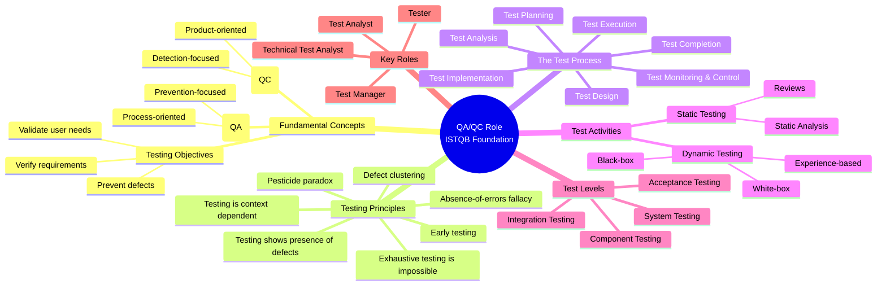
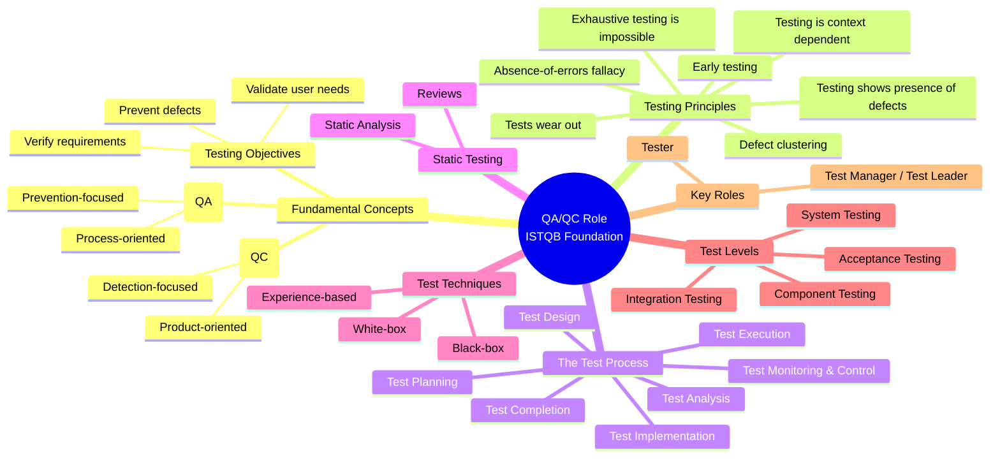

# Mapping to Course Learning Outcomes (CLOs / Bloom-AI)

| CLO | Short Description | Required Activity in This Homework | Evidence / Student Work |
|---|---|---|---|
| G9.1 | Ask AI Tool for ISTQB mindmap and correct it | R1: AI Tool draws a QA/QC role mindmap; you find 3 mistakes. | [Paste AI-generated QA/QC role mindmap here] |
| G9.3 | Analyse AI output – find missing items | R3: find ≥ 3 edge cases AI missed on a real device. | [Paste the 3 edge cases AI missed here] |

---

## G9.1 – AI Tool Mindmap Correction

### AI Tool Used

- AI Tool: Gemini
- Prompt Used:

```text
Draw a QA/QC role mindmap based on ISTQB Foundation Level. Output as a Markdown code only and use the mermaid mindmap
````

### AI-Generated Mindmap



### Three Mistakes Found and Corrected

| No. | Mistake in AI Output | Why It Is Incorrect | Corrected Version |
| --- | -------------------- | ------------------- | ----------------- |
| 1   | Wrong grouping         | The AI put Black-box, White-box, and Experience-based under "Dynamic Testing".|In ISTQB, these should be in a separate main branch called Test Techniques.|
| 2   | Misusing the term "Test Activities". | The mindmap uses this to group Static and Dynamic testing. However, "Test Activities" refers to the process steps (like Test Planning) | Static Testing should be its own separate branch. |
| 3   | Wrong roles for Foundation Level | The AI included "Test Analyst" and "Technical Test Analyst". These are Advanced Level roles |The ISTQB Foundation syllabus only focuses on two main roles: Test Manager and Tester.|

---

### Corrected Mindmap



## G9.3 – Missing Edge Cases Found

### AI Tool Used

* AI Tool: ChatGPT
* Prompt Used:

```text
Chuột Gaming bluetooth không dây Atas F30
- 3 Mode 
- Pin sạc 500mah 
- Sử dụng liên tục 50h 
F30: 3 mode kết nối ( Có dây , bluetooth , không dây ) , DPI 10000, có app Macro , Polling Rate 1000hz
THÔNG SỐ KỸ THUẬT chuột Gaming F30
- Kết nối: Có dây , Bluetooth , không dây 2.4GhZ 
- Pin lithium 500mah. 
- Mắt Đọc: M16 
- Có app Marco 
- DPI: Max 10000 DPI 
- Polling Rate : 1000Hz 
- Con Lăn TTC cho độ bền cao. 
- Switches: Huyu Độ bền 20 triệu lượt nhấn! 
- Chuyển chế độ kết nối với 1 nút bấm Bluetooth and Wireless 2.4GHz modes. 
- Thiết kế siêu nhẹ. 
- Màu sắc: Đen / Trắng 
- Low-resistance Teflon Feet.

Based on this description of the mouse, Design 15 test cases (Objective / Input / Steps / Expected / Actual / Verdict).
```

### Edge Cases AI Missed
**EC01 - Test mouse behavior when USB receiver is plugged into a weak/loose USB port**
- Objective: Verify mouse stability when the 2.4GHz USB receiver is connected to a weak or loose USB port.
- Input: Mouse, 2.4GHz USB receiver, PC/laptop with a loose or unstable USB port
- Steps:
  1. Plug the 2.4GHz USB receiver into a weak or loose USB port.
  2. Switch the mouse to 2.4GHz wireless mode.
  3. Move the mouse continuously.
  4. Left-click and right-click several times.
  5. Observe whether the cursor or clicks become unstable.
- Expected: Mouse should still work normally if the receiver remains connected. Cursor movement and clicks should not lag or disconnect unexpectedly.
- Actual: Mouse works normally and no random disconnection occurs.
- Verdict: Pass

**EC02 - Test mouse behavior on different surfaces**
- Objective: Verify mouse tracking performance on different surfaces.
- Input: Mouse, glass surface, cloth surface, glossy table, normal mouse pad
- Steps:
  1. Place the mouse on a normal mouse pad and move it.
  2. Place the mouse on a cloth surface and move it.
  3. Place the mouse on a glossy table and move it.
  4. Place the mouse on a glass surface and move it.
  5. Observe cursor movement on each surface.
- Expected: Mouse should track normally on common surfaces. Cursor movement should not skip, freeze, or become inaccurate.
- Actual: Mouse tracks normally on the tested surfaces without cursor skipping or freezing.
- Verdict: Pass

**EC03 - Test mouse behavior when used while charging**
- Objective: Verify mouse operation while it is being charged with a USB cable.
- Input: Mouse, USB charging cable, PC/laptop
- Steps:
  1. Connect the mouse to the PC/laptop using the USB charging cable.
  2. Keep the mouse turned on.
  3. Move the cursor while the mouse is charging.
  4. Left-click and right-click several times.
  5. Observe whether charging affects mouse operation.
- Expected: Mouse should continue working normally while charging. Cursor movement and clicks should respond correctly.
- Actual: Mouse works normally while charging. Cursor movement and clicks respond correctly.
- Verdict: Pass

---