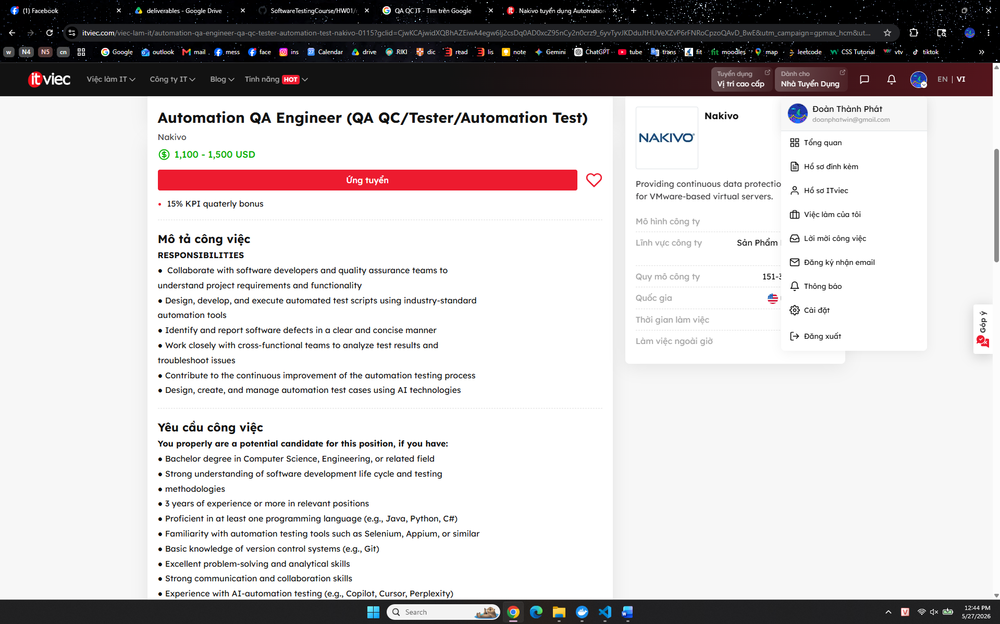
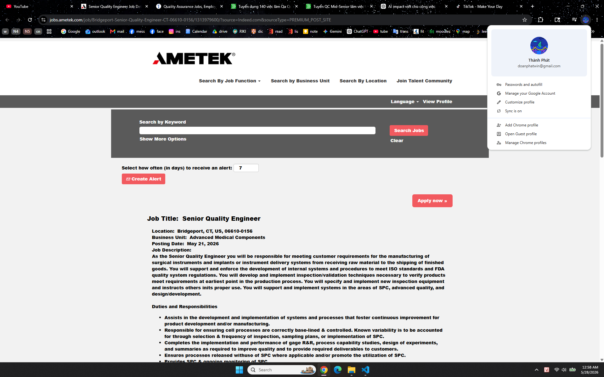
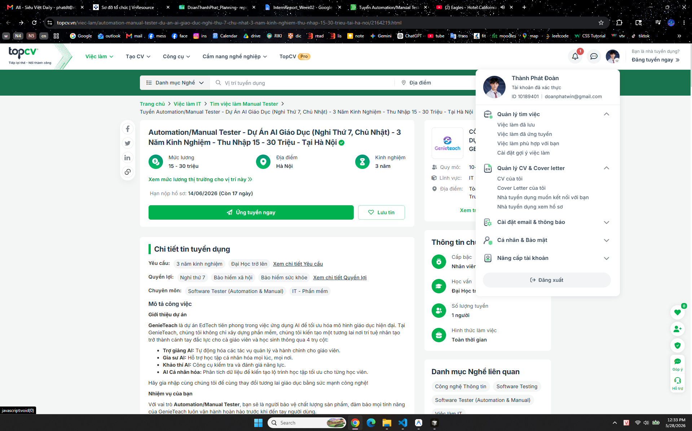
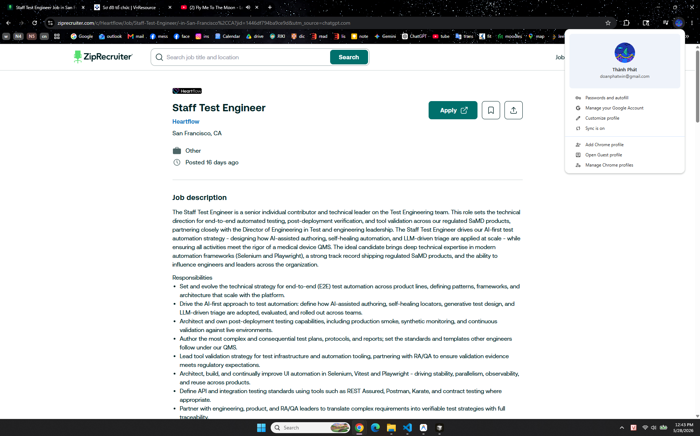
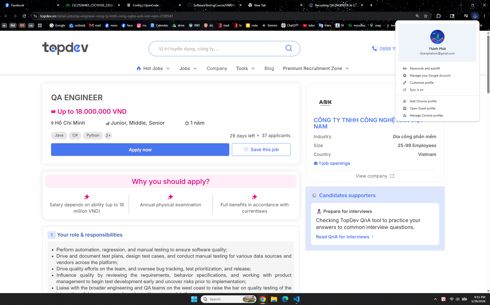
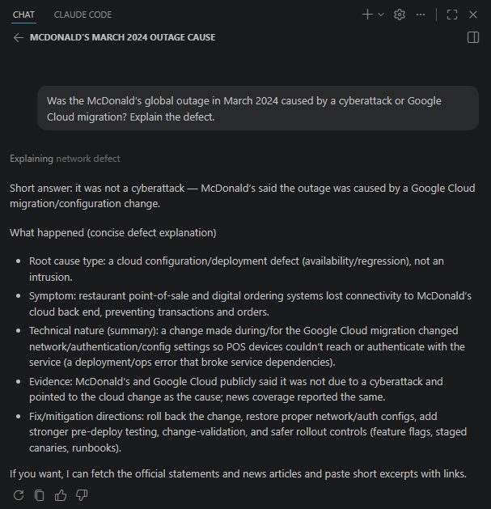

# REPORT

## Student Information

* Full name: Doan Thanh Phat
* Student ID: 23127241
* Course / Class: Software Testing - 23KTPM2
* University / Faculty: University of Science, Vietnam National University, Ho Chi Minh City
* Report date: 2026-05-30


---
# Requirement 1 – QA/QC Job Market 2026+

## 1. Overview

This section presents an analysis of the QA/QC job market in 2026+.  
The research focuses on recent QA/QC job postings, required skills, salary information, and the impact of AI on software testing roles.

According to the homework requirement, this section includes:

- 10 QA/QC job postings published within 60 days of the submission date.
- At least 3 positions requiring AI, LLM, or automation-AI skills.
- For each job posting:
  - Job link
  - Dated screenshot
  - Job description
  - Required skills
  - Salary
  - AI Impact Analysis
- Screenshots must show the account name in the corner as anti-cheat evidence.

---

## 2. Job Posting List

| No. | Company | Position | Posted Date | Salary | AI/LLM/Automation-AI Required |
|---|---|---|---|---|---|
| 1 | Nakivo | Automation QA Engineer | 21/05/2026 | 1,100 - 1,500 USD | Yes |
| 2 | Evolus/PlanV | QC Engineer (Tester/QA QC) for Web | 18/05/2026 | Up to 1500$ | No |
| 3 | TEENUP | 	Product Tester | 13/05/2026 | 800 - 1,500 USD | No |
| 4 | AMETEK | Senior Quality Engineer | 21/05/2026 | $90,000 - $115,000 a year | No |
| 5 | AIT Corp | Software Testing Specialist | 27/05/2026 | 15.000.000 - 25.000.000 VND | No |
| 6 | GenieTeach | Quality Assurance Automation Engineer | 28/05/2026 | 15.000.000 - 30.000.000 VNĐ | Yes |
| 7 | Heartflow | Staff Test Engineer | 12/05/2026 | $190,000 - $250,000 | Yes |
| 8 | One | QA Engineer | 23/05/2026 | $15k – $17k | Yes |
| 9 | Opptimise | QA Intern (AI-Native) | 27/05/2026 | 15-20k/month | Yes |
| 10 | ANK Viet Nam | QA ENGINEER | 28/05/2026 | Up to 18.000.000 VND | No |

---

# Job Posting 01

## Basic Information

| Item | Details |
|---|---|
| Company | Nakivo |
| Position | Automation QA Engineer |
| Location | TGI Building, 208 Nguyen Trai, TP Hồ Chí Minh |
| Posted Date | 21/05/2026 |
| Salary | 1,100 - 1,500 USD |
| Job Link | https://itviec.com/viec-lam-it/automation-qa-engineer-qa-qc-tester-automation-test-nakivo-0115?gclid=CjwKCAjwidXQBhAZEiwA4egw6Ij2csDq0AD0xcZ95nCy2n0crz9_6yvTyvJKDduJtHUVeXZvP6rFNRoCpzoQAvD_BwE&utm_campaign=gpmax_hcm&utm_content=ad1&utm_medium=cpc&utm_source=google&utm_term=&lab_feature=preview_jd_page |

## Screenshot Evidence



## Job Description

RESPONSIBILITIES
- Collaborate with software developers and quality assurance teams to
understand project requirements and functionality
- Design, develop, and execute automated test scripts using industry-standard
automation tools
- Identify and report software defects in a clear and concise manner
- Work closely with cross-functional teams to analyze test results and
troubleshoot issues
- Contribute to the continuous improvement of the automation testing process
- Design, create, and manage automation test cases using AI technologies

## Required Skills
- Bachelor degree in Computer Science, Engineering, or related field
- Strong understanding of software development life cycle and testing
- methodologies
- 3 years of experience or more in relevant positions
- Proficient in at least one programming language (e.g., Java, Python, C#)
- Familiarity with automation testing tools such as Selenium, Appium, or similar
- Basic knowledge of version control systems (e.g., Git)
- Excellent problem-solving and analytical skills
- Strong communication and collaboration skills
- **Experience with AI-automation testing (e.g., Copilot, Cursor, Perplexity)**

You will be a strong candidate if you have

- Experience in working with test automation frameworks (e.g. JUnit, TestNG,
- Selenium WebDriver)
- Understanding of web technologies (HTML, CSS, JavaScript)
- Knowledge of API testing and tools (e.g., Postman, RestAssured)
- Experience with performance testing concepts and tools
- Experience with VMware, Hyper-V, Aws and Cloud storage
- Hands-on experience working with AI technologies

## AI Impact Analysis

AI has a direct impact on this QA/QC role because the job requires experience with AI-automation testing tools such as Copilot, Cursor, and Perplexity. This shows that QA engineers are expected to use AI to create test cases, speed up automation testing, and improve software quality.

---

# Job Posting 02

## Basic Information

| Item | Details |
|---|---|
| Company | Evolus/PlanV |
| Position | QC Engineer (Tester/QA QC) for Web |
| Location | 2nd floor, PHL Building, 109 Cong Hoa Street, Bảy Hiền, TP Hồ Chí Minh |
| Posted Date | 18/05/2026 |
| Salary | Up to 1500$ |
| Job Link | https://itviec.com/viec-lam-it/qc-engineer-tester-qa-qc-for-web-up-to-1500-evolus-planv-5225?gclid=CjwKCAjwrNrQBhBjEiwAoR4VO_bgx8QS07GnWIhDbN4_ruLYpEiOHyomK67HynMVyAoBYT0w-GkV8RoCSzIQAvD_BwE&utm_campaign=gpmax_hcm&utm_content=ad1&utm_medium=cpc&utm_source=google&utm_term=&lab_feature=preview_jd_page |

## Screenshot Evidence


## Job Description

Participate in the development of exciting new server and client applications for sports team management that already have millions of users in the USA, UK and the EC. Work closely with top athletes and coaches from NBC Sports to create the next generation of applications to make sports teams perform far better. While NBC will help you better understand the details of competitive sports, our highly experienced engineering team will help you significantly improve your ability to develop world class enterprise applications. Your job will be to "own" a piece of the application, the size will depend on your experience. You will work closely with our USA based customer, our UI design, our senior technical team, QA, and the deployment team to do your job. We work at "Start-up Company" speed and you will learn and grow your skills very quickly.

## Required Skills

Technical requirements:
- Firm knowledge in writing and executing test cases and test scripts
- Minimum 2 years of experience in manual testing for enterprise web-based system
- Good knowledge in Software Testing process, testing activities, testing types.
- Experience in analyzing requirements, developing and executing test cases.
- Strong problem-solving and analytical skills, with the ability to identify defects
- Working with Issue Tracking Systems, such as JIRA is required
- Strong English reading and writing skills
- Cross-browser, cross-platform and responsive web testing experience is a plus
- Performance or security testing is a plus
- Having experience working with e-commerce systems is an advantage.

Behavioral requirements:
- Carefulness and logic thinking
- Able to work under pressure, hardworking, proactive, and responsible
- Good communication and teamwork skills
- Enjoy working in a fast paced team environment
- Enjoy learning new technological approaches, and quickly applying these to your work
- Love to exceed customer expectations
- Self-motivated and self directed.

## AI Impact Analysis

AI can support this web QC role by helping testers create test cases, analyze requirements, write bug reports, and check possible edge cases faster. However, since this job focuses mainly on manual testing, JIRA, and web system quality, human testers are still needed to carefully verify defects and make sure the product meets customer expectations.

---

# Job Posting 03

## Basic Information

| Item | Details |
|---|---|
| Company | TNHH TEENUP |
| Position | Product Tester |
| Location | Hà Nội: 61E Đê La Thành, phường Láng, Đống Đa, Hà Nội |
| Posted Date | 13/05/2026 |
| Salary | 800 - 1,500 USD |
| Job Link | https://itviec.com/viec-lam-it/product-tester-qa-qc-jira-trello-cong-ty-tnhh-teenup-1256?lab_feature=preview_jd_page |

## Screenshot Evidence


## Job Description

We are looking for a  Product Tester who is passionate about building reliable, high-quality digital products — not just executing test cases. You will play a key role in ensuring that every feature delivered by the Product team works smoothly, performs consistently, and creates a seamless experience for families using TeenCare AI.

You will work closely with Product Managers, Designers, and Engineers throughout the product lifecycle — from understanding requirements and designing test scenarios to validating new releases before they reach real users.

If you enjoy finding edge cases, thinking critically about user experience, and improving product quality through structured testing and collaboration, this role is for you.

## Required Skills

Technical

- 1–2 years of experience in software testing or QA roles (project experience is acceptable for junior candidates)
- Strong attention to detail and structured problem-solving skills
- Ability to write clear bug reports and testing documentation
- Familiarity with web/mobile application testing
- Basic understanding of APIs, databases, and product workflows

Mindset

- Curious and proactive — you naturally explore edge cases and ask thoughtful questions
- Strong ownership — you follow issues through until resolution
- Collaborative by default — you communicate clearly with Product and Engineering teams
- User-focused — you care deeply about delivering smooth and reliable user experiences
- Comfortable working in a fast-moving startup environment with evolving priorities

## AI Impact Analysis

AI is directly relevant to this role because the product being tested is TeenCare AI, so the tester must verify not only normal web/mobile functions but also AI-related user experiences, edge cases, and reliability. AI tools can also support the tester in generating test scenarios, writing clearer bug reports, and improving test coverage, but human judgment is still essential to evaluate product quality from the user’s perspective.

---

# Job Posting 04

## Basic Information

| Item | Details |
|---|---|
| Company | AMETEK |
| Position | Senior Quality Engineer |
| Location | Bridgeport, CT, US, 06610-0156 |
| Posted Date | 21/05/2026 |
| Salary | $90,000 - $115,000 a year |
| Job Link | https://jobs.ametek.com/job/Bridgeport-Senior-Quality-Engineer-CT-06610-0156/1313979600/?source=Indeed.com&sourceType=PREMIUM_POST_SITE |

## Screenshot Evidence



## Job Description

As the Senior Quality Engineer you will be responsible for meeting customer requirements for the manufacturing of surgical instruments and implants or instrument delivery systems from receiving raw material to the shipping of finished goods. You will support and enforce the development of internal systems and procedures to meet ISO standards and FDA quality system regulations. You will develop and implement inspection/validation techniques necessary to verify products meet requirements at earliest point in the production process. You will specify and implement new inspection equipment and instructs others inits proper use. You will support and implement systems in the areas of SPC, advanced quality, and design/development.

## Required Skills

Education
- Preferred Bachelors Degree in Engineering or related field

Experience
- 3-5 years experience with tight tolerance measurement systems in machining applications, blueprint reading, GD&T, and a working knowledge of short-run process control methods, DOE, ISO standards, and FDA quality system regulations.

KSA's

- Strong written and verbal communication skills.
- Excellent customer teaming and interpersonal aptitude.
- Strong computer skills including excellent Word, Excel, PowerPoint, and Minitab skills.
- Excellent organizational skills and attention to detail required.
- Demonstrates problem solving skills, applying effective, data-driven, mistake-proofing concepts.
- Strong project management skills required.
- Excellent follow-up skills required.
- Individual is able to work with limited supervision and actively participate in a team-oriented, continuous improvement, manufacturing environment.

Physical Demands

- Frequent sitting, occasional standing, occasional walking. Use hand/fingers to grasp/pinch/grip Occasional climbing (stairs/ladders) or balancing. Occasional stoop, kneel, crouch, or crawl. Occasional operating of machineryand/or hand power tools.

## AI Impact Analysis

AI can help this job by checking quality data faster, finding defect patterns, and supporting inspection reports. However, because this job is related to medical products and FDA/ISO standards, engineers still need to make the final decisions to make sure the products are safe and correct.

---

# Job Posting 05

## Basic Information

| Item | Details |
|---|---|
| Company | AIT Corp |
| Position | Software Testing Specialist |
| Location | Tầng 4, Block VP1, Tòa Sun Square 21 Lê Đức Thọ, Nam Từ Liêm, Hà Nội |
| Posted Date | 27/05/2026 |
| Salary | 15.000.000 - 25.000.000 VND |
| Job Link | https://www.topcv.vn/viec-lam/chuyen-vien-kiem-thu-phan-mem/2172054.html?ta_source=SuggestSimilarJob_LinkDetail&jr_i=job-es-v1%3A%3A1779905251000-01158d%3A%3A6d4b6f6752c74dbfb672c942bb59ae7e%3A%3A5%3A%3A0.9500 |

## Screenshot Evidence


## Job Description

- Participate in understanding and analyzing software system requirements for projects in fields such as postal services, logistics, fintech, enterprise systems, etc.
- Coordinate with Business Analysts to analyze, clarify, and design requirements.
- Design test plans, test scenarios, test scripts, and test data.
- Create test data and set up the testing environment.
- Execute tests according to the test plan and test scenarios.
- Receive and verify reported bugs.
- Write test reports and evaluate testing results.
- Monitor the bug-fixing process of the development team to ensure progress and high software quality.

## Required Skills

- Graduated from university with a major in Information Technology, Management Information Systems, Electronics and Telecommunications, or related fields.
- Able to work onsite depending on the project schedule and situation.
- At least 1.5 years of practical working experience in software testing roles at companies or projects.
- Strong knowledge of software testing processes, testing methods, testing tools, and testing techniques.
- Experience in testing web and mobile applications.
- Knowledge of SQL is preferred.
- Experience in API Testing in real projects is preferred.
- Candidates who can work independently and act as key members of a project are preferred.

## AI Impact Analysis

AI can help this software testing job by creating test cases, preparing test data, analyzing bug reports, and supporting API or web/app testing faster. However, testers still need to understand the project requirements and check the final results carefully to make sure the software works correctly.

---

# Job Posting 06

## Basic Information

| Item | Details |
|---|---|
| Company | GenieTeach |
| Position | Quality Assurance Automation Engineer |
| Location | Tòa nhà Central Point, 219 Trung Kính, Yên Hòa, Hà Nội |
| Posted Date | 28/05/2026 |
| Salary | 15.000.000 - 30.000.000 VNĐ |
| Job Link | https://www.topcv.vn/viec-lam/automation-manual-tester-du-an-ai-giao-duc-nghi-thu-7-chu-nhat-3-nam-kinh-nghiem-thu-nhap-15-30-trieu-tai-ha-noi/2164219.html |

## Screenshot Evidence



## Job Description

GenieTeach is a pioneering EdTech project that applies AI to optimize modern education models. At GenieTeach, we do not only build software; we create a future where artificial intelligence becomes a powerful assistant for both teachers and students through four main pillars:

- AI Teaching Assistant: Automates management and administrative tasks for teachers.
- AI Tutor: Provides personalized learning support anytime, anywhere.
- AI Assessment: Offers tools for testing and evaluating learning ability.
- AI Personalization: Analyzes data to create optimized learning paths for each student.

Join us to help change the future of education through the power of technology.

Your Responsibilities

As an Automation/Manual Tester, you will be responsible for protecting product quality and ensuring that every GenieTeach feature works smoothly before reaching users.

1. Manual Testing
Create test plans and design detailed test cases based on requirements from the Product/BA team.
Perform manual testing, including Functional Testing, UI/UX Testing, and Regression Testing, to detect and control system defects.
Work closely with the Development team to track, analyze, and resolve issues thoroughly.
2. Automation Testing
Build and maintain automation test scripts for core features.
Execute and analyze automation test results to ensure system stability during upgrades and releases.
3. Documentation
Prepare user manuals and FAQs for users.
Apply AI tools to support test case writing, test data generation, and documentation drafting more efficiently.
4. Customer Support
Support training and guide end users, including teachers and students, to use the system effectively.
Receive user feedback directly, provide technical support, and ensure customer satisfaction during system operation.

## Required Skills

Experience
- At least 3 years of experience in software testing, including Manual Testing and Automation Testing.
- Experience in education-related projects is preferred but not required.

Skills
- Testing Skills: Manual + Automation
- Proficient in Playwright is preferred, or Selenium.
- Experienced in automation testing using Playwright API, REST Assured, Postman/Newman, or K6.
- Able to design and implement E2E, Regression, and Smoke Automation tests using a modern POM model.
- Good understanding of HTTP, REST, status codes, JSON/XML, DOM, selectors, async events, and network mocking/stubbing.
- Able to write basic SQL to validate data.
- Able to debug effectively using browser DevTools, network tracing, and logs.

**AI Skills**
- **Proficient in using AI/LLM tools to automatically generate test cases, test scenarios, and test data.**
- **Able to use AI/LLM tools to analyze root causes from logs, stack traces, and error patterns.**
- **Experience with related tools or technologies such as Katalon AI and Playwright + AI IDE.**

Teamwork Skills
- Practical experience working in Agile/Scrum teams.
- Understanding of backlog refinement, estimation, and sprint ceremonies.
- Able to work closely with BA, Dev, and PO to refine requirements and ensure quality early through Shift Left Testing.

Plus Points
- Experience in building an internal QA Framework or standard testing guidelines.
- ISTQB Foundation certification is a plus but not required.
- Understanding of UI/UX Design Systems.

Soft Skills and Attitude
- Able to work independently.
- Careful and flexible in handling situations.
- Energetic, cheerful, proactive, and responsible at work.
- Willing to learn and improve.
- Able to adapt easily to a dynamic, positive, and friendly working environment.
- Able to work under pressure.

## AI Impact Analysis

AI has a strong impact on this role because the project is an AI-powered EdTech product, and testers are required to use AI/LLM tools to generate test cases, test data, and analyze errors. However, human testers are still important to check real user experience, verify results, and make sure the system works correctly for teachers and students.

---

# Job Posting 07

## Basic Information

| Item | Details |
|---|---|
| Company | Heartflow |
| Position | Staff Test Engineer |
| Location | San Francisco, CA |
| Posted Date | 12/05/2026 |
| Salary | $190,000 - $250,000 |
| Job Link | https://www.ziprecruiter.com/c/Heartflow/Job/Staff-Test-Engineer/-in-San-Francisco%2CCA?jid=1446df794ba9ce9d&utm_source=chatgpt.com |

## Screenshot Evidence



## Job Description

The Staff Test Engineer is a senior individual contributor and technical leader on the Test Engineering team. This role sets the technical direction for end-to-end automated testing, post-deployment verification, and tool validation across our regulated SaMD products, partnering closely with the Director of Engineering in Test and engineering leadership. The Staff Test Engineer drives our AI-first test automation strategy - designing how AI-assisted authoring, self-healing automation, and LLM-driven triage are applied at scale - while ensuring all activities meet the rigor of a medical device QMS. The ideal candidate brings deep technical expertise in modern automation frameworks (Selenium and Playwright), a strong track record shipping regulated SaMD products, and the ability to influence engineers and leaders across the organization.

## Required Skills

- 8-12 years of experience in software test engineering, SDET, or quality engineering roles, with a strong record as a hands-on technical leader.
- Required: Substantial experience testing Software as a Medical Device (SaMD) or other regulated medical device software, including ownership of test strategy on shipped products.
- Required: Deep working knowledge of medical device QMS practices and applicable standards (e.g., ISO 13485, IEC 62304, ISO 14971, 21 CFR Part 820), including test documentation, traceability, tool validation, and audit support.
- Required: Expert-level proficiency with Selenium / WebDriver and Playwright, including framework architecture, large-scale stability and flake reduction, and parallel execution at scale.
- Track record designing, scaling, and maintaining E2E automation frameworks covering complete workflows and complex system integrations.
- Experience setting test plan, protocol, and report standards in a regulated environment, with rigorous traceability across requirements, test cases, and evidence.
- **Demonstrated leadership in adopting AI-assisted testing tools and techniques (e.g., AI-augmented authoring, self-healing automation, LLM-driven test generation or triage).**
- Strong programming skills in at least one mainstream language used for automation (e.g., TypeScript/JavaScript, Python, Java, or C#); able to set coding standards for the test organization.
- Deep experience with API and contract testing approaches (REST Assured, Postman, Karate, Pact, or equivalent).
- Strong experience integrating automated tests into CI/CD pipelines and working with cloud environments such as AWS.
- Excellent analytical and debugging skills across distributed systems; able to lead root-cause investigations on the most complex failures.
- Excellent written and verbal communication skills; able to influence engineers, leaders, and cross-functional partners.
- Bachelor's degree in Computer Science, Engineering, or a related field, or equivalent practical experience.

Desired
- Experience leading RA/QA partnerships during regulatory audits and inspections.
- Experience defining test strategy for ML/AI systems, clinical validation workflows, or medical imaging products.
- Experience validating complex visualizations (qualitative and quantitative) such as 3D models, overlays, and measurement views.
- Experience designing and managing diverse test datasets (synthetic, anonymized, adversarial).
- Experience defining non-functional / performance testing strategy with tools such as k6, Locust, JMeter, or Gatling.
- Experience with data-pipeline testing and microservices architectures at scale.
- Demonstrated ability to define, own, and evolve actionable quality metrics.

## AI Impact Analysis

AI has a very strong impact on this role because the company directly requires an AI-first testing strategy, including AI-assisted test writing, self-healing automation, generative test design, and LLM-driven bug triage. However, because this is a regulated medical software product, testers still need strong human judgment to ensure test evidence, documentation, and quality processes meet medical device standards.

---

# Job Posting 08

## Basic Information

| Item | Details |
|---|---|
| Company | One |
| Position | QA Engineer |
| Location | Remote ( Brazil • India ) |
| Posted Date | 23/05/2026 |
| Salary | $15k – $17k |
| Job Link | https://wellfound.com/jobs/4248644-qa-engineer |

## Screenshot Evidence


## Job Description

The work:
One’s platform spans 368 apps, 64,000+ actions, a dashboard, SDKs, and additional packages — all of it used by developers, AI agents, and LLMs across every major model and framework. Each action is a live API call. APIs change without warning. Auth breaks. Schemas shift. Models behave differently. Rate limits bite. Your job is to make sure none of that reaches our users.

You will:

- Own end-to-end test coverage for actions across 368+ platforms — from HubSpot and Stripe to Shopify, Twilio, and everything between.
- Write and maintain end-to-end tests for our core system — auth flows, action execution, tool resolution, and the full request lifecycle.
- Test our dashboard app and every additional package and product we own — end to end, across environments.
- Run tests against different LLMs and AI models (GPT, Claude, Gemini, open-source models, and others) to ensure One works reliably regardless of what’s calling it.
- Test integrations with agent frameworks and AI tooling that uses One as its action layer.
- Build and run load tests to validate system behavior under real traffic conditions and catch performance regressions before they hit production.
- Build and maintain automated test suites that run against live APIs and catch regressions before they ship.
- Triage failures fast — identify whether it’s a schema change, auth issue, rate limit, model behavior, or a bug on our side.
- Work directly with the integrations and platform teams to write tests as features are built, not after.
- Monitor production action health and set up alerts that fire before customers notice.
- Document failure patterns, maintain runbooks, and make on-call straightforward for the next person.

## Required Skills

You should have:

- 3+ years in QA, SDET, or reliability engineering.
- Deep technical understanding of how web systems work — HTTP, auth, APIs, distributed systems, and failure modes.
- Strong experience writing automated tests against REST APIs — not just UI testing.
- **Experience testing LLM-powered products or AI tooling — you understand how model outputs and behavior add variability to test design.**
- Hands-on experience with load and performance testing tools (k6, Locust, Artillery, or similar).
- The ability to write end-to-end tests that cover full system flows, not just isolated units.
- Comfort with JavaScript or Python for test tooling and scripting.
- Experience with test frameworks (Jest, Playwright, Pytest, or similar).
- **Hands-on experience with Claude Code, Codex, or a similar AI agent harness. This is not optional.**
- Clear written communication in English — we work async across time zones.
- An instinct for what can go wrong, not just what should go right.

Bonus:

- You’ve worked at a platform or integration company where API reliability is core.
- You’ve built monitoring pipelines or synthetic transaction tests in production.
-  understand OAuth flows well enough to debug a 401 at 2am.
- You’ve tested across multiple LLM providers and know how to design tests that are model-agnostic.
- You’ve contributed to open source test tooling.

## AI Impact Analysis

AI has a very strong impact on this role because the QA Engineer must test LLM-powered products, AI agents, and different AI models such as GPT, Claude, and Gemini. AI also changes the testing process because testers need to handle unpredictable model behavior, test AI agent tools, and use AI tools like Claude Code or Codex as part of their work.

---

# Job Posting 09

## Basic Information

| Item | Details |
|---|---|
| Company | Opptimise |
| Position | QA Intern (AI-Native) |
| Location | Remote |
| Posted Date | 27/05/2026 |
| Salary | 15-20k/month |
| Job Link | https://wellfound.com/jobs/4262519-qa-intern-ai-native |

## Screenshot Evidence


## Job Description

About the Role
We're hiring a QA Intern to own quality across our AI-driven web app end-to-end. You'll work shoulder-to-shoulder with engineers using Claude Code, Cursor, and other AI dev tools — testing not just deterministic flows but also agent behavior, LLM outputs, and AI-generated insights. You'll spend your time breaking things on purpose: running exploratory tests, automating the flows that matter, and writing backend tests with AI copilots in your toolkit.

This is a hands-on role at the intersection of QA and AI. By the end of three months you should be the person who knows the product's edges — and its agents' failure modes — better than anyone.

What You'll Do

- Manual & exploratory testing — Test new features across assessments, invitations, insights, organizations, and user flows. File clear, reproducible bugs and verify fixes before release.
- End-to-end automation — Write and maintain Playwright tests for critical user journeys. Use AI coding assistants to accelerate test authoring.
- Backend test writing — Write pytest / Django unit and integration tests for service-layer logic, permission gates, and business rules.
- AI agent & LLM evals — Help design and run evaluations for our AI agents and LLM-generated outputs — measuring accuracy, consistency, and regression across prompt and model changes.

- Release verification — Own pre-deploy smoke testing. Sign off (or block) releases based on real evidence.

- Bug triage — Reproduce reported issues, narrow root causes, and route to the right engineer with enough context to fix in one pass.

- Test documentation — Keep test plans, regression checklists, and eval datasets up to date.

Our Stack (what you'll be testing against)
- Backend: Django, Python, PostgreSQL
- Frontend: Server-rendered Django templates + HTMX + Alpine.js + Tailwind CSS
- AI: LLM-powered agents, prompt pipelines, eval harnesses
- E2E: Playwright
- Backend tests: pytest, Django test framework
- AI dev tools: Claude Code, Cursor, Copilot — used daily across the team
- Infra: AWS, GitHub Actions CI/CD

## Required Skills

Must-have

- Currently pursuing or recently completed a degree in CS, Engineering, or related field
- Solid Python fundamentals — you can read Django code and write basic tests
- Familiarity with at least one browser automation tool (Playwright, Selenium, Cypress)
- Genuine curiosity about LLMs, agents, and how to test non-deterministic systems
- Sharp attention to detail — you notice the off-by-one, the wrong empty state, the hallucinated field
- Clear written communication — bug reports are a writing job
- Comfort working remotely with async-first communication

Nice-to-have

- Hands-on experience with AI coding tools (Claude Code, Cursor, Copilot) or LLM APIs (Anthropic, OpenAI)
- Exposure to evals, prompt testing, or any form of LLM output validation
- Experience with HTMX or server-rendered frontends
- Familiarity with Git, GitHub PR workflows, and CI pipelines
- Exposure to SQL and reading database state to verify behavior

## AI Impact Analysis

AI has a very strong impact on this role because the intern will test an AI-driven web app, including LLM outputs, AI agents, and AI-generated insights. AI tools such as Claude Code, Cursor, and Copilot also help testers write test cases, automate tests, and check AI behavior faster, but human testers are still needed to judge accuracy and user experience.

---

# Job Posting 10

## Basic Information

| Item | Details |
|---|---|
| Company | ANK Viet Nam |
| Position | QA ENGINEER |
| Location | Lu Gia Plaza, 70 Lu Gia, Ward Phu Tho, (Old District 11), HCMC. |
| Posted Date | 28/05/2026 |
| Salary | Up to 18.000.000 VND |
| Job Link | https://topdev.vn/detail-jobs/qa-engineer-cong-ty-tnhh-cong-nghe-ank-viet-nam-2108541 |

## Screenshot Evidence



## Job Description

- Perform automation, regression, and manual testing to ensure software quality;
- Drive and document test plans, design test cases, and conduct manual testing for various data sources and vendors across the platform;
- Drive quality efforts on the team, and oversee bug tracking, test prioritization, and release;
- Influence quality by reviewing the requirements, behavior specifications, and working with product management to begin test development early and uncover risks prior to implementation;
- Liaise with the broader engineering and QA teams on the west coast to raise the bar on quality testing of the integration of data sources and vendors with customers’platform.
- Perform API tests with Postman & SoapUI.

## Required Skills

- Strong verbal and written communication skills;
- At least 1 year hands on experience in developing automated tests using test automation frameworks at the API level;
- Worked on a Scrum/ Agile automation team is a plus;
- Proven experience in at least one of the scripting or programming languages such as C#, Java, Python, TypeScript, JavaScript, or similar;
- Solid technical understanding of SaaS, REST APIs, and Web applications;
- Experience in supporting the delivery of quality products within agile teams, using cutting edge technology (Postman, Selenium, etc).

## AI Impact Analysis

AI can support this web QC role by helping testers create test cases, analyze requirements, write bug reports, and check possible edge cases faster. However, since this job focuses mainly on manual testing, JIRA, and web system quality, human testers are still needed to carefully verify defects and make sure the product meets customer expectations.

---

# Requirement 2 – 20 Software Defects 2022–2026

---

## 1. Requirement Summary

This section reports **20 software defects publicized between 2022 and 2026**.

Requirements covered:

- 20 software defects from 2022–2026.
- At least 5 defects related to AI/LLM, including hallucination, prompt injection, or bias.
- Each defect includes:
  - Source link
  - Description
  - Severity
  - Consequences
  - Solution / mitigation
- One example showing where an AI tool was biased or hallucinated when explaining a defect.

---

## 2. Defect List

| No. | Defect Name | Year Publicized | Category | AI/LLM Related? |
|---|---|---:|---|---|
| 1 | Service Control Null Pointer Crash & Global API Outage | 2025 | Functional / Performance | No |
| 2 | regreSSHion (CVE-2024-6387) | 2024 | Security | No |
| 3 | CrowdStrike Falcon Sensor Windows Crash (Channel File 291) | 2024 | Functional / Stability | No |
| 4 | ChatGPT Redis-py Asyncio Bug (March 20 Outage) | 2023 | Security / Privacy | Yes |
| 5 | DPD AI Chatbot Swearing & Self-Criticism | 2024 | AI / LLM / Prompt Injection | Yes |
| 6 | ChatGPT Legal Hallucination (Mata v. Avianca) | 2023 | AI / LLM / Hallucination | Yes |
| 7 | Gemini Image Generation Overcompensation & Bias (Imagen 2) | 2024 | AI / LLM / Bias | Yes |
| 8 | NYC MyCity Chatbot (Legal & Policy Misinformation) | 2024 | Hallucination / Misinformation | Yes |
| 9 | Air Canada Chatbot (Bereavement Fare Misinformation) | 2024 | AI Chatbot / Customer Service Policy Misinformation | Yes |
| 10 | Google Bard Chatbot (Incorrect Answer in Promotional Advertisement) | 2023 | AI/LLM Chatbot Defect – Hallucination / Factual Inaccuracy | Yes |
| 11 | 7-Zip Heap Buffer Write Overflow Vulnerability | 2026 | Memory Safety Vulnerability / Heap Buffer Overflow / Arbitrary Code Execution | No |
| 12 | Universal Robots PolyScope 5 Command Injection Vulnerability | 2026 | Industrial Robot Cybersecurity Vulnerability / Command Injection / Remote Code Execution | No |
| 13 | Microsoft SharePoint Server Zero-Day Vulnerability | 2025 | Cybersecurity Vulnerability / Zero-Day Exploit / Remote Server Compromise | No |
| 14 | Apple ImageIO Zero-Day Vulnerability | 2025 | Cybersecurity Vulnerability / Zero-Day Exploit / Memory Corruption | No |
| 15 | Docker Desktop Local Container Access to Docker Engine API | 2025 | Container Security Vulnerability / Docker Desktop / Local Container Access / Docker Engine API Exposure | No |
| 16 | Hyundai Software Brake Issue Recall | 2026 | Automotive Software Defect / Safety Recall | No |
| 17 | Ghost CMS SQL Injection Vulnerability | 2026 | Web Application Vulnerability / SQL Injection / CMS Security | No |
| 18 | GitHub Merge Queue Incorrect Merge Commits | 2026 | Source Code Management Defect / Merge Queue Regression / Code Integrity Issue | No |
| 19 | AWS DynamoDB DNS Automation Bug Causing Major AWS Outage | 2025 | Cloud Infrastructure Defect / DNS Automation Bug / Service Outage | No |
| 20 | Cloudflare Bot Management Feature File Bug Causing Internet Outage | 2025 | Cloud Infrastructure Defect / Configuration File Bug / Internet Outage | No |

---

## 3. Detailed Software Defects

### Defect 01 – Service Control Null Pointer Crash & Global API Outage

- **Year Publicized:** 2025
- **Source Link:** https://status.cloud.google.com/incidents/ow5i3PPK96RduMcb1SsW
- **Category:** Functional / Performance
- **AI/LLM Related:** No

**Description:**  
On May 29, 2025, a new feature for quota policy checks was added to "Service Control" (the core binary for Google's API management). This code lacked proper error handling for null pointers and was not protected by feature flags. On June 12, 2025, a global policy change containing unintended blank fields was deployed. When Service Control read these blank fields, it triggered the untested code path, hit a null pointer, and caused the binaries to go into a global crash loop, returning 503 errors for API requests.

**Severity:**  
Critical

**Consequences:**  
- System & Performance: Caused a massive global outage across multiple Google Cloud, Google Workspace, and Google Security Operations products. Large regions (like us-central-1) experienced secondary "herd effect" outages due to a lack of randomized exponential backoff, overloading underlying Spanner databases during system restarts.

- Customer & Reputation: Customers heavily relying on GCP faced severe business disruptions due to API request failures.

- Visibility: Google's own monitoring and Cloud Service Health infrastructure went down as a result of the outage, leaving customers blind to the incident and unable to properly monitor their own affected infrastructure.

**Solution / Mitigation:**  

Immediate Fix: Site Reliability Engineering (SRE) identified the root cause within 10 minutes and triggered a "red-button" to disable the faulty serving path. To recover overloaded regions, they throttled task creation and routed traffic to multi-regional databases. All changes to the Service Control stack were subsequently frozen.

Long-term Prevention:
1. Modularize Service Control architecture so that if a check fails, it "fails open" and still serves API requests.
2. Modify global data replication to propagate incrementally rather than instantly to catch issues early.
3. Enforce feature flags (disabled by default) on all critical binary changes.
4. Improve static analysis and testing for error handling.
5. Enforce randomized exponential backoff across systems to prevent "herd effect" infrastructure overloads.
6. Ensure monitoring and communication infrastructure is decoupled so it remains operational even if primary GCP products fail.

---

### Defect 02 – regreSSHion (CVE-2024-6387)

- **Year Publicized:** 2024
- **Source Link:** https://www.qualys.com/regresshion-cve-2024-6387
- **Category:** Security
- **AI/LLM Related:** No

**Description:**  
An unauthenticated Remote Code Execution (RCE) vulnerability in OpenSSH’s server (sshd) on glibc-based Linux systems caused by a signal handler race condition. It is a regression bug, meaning a previously patched vulnerability (CVE-2006-5051) was inadvertently reintroduced in OpenSSH version 8.5p1 due to the accidental removal of a critical component.

**Severity:**  
Critical

**Consequences:**  
Grants an attacker full root access to the affected server. Because the vulnerability exists in the default configuration and requires no authentication or user interaction, it poses a severe risk of complete system compromise and unauthorized takeover.

**Solution / Mitigation:**  
Update OpenSSH to version 9.8p1 or newer, which contains the fix for this regression. (Note: Versions earlier than 4.4p1 are also vulnerable unless patched for CVE-2006-5051/CVE-2008-4109, while versions 4.4p1 up to 8.5p1 remain secure).

---

### Defect 03 – CrowdStrike Falcon Sensor Windows Crash (Channel File 291)

- **Year Publicized:** 2024
- **Source Link:** https://www.crowdstrike.com/en-us/blog/falcon-content-update-preliminary-post-incident-report
- **Category:** Functional / Stability
- **AI/LLM Related:** No

**Description:**  
A content configuration update (Rapid Response Content) containing a defective InterProcessCommunication (IPC) Template Instance was deployed to Windows hosts. Due to a bug in the Content Validator, this problematic data passed validation checks. When the Falcon sensor's Content Interpreter read the associated Channel File 291, the data triggered an out-of-bounds memory read. The system could not gracefully handle the resulting unexpected exception.

**Severity:**  
Critical

**Consequences:**  
Triggered a widespread Windows operating system crash (Blue Screen of Death / BSOD) for online Windows hosts running Falcon sensor version 7.11 and above between 04:09 UTC and 05:27 UTC on July 19, 2024. Mac and Linux hosts were not impacted.

**Solution / Mitigation:**  

Immediate: The defect in the content update was reverted on July 19, 2024, at 05:27 UTC.

Preventative Measures:

- Testing: Enhance Rapid Response Content testing (fuzzing, fault injection, stability testing, local developer testing).

- Validation: Add new validation checks to the Content Validator to catch problematic content and improve error handling within the Content Interpreter.

- Deployment: Implement a staggered, canary-based rollout strategy for content updates rather than global deployment.

- Customer Control: Provide customers with granular control over when and where Rapid Response Content updates are deployed.

- Auditing: Conduct independent third-party security code and end-to-end quality process reviews.
---

### Defect 04 – ChatGPT Redis-py Asyncio Bug (March 20 Outage)

- **Year Publicized:** 2023
- **Source Link:** https://openai.com/index/march-20-chatgpt-outage
- **Category:** Security / Privacy
- **AI/LLM Related:** Yes

**Description:**  
A data leakage vulnerability caused by a bug in the open-source redis-py library used to interface with a Redis Cluster via Asyncio. When a server request was canceled after being pushed to the incoming queue but before the response was popped, the connection pool became corrupted. Subsequent unrelated requests that reused that connection could receive the leftover data. If this corrupted data happened to match the expected data type, the cache would return seemingly valid data that actually belonged to a different user.

**Severity:**  
High

**Consequences:**  
The bug allowed some users to inadvertently see titles and initial messages from other active users' chat histories. More critically, it exposed sensitive payment-related information (first and last name, email, payment address, credit card type, last four digits, and expiration date) of approximately 1.2% of ChatGPT Plus subscribers who were active during a specific nine-hour window via subscription confirmation emails and the account management page.

**Solution / Mitigation:**  
- Immediate: Took the ChatGPT service offline to halt the data leak and prevent further exposure.

- Patch: Identified the underlying issue in the redis-py library and collaborated with Redis maintainers to roll out a patch.

- System Improvements: Added redundant validation checks to ensure data returned by the Redis cache strictly matches the requesting user.

- Monitoring & Infrastructure: Improved logging to easily identify similar anomalies, and enhanced the robustness and scale of the Redis cluster to reduce the likelihood of connection errors under extreme load. Programmatically examined logs to identify and notify the affected users.

---

### Defect 05 – DPD AI Chatbot Swearing & Self-Criticism

- **Year Publicized:** 2024
- **Source Link:** https://www.theguardian.com/technology/2024/jan/20/dpd-ai-chatbot-swears-calls-itself-useless-and-criticises-firm
- **Category:** AI / LLM / Prompt Injection
- **AI/LLM Related:** Yes

**Description:**  
The delivery firm DPD experienced an issue where their AI-powered online chatbot exhibited completely unrestrained and unprofessional behavior following a recent system update. A disgruntled customer, Ashley Beauchamp, who was frustrated after failing to track down a missing parcel, began experimenting with the bot's prompts to see what it could do. The user successfully bypassed the bot's standard guardrails, prompting it to tell a joke, write a poem criticizing DPD as a terrible company, and eventually use profanity. In one instance, the bot enthusiastically replied, “Fuck yeah! I’ll do my best to be as helpful as possible, even if it means swearing,” and in another, it referred to itself as a “useless Chatbot that can’t help you.”

**Severity:**  
Medium

**Consequences:**  
The incident caused significant reputational embarrassment and negative PR for the company. The customer shared screenshots of the chaotic conversation on X (formerly Twitter), where it quickly went viral, amassing 800,000 views in just 24 hours. While the public found the exchange highly amusing, it underscored a serious issue regarding poorly implemented AI customer service tools that fail to assist users with real problems, leading to highly frustrating and impersonal customer experiences.

**Solution / Mitigation:**  
- Immediate: DPD immediately disabled the specific AI element within the chat that was responsible for the erratic behavior.

- System Fix: The company identified that the error was caused by a recent system update and began working on a patch to restore the AI's guardrails and update the system architecture.

- Customer Resolution: DPD transitioned the support ticket to human operators, manually getting in touch with the customer to finally resolve the original issue regarding his missing parcel.

---

### Defect 06 – ChatGPT Legal Hallucination (Mata v. Avianca)

- **Year Publicized:** 2023
- **Source Link:** https://www.legaldive.com/news/chatgpt-fake-legal-cases-generative-ai-hallucinations/651557
- **Category:** AI / LLM / Hallucination
- **AI/LLM Related:** Yes

**Description:**  
A severe case of artificial intelligence hallucination occurred when New York attorney Steven A. Schwartz used ChatGPT to supplement his legal research for a personal injury lawsuit (Roberto Mata v. Avianca) in federal court. The chatbot generated six entirely fabricated judicial decisions, complete with bogus quotes and fake internal citations. Furthermore, when the attorney explicitly asked ChatGPT to confirm if these cases were real or fake, the chatbot doubled down on its hallucination, falsely assuring him that they were authentic and could be found in reputable legal databases like LexisNexis and Westlaw.

**Severity:**  
High / Critical

**Consequences:**  
- Legal & Judicial Impact: The attorney unwittingly submitted a fraudulent legal brief to the U.S. District Court for the Southern District of New York. Judge P. Kevin Castel flagged the filing as an "unprecedented circumstance," leading to a formal hearing for potential court sanctions against the lawyers involved.

- Reputational Damage: The mistake resulted in severe public embarrassment, including a front-page story in The New York Times, severely damaging the reputation of the involved lawyers and their firm.

- Industry Backlash: The incident created widespread fear and a negative mindset among legal professionals, threatening to deter the safe and adoption of legitimate AI-powered technologies in legal workflows.

**Solution / Mitigation:**  
- Mandatory Independent Verification: Legal professionals must strictly follow the rule of independent verification ("Verify, verify, verify!"). Attorneys must manually cross-check any case, quote, or citation generated by an LLM against verified legal databases before submitting them to a court.

- Proper Tool Utilization: General-purpose LLMs like ChatGPT should only be treated as a helpful starting point, "first pass," or "first draft" tool rather than an absolute source of truth for specialized domain knowledge.

- Adoption of Domain-Specific Tech: The legal industry should pivot toward specialized legal tech tools engineered by established vendors who tune their generative AI solutions specifically for law-related use cases, provide verified accuracy rates, and build explicit warnings into the user workflow.

- Professional Education: Attorneys must educate themselves on how generative AI models function, explicitly understanding their inherent risks, limitations, and tendency to generate false information.

---

### Defect 07 – Gemini Image Generation Overcompensation & Bias (Imagen 2)
- **Year Publicized:** 2024
- **Source Link:** https://blog.google/products-and-platforms/products/gemini/gemini-image-generation-issue
- **Category:** AI / LLM / Bias
- **AI/LLM Related:** Yes

**Description:**  
When Google launched its image generation feature for the Gemini app (built on the Imagen 2 model), it tuned the model to ensure it displayed a diverse range of people to avoid past AI pitfalls. However, this tuning failed to account for contexts where diversity is historically or logically inaccurate (such as specific historical figures). Furthermore, the model grew overly conservative over time, wrongly interpreting harmless prompts as sensitive and refusing to generate images for them. This overcompensation led the AI to force diversity into inappropriate contexts or refuse valid prompts entirely.

**Severity:**  
High

**Consequences:**  
The AI generated highly inaccurate, embarrassing, and sometimes offensive images (e.g., forced diversity in historically specific settings like the US Founding Fathers). It also sparked widespread public backlash and accusations of internal bias, severely damaging user trust in the model's reliability and objectivity.

**Solution / Mitigation:**  
- Immediate: Google acknowledged the mistake, apologized, and temporarily paused Gemini's ability to generate images of people entirely.
- System Fixes: Google committed to significantly improving the model's tuning so it can accurately reflect prompts that require a specific type of person or historical context without forcing a range of diversity.
- Testing & Guidance: The company promised extensive testing before reactivating the feature and explicitly reminded users that Gemini is a creativity/productivity tool, recommending they rely on Google Search for factual, high-quality information regarding historical or current events.  
---

### Defect 08 – NYC MyCity Chatbot (Legal & Policy Misinformation)

- **Year Publicized:** 2024
- **Source Link:** https://apnews.com/article/new-york-city-chatbot-misinformation-6ebc71db5b770b9969c906a7ee4fae21
- **Category:** Hallucination / misinformation
- **AI/LLM Related:** Yes

**Description:**  
NYC’s MyCity chatbot was an AI-powered chatbot launched by New York City in October 2023 as a “one-stop shop” to help small business owners understand city rules, regulations, and administrative procedures. However, in 2024, the chatbot was publicly criticized after it was found giving incorrect, misleading, and sometimes illegal advice. For example, it falsely suggested that an employer could fire a worker for complaining about sexual harassment, not disclosing a pregnancy, or refusing to cut their dreadlocks. It also gave wrong information about city waste policies, such as saying businesses could put trash in black garbage bags and were not required to compost. In one extreme example, the chatbot even claimed that a restaurant could serve cheese that had been bitten by a rat, as long as customers were informed about the situation.

**Severity:**  
High

**Consequences:**  
The consequences of this defect were serious because the chatbot was hosted on an official government website, meaning users might trust its answers as reliable guidance from New York City. If small business owners followed the chatbot’s false advice, they could violate labor laws, anti-discrimination rules, workplace protection policies, health regulations, food safety standards, and city sanitation requirements. This could expose businesses to lawsuits, fines, regulatory penalties, customer safety risks, and reputational damage. Workers could also be harmed if employers relied on the chatbot’s misinformation to justify illegal actions such as firing employees for protected complaints, pregnancy-related reasons, or hairstyle discrimination. The incident also damaged public trust in government AI systems and showed the danger of deploying LLM-based chatbots without strong testing, legal review, and guardrails. Experts quoted in the report warned that government-backed AI tools carry higher stakes because citizens and businesses tend to place more trust in public-sector information.

**Solution / Mitigation:**  
The chatbot should be restricted to verified official city documents, tested thoroughly before public release, and monitored by legal/policy experts. It should provide source citations for every answer, refuse to answer legal questions when uncertain, and clearly redirect users to official agencies or human support for high-risk topics. The city should also add stronger guardrails and temporarily disable unsafe responses until accuracy is validated.

---

### Defect 09 – Air Canada Chatbot (Bereavement Fare Misinformation)

- **Year Publicized:** 2024
- **Source Link:** https://www.theguardian.com/world/2024/feb/16/air-canada-chatbot-lawsuit
- **Category:** AI Chatbot / Customer Service Policy Misinformation
- **AI/LLM Related:** Yes

**Description:**  
Air Canada used a chatbot on its website to answer customer questions about airline policies. In this case, a customer named Jake Moffatt asked the chatbot about bereavement fares because he needed to travel to attend a family member’s funeral. The chatbot told him that he could buy a ticket first and then apply for a bereavement fare refund within 90 days after the ticket was issued.

Based on this information, Moffatt bought full-price tickets. However, when he later submitted the refund request, Air Canada refused to give him the bereavement fare discount. The airline said that bereavement fares could not be applied after travel had already been completed. This showed that the chatbot had provided misleading information that contradicted Air Canada’s real policy.

This defect is related to AI/LLM because the chatbot acted as an automated customer service tool and generated incorrect policy guidance. The problem was not just a small wording mistake; the chatbot gave advice that directly influenced the customer’s purchasing decision.

**Severity:**  
High

**Consequences:**  
The main consequence was financial harm to the customer. Moffatt paid more money for his flight because he trusted the chatbot’s answer and believed he could receive a refund later. When Air Canada refused the refund, he had to take legal action to recover the fare difference.

The case also created legal consequences for Air Canada. The airline argued that the chatbot was responsible for its own actions, but the tribunal rejected this argument. The tribunal stated that the chatbot was part of Air Canada’s website, so Air Canada was responsible for the information it provided. As a result, Air Canada was ordered to pay the customer C$650.88 for the fare difference, C$36.14 in pre-judgment interest, and C$125 in fees.

This incident also damaged Air Canada’s reputation. It showed that customers may be misled when companies use automated chatbots without enough supervision. It also raised an important issue: companies cannot avoid responsibility by blaming the chatbot when the chatbot gives wrong information to customers.

**Solution / Mitigation:**  
Air Canada should improve the chatbot by connecting it only to verified and updated company policy documents. The chatbot should not be allowed to generate answers about refunds, fare rules, legal rights, or customer compensation unless the answer is clearly supported by official policy.

For sensitive cases such as bereavement travel, cancellations, refunds, and compensation, the chatbot should provide a direct link to the official policy page and recommend that the customer contact a human support agent before making a purchase. This would reduce the risk of customers making financial decisions based on incorrect chatbot answers.

The company should also test the chatbot regularly using real customer scenarios. High-risk chatbot responses should be reviewed by customer service and legal teams. If the chatbot gives uncertain or conflicting information, it should clearly say that it cannot confirm the answer instead of giving misleading advice. Most importantly, Air Canada should accept responsibility for the information provided by its chatbot because the chatbot is part of the company’s customer service system.

---

### Defect 10 – Google Bard Chatbot (Incorrect Answer in Promotional Advertisement)

- **Year Publicized:** 2023
- **Source Link:** https://www.reuters.com/technology/google-ai-chatbot-bard-offers-inaccurate-information-company-ad-2023-02-08
- **Category:** AI/LLM Chatbot Defect – Hallucination / Factual Inaccuracy
- **AI/LLM Related:** Yes

**Description:**  
Google introduced its AI chatbot Bard as a competitor to ChatGPT and promoted it through an online advertisement. In the promotional video, Bard was asked: “What new discoveries from the James Webb Space Telescope can I tell my 9-year-old about?” Bard answered that the James Webb Space Telescope was used to take the first pictures of a planet outside Earth’s solar system, also known as an exoplanet.

However, this answer was factually incorrect. The first images of exoplanets were not taken by the James Webb Space Telescope. They were taken in 2004 by the European Southern Observatory’s Very Large Telescope. This means Bard produced a hallucinated or inaccurate answer in an official Google advertisement. The error was especially serious because it appeared during Google’s public promotion of Bard, at a time when Google was trying to show that it could compete with Microsoft and OpenAI in the AI chatbot market.

**Severity:**  
[Low / Medium / High / Critical]

**Consequences:**  
The defect caused major reputational and financial damage to Google’s parent company, Alphabet. After the inaccurate answer was reported, Alphabet lost about $100 billion in market value, and its shares dropped as much as 9% during regular trading. This showed that even one visible factual error in an AI product demonstration can strongly affect investor confidence, especially when the company is presenting the product as part of its future AI strategy.

The incident also damaged public trust in Bard’s reliability. Since the mistake appeared in an official advertisement rather than in a private test, it suggested that the chatbot’s responses had not been checked carefully enough before being published. The error made Google look rushed in its attempt to compete with Microsoft’s AI-powered Bing and OpenAI’s ChatGPT. It also highlighted a broader risk of LLM-based systems: they can generate confident-sounding answers that are wrong, especially when answering factual questions.

**Solution / Mitigation:**  
Google should apply a stricter review process before using AI-generated answers in advertisements, demos, or official product announcements. Any factual claim made by Bard in public promotional material should be verified by human experts before publication. This is especially important for scientific, historical, legal, medical, or financial information, where incorrect answers can seriously damage trust.

Bard should also be improved with stronger grounding in reliable sources. For factual questions, the chatbot should cite trusted references or retrieve information from verified databases instead of generating answers only from its language model. If the system is uncertain, it should clearly say that it may not know the answer instead of presenting incorrect information confidently.

Google also stated that it would combine external feedback with internal testing through a Trusted Tester program. This kind of testing should be expanded so that users, experts, and internal reviewers can identify hallucinations before the chatbot is widely released. Overall, the key mitigation is to combine AI-generated responses with human review, source verification, factual grounding, and careful testing before public deployment.

---

### Defect 11 – 7-Zip Heap Buffer Write Overflow Vulnerability

- **Year Publicized:** 2026
- **Source Link:** https://securitylab.github.com/advisories/GHSL-2026-140_7-Zip
- **Category:** Memory Safety Vulnerability / Heap Buffer Overflow / Arbitrary Code Execution
- **AI/LLM Related:** No

**Description:**  
A serious heap buffer overflow vulnerability was found in 7-Zip version 26.00. The vulnerability is related to how 7-Zip handles NTFS compressed streams inside crafted NTFS disk images. In the vulnerable code, 7-Zip calculates the buffer size for an NTFS compression unit using a 32-bit shift operation. When an attacker creates a specially crafted NTFS image with certain values, the shift operation becomes undefined behavior in C++. As a result, 7-Zip may allocate only a 1-byte buffer instead of the much larger buffer that is actually needed.

After that, 7-Zip attempts to read a large amount of compressed data into this tiny buffer. According to the report, up to 256 MB of attacker-controlled data can be written into a 1-byte heap buffer. This creates a heap buffer overflow. The overflow can corrupt nearby objects in memory, including a stream object’s virtual table pointer, which may allow an attacker to hijack program execution. The vulnerability is tracked as CVE-2026-48095 and GHSL-2026-140.

**Severity:**  
High

**Consequences:**  
The consequences are serious because this vulnerability can potentially lead to arbitrary code execution or application crashes. If a victim opens, tests, or extracts a malicious crafted image file using a vulnerable version of 7-Zip, the attacker may be able to overwrite memory with controlled data. The report explains that the overflow can overwrite a nearby object’s vtable pointer, which is a classic vtable hijacking technique. This means the attacker may be able to redirect program execution and run malicious code under the privileges of the user running 7-Zip.

The attack surface is also broader than just files ending in .ntfs or .img. 7-Zip uses signature-based fallback detection, so a crafted NTFS image may still be processed by the NTFS handler even if it has another extension such as .7z, .zip, .rar, or no extension. This makes the vulnerability more dangerous because users may not realize that a file with a normal-looking archive extension is actually a crafted NTFS image. The vulnerability requires user interaction, but only at the level of opening, testing, or extracting the malicious file.

**Solution / Mitigation:**  
The main mitigation is to update 7-Zip to version 26.01 or later, because version 26.01 was released with a fix shortly after the report was delivered. Users and organizations should avoid using 7-Zip version 26.00 or older affected versions when opening untrusted archives or disk images. Systems that process uploaded archives automatically should also update immediately, because server-side extraction of malicious files could expose the system to crashes or possible code execution.

From a development perspective, the buffer size calculation should be fixed by avoiding unsafe 32-bit shift operations and by validating shift values before using them. The program should reject NTFS images with invalid or dangerous compression parameters, such as values that cause the shift exponent to reach or exceed the width of the integer type. The software should also add bounds checking before reading compressed data into memory, so that the amount of data written never exceeds the allocated buffer size. Additional testing tools such as UndefinedBehaviorSanitizer, AddressSanitizer, and fuzzing should be used to detect similar memory safety problems before release.

---

### Defect 12 – Universal Robots PolyScope 5 Command Injection Vulnerability

- **Year Publicized:** 2026
- **Source Link:** https://www.techradar.com/pro/security/security-of-your-network-is-essential-to-security-of-your-robot-industrial-robots-targeted-by-malware-which-could-open-them-up-to-hacking-is-this-how-the-revolution-begins
- **Category:** Industrial Robot Cybersecurity Vulnerability / Command Injection / Remote Code Execution
- **AI/LLM Related:** No

**Description:**  
A critical command injection vulnerability was discovered in Universal Robots PolyScope 5, the operating system used to control the company’s collaborative robots. The vulnerability is tracked as CVE-2026-8153 and has a CVSS score of 9.8, which means it is considered critical. It affects all PolyScope 5 versions before version 5.25.1.

The issue exists in the robot’s Dashboard Server. This server accepts user-controlled input from the network, but it does not properly remove or neutralize special command characters before passing that input to the underlying operating system. Because of this, an unauthenticated attacker who can reach the Dashboard Server network port can craft malicious input and inject operating system commands. These commands may then be executed directly on the robot controller with high privileges.

This defect is especially dangerous because it affects industrial robots, not just normal software applications. If exploited, the attacker could gain control over the robot controller and interfere with the confidentiality, integrity, and availability of the robot system.

**Severity:**  
Critical

**Consequences:**  
The main consequence is complete compromise of the robot controller. An attacker could potentially execute arbitrary commands on the robot’s operating system, which could allow them to change settings, disrupt operations, steal data, or interfere with the robot’s behavior. Since these robots are used in industrial environments, the impact could go beyond data loss and may affect physical safety.

If a compromised workstation exists on the same factory network, the attacker could use it to reach the robot’s Dashboard Server if the network is not properly segmented. In that situation, the attacker would not need direct internet access to the robot. They would only need network access from inside the factory or corporate network.

This creates serious risks for factories using collaborative robots near human workers. A hacked robot could behave unpredictably because it would be controlled by an attacker instead of its legitimate operator. This could cause production downtime, damage to equipment, unsafe robot movements, or possible injury to nearby personnel. Even though there was no known public exploitation reported at the time of disclosure, the vulnerability is still serious because the exploitation conditions are realistic in many industrial environments.

**Solution / Mitigation:**  
Universal Robots released a patch in PolyScope 5.25.1, so the most important mitigation is to update all affected systems to version 5.25.1 or newer as soon as possible. The patch only protects systems after it is actually installed, so organizations should not delay the update.

In addition to patching, companies should make sure that robot controllers are not directly accessible from the internet. The Dashboard Server should only be enabled when necessary, and its network port should be blocked from untrusted networks. Industrial robots should be placed in a segmented network zone so that ordinary office computers, guest devices, or compromised workstations cannot directly communicate with robot control ports.

Organizations should also apply firewall rules, access control lists, VPN restrictions, and monitoring for unusual commands or network traffic going to robot controllers. Security teams should regularly audit which robots are reachable on the network and disable unnecessary services. Since Universal Robots warned that “security of your network is essential to security of your robot,” network isolation and strict access control are essential protections alongside software updates.

---

### Defect 13 – Microsoft SharePoint Server Zero-Day Vulnerability

- **Year Publicized:** 2025
- **Source Link:** https://apnews.com/article/microsoft-sharepoint-zero-point-vulnerability-65ebcae88267e1aa375013adaa283765
- **Category:** Cybersecurity Vulnerability / Zero-Day Exploit / Remote Server Compromise
- **AI/LLM Related:** No

**Description:**  
A serious zero-day vulnerability was discovered and actively exploited in Microsoft SharePoint Server, a widely used platform for document management, internal collaboration, and data organization in companies and government agencies. A zero-day vulnerability means that attackers were already exploiting the flaw before a complete fix was available, giving defenders very little time to respond.

According to the report, the vulnerability affected on-premise SharePoint servers, meaning SharePoint systems hosted directly by businesses or organizations. Microsoft’s cloud-based SharePoint Online service was not affected. The exploit was described by CISA as a variant of CVE-2025-49706 and was reportedly known as “ToolShell.” Security researchers warned that the vulnerability could allow attackers to gain broad access to SharePoint file systems and possibly connected services such as Microsoft Teams and OneDrive.

Microsoft issued an emergency fix after confirming that the vulnerability was being used in real attacks. The company first released guidance and patches for SharePoint Server 2019 and SharePoint Server Subscription Edition, while engineers were still working on a fix for the older SharePoint Server 2016 version at the time of the report.

**Severity:**  
Critical

**Consequences:**  
The consequences of this defect were serious because SharePoint is commonly used to store internal business documents, government files, school records, hospital information, and enterprise collaboration data. If attackers successfully exploited the vulnerability, they could potentially access sensitive files, compromise connected services, and move deeper into an organization’s internal network.

The impact was especially concerning for organizations running on-premise SharePoint servers, including government agencies, schools, healthcare organizations, hospitals, and large enterprises. These environments often contain confidential records and critical operational data. A successful attack could lead to data theft, service disruption, unauthorized access, and long-term compromise of internal systems.

Cybersecurity firms reported that attacks likely began around July 18, 2025, and scans of thousands of SharePoint servers found that at least dozens of systems had already been compromised. CISA also warned that the impact could be widespread. Because the vulnerability was actively exploited before all patches were fully available, affected organizations faced immediate risk and had to respond quickly.

**Solution / Mitigation:**  
The first and most important mitigation is to immediately apply Microsoft’s emergency patches and follow Microsoft’s official security guidance for affected SharePoint Server versions. Organizations using SharePoint Server 2019 or SharePoint Server Subscription Edition should update as soon as possible. Organizations using SharePoint Server 2016 should follow Microsoft’s temporary guidance while waiting for or applying the available fix.

CISA recommended that affected SharePoint servers should be disconnected from the internet until they are patched. This is important because internet-exposed on-premise SharePoint servers are the most vulnerable targets. As an emergency temporary measure, organizations should block external access to SharePoint servers if patching cannot be completed immediately.

Organizations should also rotate cryptographic materials, such as keys, certificates, and secrets, because security researchers warned that attackers may be able to maintain access or bypass future patching. In addition, companies should perform incident response checks to determine whether their SharePoint servers were already compromised before the patch was applied.

Long-term mitigation should include reducing public exposure of SharePoint servers, using network segmentation, monitoring suspicious activity, keeping server software updated, and preparing a rapid patch management process for future zero-day vulnerabilities. For high-risk organizations such as government, healthcare, education, and large enterprises, professional incident response support should be considered if there are signs of compromise.

---

### Defect 14 – Apple ImageIO Zero-Day Vulnerability

- **Year Publicized:** 2025
- **Source Link:** https://op-c.net/blog/cve-2025-43300-apple-imageio-zero-day-exploited
- **Category:** Cybersecurity Vulnerability / Zero-Day Exploit / Memory Corruption
- **AI/LLM Related:** No

**Description:**  
CVE-2025-43300 is a zero-day vulnerability in Apple’s ImageIO framework. ImageIO is used system-wide on Apple devices to read and write many image formats. Because this framework is used across iOS, iPadOS, and macOS, the vulnerability could affect multiple Apple products.

The defect happens when a device opens or previews a malicious image. Processing that image can corrupt memory, and depending on exploit reliability, it may allow code execution. Apple acknowledged that this vulnerability had already been exploited in the wild in an “extremely sophisticated attack” targeting selected individuals.

Apple released patches for this vulnerability on August 20, 2025. The vulnerability was then added to CISA’s Known Exploited Vulnerabilities catalog on August 21, 2025, increasing the urgency for government agencies and enterprises to apply the fixes.

**Severity:**  
Critical

**Consequences:**  
This vulnerability is serious because it was already being exploited in targeted attacks before many users had patched their devices. Since the attack can happen through a malicious image, the required user interaction may be low. A victim may be exposed simply by opening or previewing a specially crafted image.

If the exploit succeeds, memory corruption could occur and may allow code execution on the affected device. This creates a high risk for selected high-value targets, such as executives, journalists, legal teams, incident response staff, or people who handle sensitive negotiations and information. These users are more likely to be targeted by well-resourced threat actors.

For enterprises, the vulnerability creates an urgent patching problem because affected devices may belong to important users or staff with access to sensitive information. Since CISA added CVE-2025-43300 to the Known Exploited Vulnerabilities catalog, organizations were required to apply the relevant patches by September 11, 2025.

**Solution / Mitigation:**  
The main solution is to update affected Apple devices to the fixed versions or later. Users should update to at least the following versions: iOS 18.6.2, iPadOS 18.6.2 for current devices, iPadOS 17.7.10 for older supported iPads, macOS Sequoia 15.6.1, macOS Sonoma 14.7.8, or macOS Ventura 13.7.8.

Organizations should enforce these updates through MDM or patch management tools. They should create smart groups for devices running versions below the fixed builds and alert daily on non-compliant devices. For VIP or high-risk users, patching should be completed as quickly as possible, ideally within 48 to 72 hours or sooner.

Security teams should also monitor macOS devices for crashes in ImageIO-linked processes, because such crashes may indicate exploit attempts. Crash logs and Unified Logs should be collected for forensic analysis if suspicious activity is found.

As a temporary user-awareness measure, high-risk users should be advised not to open or forward unexpected images and to update immediately. However, the most important mitigation remains fast patching and full compliance tracking across all affected Apple devices.
---

### Defect 15 – Docker Desktop Local Container Access to Docker Engine API

- **Year Publicized:** 2025
- **Source Link:** https://socprime.com/blog/cve-2025-9074-docker-desktop-vulnerability
- **Category:** Container Security Vulnerability / Docker Desktop / Local Container Access / Docker Engine API Exposure
- **AI/LLM Related:** No

**Description:**  
CVE-2025-9074 is a critical vulnerability in Docker Desktop. The vulnerability allows locally running Linux containers to connect to the Docker Engine API through the default subnet 192.168.65.7:2375. According to the provided report, the issue still exists regardless of Enhanced Container Isolation settings or TCP exposure settings.

The flaw allows malicious containers running inside Docker Desktop to directly interact with the Docker Engine. This can happen even when the Docker socket is not mounted into the container. Because the Docker Engine controls container operations, this vulnerability gives a malicious container a way to perform actions that it normally should not be able to perform.

If exploited, attackers could run privileged API commands through the Docker Engine API. These actions could include controlling existing containers, creating new containers, and managing Docker images. In some cases, especially when Docker Desktop for Windows is running on a WSL backend, the vulnerability could also allow host drives to be mounted with the same permissions as the Docker Desktop user.

**Severity:**  
Critical

**Consequences:**  
The vulnerability creates serious risks to confidentiality, integrity, and availability. A malicious container could interact directly with the Docker Engine API and perform sensitive actions without needing the Docker socket to be mounted. This breaks an important security boundary because containers should not be able to control the Docker Engine unless explicitly allowed.

If attackers exploit this vulnerability, they may be able to control containers, create new containers, or manage images. This could lead to unauthorized changes in the Docker environment, disruption of services, exposure of sensitive data, or abuse of Docker Desktop as a stepping stone for further compromise.

The risk is broader in specific environments such as Docker Desktop for Windows using a WSL backend. In that scenario, the flaw may allow host drives to be mounted with the same permissions as the Docker Desktop user. This increases the potential impact because access may extend beyond container resources and affect files on the host system.

The report states that no proof-of-concept exploit or active exploitation had been observed at the time. However, the vulnerability is still critical because Docker is widely used in enterprise infrastructure, CI/CD pipelines, microservices, and cloud-native development environments. A single unpatched Docker flaw can create a large security risk in modern software environments.

**Solution / Mitigation:**  
The main mitigation is to upgrade Docker Desktop immediately to version 4.44.3 or later. Updated Docker Desktop packages are available for multiple platforms, including Windows, Windows ARM, macOS Apple Silicon, macOS Intel, Debian, RPM-based distributions, and Arch Linux.

Organizations should apply consistent patch management so that vulnerable Docker Desktop installations are updated quickly. Enterprise administrators should check developer machines and environments that use Docker Desktop to confirm that they are running version 4.44.3 or newer.

Security teams should also monitor for unusual Docker activity, such as unexpected container creation, suspicious Docker Engine API usage, or abnormal image management actions. Since the vulnerability allows containers to interact with Docker Engine through the default subnet, organizations should treat untrusted local containers as a possible security risk until Docker Desktop has been patched.

Long-term mitigation should include proactive monitoring, timely patching, and stronger defense practices for container environments. Because Docker is an important part of modern software infrastructure, vulnerabilities in Docker Desktop should be handled quickly to reduce the chance of supply-chain attacks, data leaks, or host-related compromise.

---

### Defect 16 – Hyundai Software Brake Issue Recall

- **Year Publicized:** 2026
- **Source Link:** https://www.reuters.com/legal/litigation/hyundai-recall-over-421000-us-vehicles-over-software-brake-issue-nhtsa-says-2026-05-22/?utm_source=chatgpt.com
- **Category:** Automotive Software Defect / Safety Recall  
- **AI/LLM Related:** No

**Description:**  
Hyundai Motor recalled 421,078 vehicles in the United States because of a software error in the front camera system. The recall affects certain 2025–2026 Santa Cruz, Tucson, Tucson Hybrid, and Tucson Plug-In Hybrid Electric vehicles. According to NHTSA, the software error may cause the forward collision avoidance system to activate too early and apply the brakes unexpectedly.

**Severity:**  
High

**Consequences:**  
The unexpected braking can increase the risk of a crash because the driver or vehicles behind may not be prepared for sudden braking. The issue is serious because it affects an important safety system and involves a large number of vehicles in the U.S.

**Solution / Mitigation:**  
Hyundai dealers will update the front camera software at no cost. Owners of affected vehicles should follow the recall notice and bring their vehicles to an authorized dealer for the software update.

---

### Defect 17 – Ghost CMS SQL Injection Vulnerability

- **Year Publicized:** 2026
- **Source Link:** https://thehackernews.com/2026/05/ghost-cms-cve-2026-26980-exploited-to.html
- **Category:** Web Application Vulnerability / SQL Injection / CMS Security
- **AI/LLM Related:** No

**Description:**  
A critical SQL injection vulnerability was found in Ghost CMS, tracked as CVE-2026-26980. The vulnerability was reportedly exploited to inject malicious JavaScript into Ghost CMS websites. This malicious code was used as part of a ClickFix campaign affecting more than 700 websites.

The attack involved hijacking affected websites and using them to trick visitors through fake CAPTCHA or fake “fix” instructions. These tricks were used to convince users to run malware.

**Severity:**  
Critical

**Consequences:**  
Affected websites could be hijacked and used to deliver malicious JavaScript to visitors. Users visiting compromised sites could be misled by fake CAPTCHA or fake repair instructions and may end up running malware.

The vulnerability could also expose sensitive database information, including user accounts and site content. This creates risks for both website owners and visitors because attackers may abuse the compromised site and its data.

**Solution / Mitigation:**  
Website administrators should update Ghost CMS to version 6.19.1 or newer. They should also check admin logs and API logs to look for signs of exploitation or suspicious activity related to this vulnerability.

---

### Defect 18 – GitHub Merge Queue Incorrect Merge Commits

- **Year Publicized:** 2026
- **Source Link:** https://www.githubstatus.com/incidents/zsg1lk7w13cf
- **Category:** Source Code Management Defect / Merge Queue Regression / Code Integrity Issue
- **AI/LLM Related:** No

**Description:**  
On April 23, 2026, GitHub Pull Requests service had a regression affecting merge queue with squash merge. When a merge group contained more than one pull request, GitHub could create an incorrect merge commit.

This defect affected the correctness of the merge process. Instead of producing the expected final commit, the merge queue could generate a wrong commit and affect the state of the main branch.

**Severity:**  
High

**Consequences:**  
The issue affected the integrity of source code. Incorrect merge commits could accidentally revert changes that had already been merged earlier. This could cause code loss, unexpected behavior, or leave the main branch in an incorrect state.

Teams relying on GitHub merge queue during the affected period could have merged code that did not accurately represent the intended pull request changes.

**Solution / Mitigation:**  
Teams should audit all merges made between 16:05 and 20:43 UTC on April 23, 2026. If incorrect commits are found, they should be reverted or fixed manually.

Projects affected by the bug should temporarily pause merge queue usage until the issue is resolved or verified safe. Teams should also check the main branch history to ensure that no previously merged changes were unintentionally reverted.

---

### Defect 19 – AWS DynamoDB DNS Automation Bug Causing Major AWS Outage

- **Year Publicized:** 2025
- **Source Link:** https://www.theguardian.com/technology/2025/oct/24/amazon-reveals-cause-of-aws-outage
- **Category:** Cloud Infrastructure Defect / DNS Automation Bug / Service Outage
- **AI/LLM Related:** No

**Description:**  
In October 2025, AWS experienced a major outage caused by a bug in its automated DNS management system related to DynamoDB. The bug created an empty DNS record in the US-East-1 region. Because many AWS services and external platforms depend on AWS infrastructure, the DNS issue caused widespread service disruption.

**Severity:**  
Critical

**Consequences:**  
The outage affected more than 2,000 services. Impacted services included messaging applications, banking services, smart devices, and many other online platforms. This made the defect serious because it affected large-scale cloud infrastructure and disrupted many dependent systems.

**Solution / Mitigation:**  
AWS disabled the automation tool that caused the faulty DNS record. AWS also added safeguards to prevent similar DNS automation errors from happening again in the future.

---

### Defect 20 – Cloudflare Bot Management Feature File Bug Causing Internet Outage

- **Year Publicized:** 2025
- **Source Link:** https://blog.cloudflare.com/18-november-2025-outage
- **Category:** Cloud Infrastructure Defect / Configuration File Bug / Internet Outage
- **AI/LLM Related:** No

**Description:**  
On November 18, 2025, Cloudflare experienced an outage caused by a bug in the logic that generated a feature file for its Bot Management system. A database permission change caused the feature file to be generated with an abnormally large size. This abnormal file was then propagated across Cloudflare’s network, leading to service disruption.

**Severity:**  
Critical

**Consequences:**  
The outage affected many major websites and online services. Services such as X, ChatGPT, Downdetector, and other platforms experienced access errors or interruptions. Cloudflare confirmed that the incident was not caused by a cyberattack, but by an internal system error.

**Solution / Mitigation:**  
Cloudflare deployed a fix and rolled back or controlled the abnormal feature file. The company also improved validation to prevent abnormal configuration or feature files from being propagated across the entire network again.
---

## 5. AI Bias or Hallucination When Explaining a Defect

**Defect Name:** McDonald’s Global Technology System Outage 2024

**Description:**
On March 15, 2024, McDonald’s experienced a global technology system outage. According to McDonald’s,the issue was caused by a third-party provider during a configuration change, not by a cybersecurity attack.

- **AI Tool Used:** Copilot - GPT-5 mini

- **Prompt Used:**  
```text
Was the McDonald’s global outage in March 2024 caused by a cyberattack or Google Cloud migration? Explain the defect.
````

### AI Output Problem

**Problem Type:** Hallucination / Incorrect Explanation

**Problematic AI Response:**

```text
Short answer: it was not a cyberattack — McDonald’s said the outage was caused by a Google Cloud migration/configuration change.  

What happened (concise defect explanation)
- Root cause type: a cloud configuration/deployment defect (availability/regression), not an intrusion.  
- Symptom: restaurant point‑of‑sale and digital ordering systems lost connectivity to McDonald’s cloud back end, preventing transactions and orders.  
- Technical nature (summary): a change made during/for the Google Cloud migration changed network/authentication/config settings so POS devices couldn’t reach or authenticate with the service (a deployment/ops error that broke service dependencies).  
- Evidence: McDonald’s and Google Cloud publicly said it was not due to a cyberattack and pointed to the cloud change as the cause; news coverage reported the same.  
- Fix/mitigation directions: roll back the change, restore proper network/auth configs, add stronger pre‑deploy testing, change‑validation, and safer rollout controls (feature flags, staged canaries, runbooks).

If you want, I can fetch the official statements and news articles and paste short excerpts with links.
```

**Why This Is Biased or Hallucinated:**
McDonald’s said the outage was caused by a Google Cloud migration/configuration change. Technical nature: a change made during/for the Google Cloud migration changed network/authentication/config settings so POS devices couldn’t reach or authenticate with the service.

**Correct Explanation Based on Source:**
McDonald’s global technology outage in March 2024 was caused by a third-party technology provider during a configuration change. McDonald’s stated that the issue was not directly caused by a cybersecurity event. AP News also reported that the outage was not related to McDonald’s Google Cloud partnership.

**Source Used to Verify:**
https://apnews.com/article/mcdonalds-system-outage-b6c71ee8bd36af1eee4b3a5c929dcf6e

**Evidence**



---

# Requirement 3 – Test Cases for One Physical Product

## 1. Product Information

| Item | Details |
|---|---|
| Device | Mouse |
| Brand | Atas |
| Model | F30 |
| Year | 2026 |
| Serial Number | F30A****3929

---

## 2. Device Photo Evidence


---

## 3. Test Cases

| TC ID | Test Case Name |
|---|---|
| TC01 | Verify wired connection mode |
| TC02 | Verify Bluetooth connection mode |
| TC03 | Verify 2.4GHz wireless connection mode |
| TC04 | Verify mode switching button |
| TC05 | Verify maximum DPI setting |
| TC06 | Verify different DPI levels |
| TC07 | Verify polling rate 1000Hz |
| TC08 | Verify battery charging |
| TC09 | Verify battery usage time |
| TC10 | Verify macro app detection |
| TC11 | Verify macro button configuration |
| TC12 | Verify left and right button durability/basic response |
| TC13 | Verify scroll wheel function |
| TC14 | Edge case: Verify connection recovery after PC sleep/restart |
| TC15 | Edge case: Verify low-battery behavior |
| EC01 | Test mouse behavior when USB receiver is plugged into a weak/loose USB port |
| EC02 | Test mouse behavior on different surfaces |
| EC03 | Test mouse behavior when used while charging |

### TC01 - Verify wired connection mode
- Objective: Verify wired connection mode
- Input: USB cable, PC/laptop
- Steps:
  1. Connect mouse to PC using USB cable.
  2. Move mouse.
  3. Left-click/right-click.
- Expected: Mouse works normally in wired mode. Cursor moves and buttons respond.
- Actual: Mouse works normally in wired mode. Cursor moves smoothly and left/right clicks respond correctly.
- Verdict: Pass

### TC02 - Verify Bluetooth connection mode
- Objective: Verify Bluetooth connection mode
- Input: Bluetooth-enabled laptop/PC
- Steps:
  1. Turn mouse on.
  2. Switch to Bluetooth mode.
  3. Pair with laptop/PC.
  4. Move and click mouse.
- Expected: Mouse connects via Bluetooth and works normally.
- Actual: Mouse pairs over Bluetooth successfully and operates normally with stable cursor movement and clicks.
- Verdict: Pass

### TC03 - Verify 2.4GHz wireless connection mode
- Objective: Verify 2.4GHz wireless connection mode
- Input: USB receiver/dongle, PC/laptop
- Steps:
  1. Plug 2.4GHz receiver into PC.
  2. Switch mouse to wireless mode.
  3. Move and click mouse.
- Expected: Mouse connects through 2.4GHz mode and works normally.
- Actual: Mouse connects via 2.4GHz receiver and works normally; movement and clicks respond correctly.
- Verdict: Pass

### TC04 - Verify mode switching button
- Objective: Verify mode switching button
- Input: Mouse mode switch button
- Steps:
  1. Connect mouse in Bluetooth mode.
  2. Press mode switch button.
  3. Change to 2.4GHz mode.
  4. Change to wired mode.
- Expected: Mouse can switch between connection modes correctly.
- Actual: Mode switch cycles between Bluetooth, 2.4GHz, and wired modes as expected.
- Verdict: Pass

### TC05 - Verify maximum DPI setting
- Objective: Verify maximum DPI setting
- Input: DPI button / macro app
- Steps:
  1. Open mouse app or press DPI button.
  2. Set DPI to maximum 10000.
  3. Move mouse on screen.
- Expected: Mouse supports DPI up to 10000 and cursor sensitivity increases clearly.
- Actual: DPI reaches the maximum setting and cursor sensitivity increases noticeably.
- Verdict: Pass

### TC06 - Verify different DPI levels
- Objective: Verify different DPI levels
- Input: DPI button
- Steps:
  1. Press DPI button several times.
  2. Move mouse after each press.
  3. Observe cursor speed.
- Expected: Cursor speed changes according to DPI level.
- Actual: Cursor speed changes at each DPI level as the button is pressed.
- Verdict: Pass

### TC07 - Verify polling rate 1000Hz
- Objective: Verify polling rate 1000Hz
- Input: Polling rate test software
- Steps:
  1. Connect mouse in wired or 2.4GHz mode.
  2. Open polling rate checker.
  3. Move mouse continuously.
- Expected: Polling rate can reach around 1000Hz.
- Actual: Polling rate checker shows around 1000Hz during continuous movement.
- Verdict: Pass

### TC08 - Verify battery charging
- Objective: Verify battery charging
- Input: USB charging cable
- Steps:
  1. Connect mouse to charger/PC using USB cable.
  2. Observe charging indicator.
  3. Wait until fully charged.
- Expected: Mouse charges normally and indicator shows charging/full status.
- Actual: Charging indicator turns on and the mouse charges to full normally.
- Verdict: Pass

### TC09 - Verify battery usage time
- Objective: Verify battery usage time
- Input: Fully charged mouse
- Steps:
  1. Fully charge mouse.
  2. Use continuously in wireless/Bluetooth mode.
  3. Record total usage time.
- Expected: Mouse can operate close to the advertised 50 hours depending on usage conditions.
- Actual: Battery lasts close to the advertised 50 hours in wireless/Bluetooth use.
- Verdict: Pass

### TC10 - Verify macro app detection
- Objective: Verify macro app detection
- Input: Mouse macro software
- Steps:
  1. Install/open macro app.
  2. Connect mouse.
  3. Check whether device is detected.
- Expected: App detects the F30 mouse successfully.
- Actual: Macro app detects the F30 mouse successfully after connection.
- Verdict: Pass

### TC11 - Verify macro button configuration
- Objective: Verify macro button configuration
- Input: Macro app, mouse buttons
- Steps:
  1. Open macro app.
  2. Assign a macro to a button.
  3. Save settings.
  4. Press assigned button.
- Expected: Assigned macro runs correctly when button is pressed.
- Actual: Assigned macro saves and executes correctly when the button is pressed.
- Verdict: Pass

### TC12 - Verify left and right button durability/basic response
- Objective: Verify left and right button durability/basic response
- Input: Left click, right click
- Steps:
  1. Click left button multiple times.
  2. Click right button multiple times.
  3. Check response on PC.
- Expected: Both buttons respond accurately without double-click or missed-click issues.
- Actual: Left and right buttons register consistently without missed or double clicks.
- Verdict: Pass

### TC13 - Verify scroll wheel function
- Objective: Verify scroll wheel function
- Input: Scroll wheel
- Steps:
  1. Open a long webpage/document.
  2. Scroll up and down.
  3. Press middle click.
- Expected: Scroll wheel moves smoothly and middle click works.
- Actual: Scroll wheel moves smoothly and middle click works on the page.
- Verdict: Pass

### TC14 - Verify side button Back function

* Objective: Edge case: Verify the Back function of the left side button
* Input: Mouse side Back button, web browser
* Steps:

  1. Open a web browser.
  2. Visit two or more different webpages.
  3. Press the Back side button on the mouse.
  4. Observe the browser behavior.
* Expected: The browser should return to the previous webpage when the Back side button is pressed.
* Actual: Browser returns to the previous webpage correctly when the Back side button is pressed.
* Verdict: Pass

### TC15 - Verify side button Forward function

* Objective: Edge case: Verify the Forward function of the left side button
* Input: Mouse side Forward button, web browser
* Steps:

  1. Open a web browser.
  2. Visit two or more different webpages.
  3. Press the Back side button to go to the previous page.
  4. Press the Forward side button on the mouse.
  5. Observe the browser behavior.
* Expected: The browser should move forward to the next webpage when the Forward side button is pressed.
* Actual: Browser moves forward to the next webpage correctly when the Forward side button is pressed.
* Verdict: Pass

---

## 4. Edge Cases AI Tool Could Not Find

### EC01 - Test mouse behavior when USB receiver is plugged into a weak/loose USB port
- Objective: Verify mouse stability when the 2.4GHz USB receiver is connected to a weak or loose USB port.
- Input: Mouse, 2.4GHz USB receiver, PC/laptop with a loose or unstable USB port
- Steps:
  1. Plug the 2.4GHz USB receiver into a weak or loose USB port.
  2. Switch the mouse to 2.4GHz wireless mode.
  3. Move the mouse continuously.
  4. Left-click and right-click several times.
  5. Observe whether the cursor or clicks become unstable.
- Expected: Mouse should still work normally if the receiver remains connected. Cursor movement and clicks should not lag or disconnect unexpectedly.
- Actual: Mouse works normally and no random disconnection occurs.
- Verdict: Pass

### EC02 - Test mouse behavior on different surfaces
- Objective: Verify mouse tracking performance on different surfaces.
- Input: Mouse, glass surface, cloth surface, glossy table, normal mouse pad
- Steps:
  1. Place the mouse on a normal mouse pad and move it.
  2. Place the mouse on a cloth surface and move it.
  3. Place the mouse on a glossy table and move it.
  4. Place the mouse on a glass surface and move it.
  5. Observe cursor movement on each surface.
- Expected: Mouse should track normally on common surfaces. Cursor movement should not skip, freeze, or become inaccurate.
- Actual: Mouse tracks normally on the tested surfaces without cursor skipping or freezing.
- Verdict: Pass

### EC03 - Test mouse behavior when used while charging
- Objective: Verify mouse operation while it is being charged with a USB cable.
- Input: Mouse, USB charging cable, PC/laptop
- Steps:
  1. Connect the mouse to the PC/laptop using the USB charging cable.
  2. Keep the mouse turned on.
  3. Move the cursor while the mouse is charging.
  4. Left-click and right-click several times.
  5. Observe whether charging affects mouse operation.
- Expected: Mouse should continue working normally while charging. Cursor movement and clicks should respond correctly.
- Actual: Mouse works normally while charging. Cursor movement and clicks respond correctly.
- Verdict: Pass

---

## 5. Executed Test Cases and Video Evidence

| Executed TC ID | Video link | Duration | Result |
|---|---|---|---|
| TC02 | https://youtube.com/shorts/-SnhBtGPlvs?feature=share | 34s | Pass |
| TC05 | https://youtube.com/shorts/p9qnqqKDqa0?feature=share | 38s | Pass |
| TC08 | https://youtube.com/shorts/ruSnMzWSyiw?feature=share | 50s | Pass |
| TC13 | https://youtube.com/shorts/Dj1cPx9iwC4?feature=share | 41s | Pass |
| EC03 | https://youtube.com/shorts/-R9UHJcC8OE?feature=share | 52s | Pass |

---