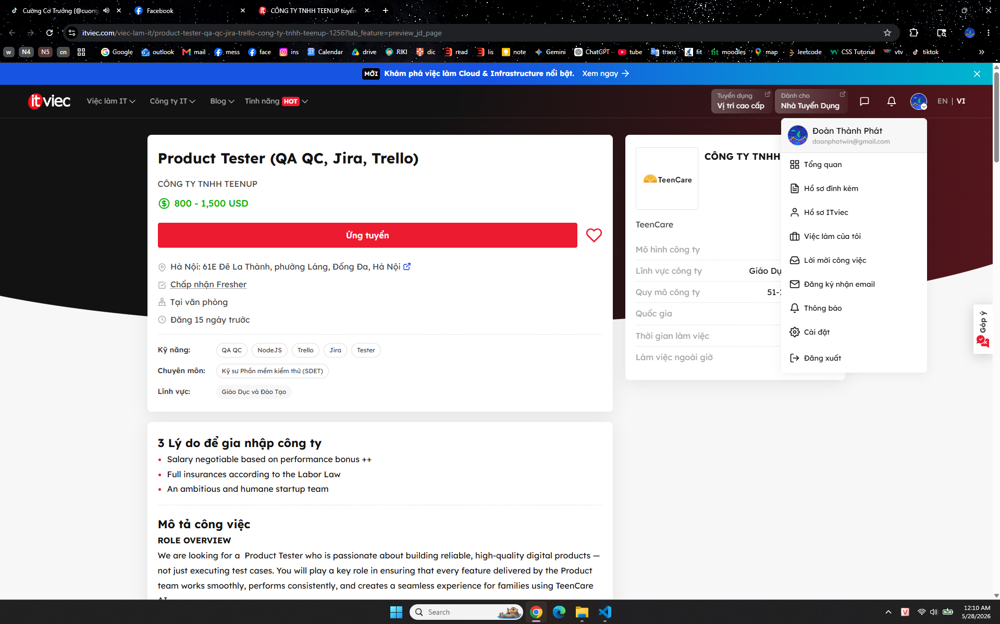
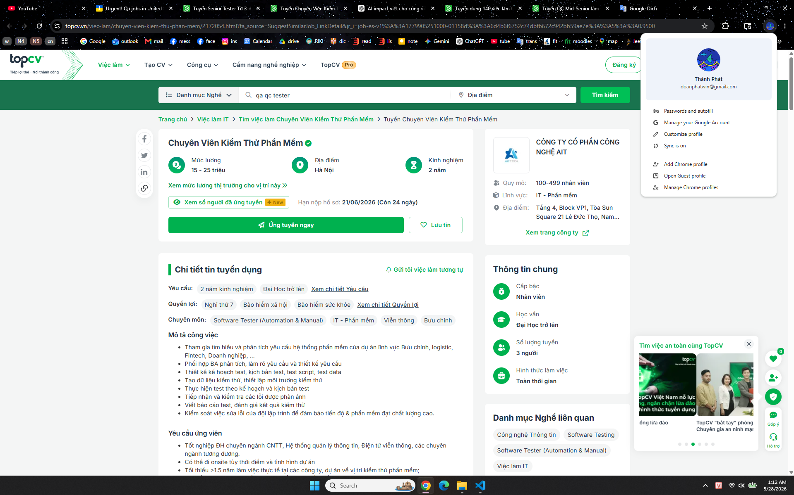
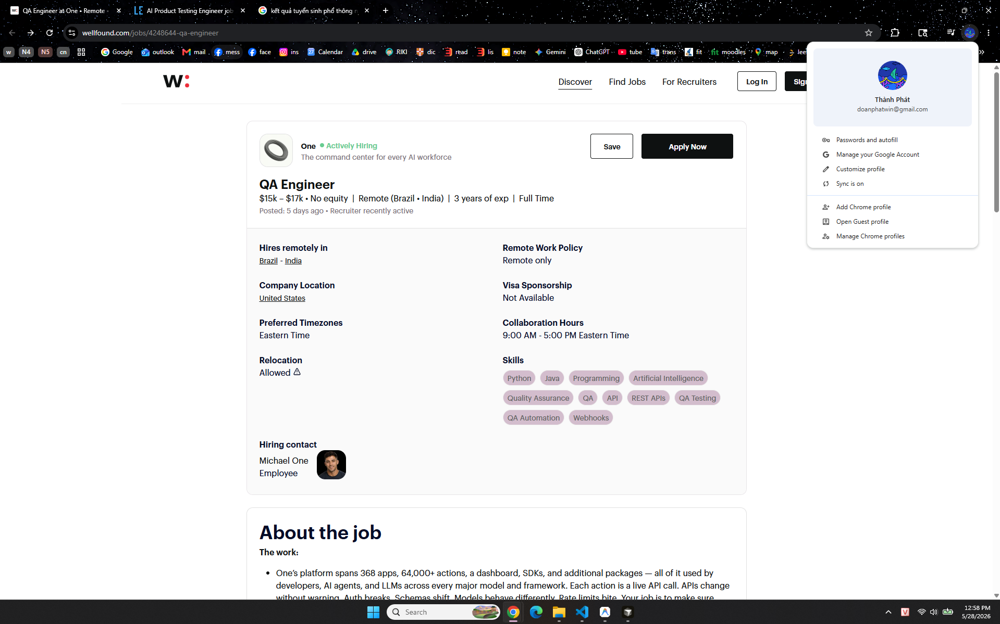
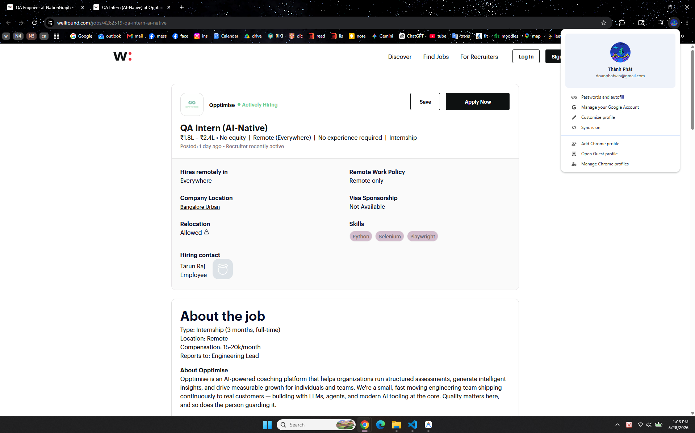

# Requirement 1 – QA/QC Job Market 2026+

## 1. Overview

This section presents an analysis of the QA/QC job market in 2026+.  
The research focuses on recent QA/QC job postings, required skills, salary information, and the impact of AI on software testing roles.

According to the homework requirement, this section includes:

- 10 QA/QC job postings published within 60 days of the submission date.
- At least 3 positions requiring AI, LLM, or automation-AI skills.
- For each job posting:
  - Job link
  - Dated screenshot
  - Job description
  - Required skills
  - Salary
  - AI Impact Analysis
- Screenshots must show the account name in the corner as anti-cheat evidence.

---

## 2. Job Posting List

| No. | Company | Position | Posted Date | Salary | AI/LLM/Automation-AI Required |
|---|---|---|---|---|---|
| 1 | Nakivo | Automation QA Engineer | 21/05/2026 | 1,100 - 1,500 USD | Yes |
| 2 |  |  |  |  | Yes / No |
| 3 |  |  |  |  | Yes / No |
| 4 |  |  |  |  | Yes / No |
| 5 |  |  |  |  | Yes / No |
| 6 |  |  |  |  | Yes / No |
| 7 |  |  |  |  | Yes / No |
| 8 |  |  |  |  | Yes / No |
| 9 |  |  |  |  | Yes / No |
| 10 |  |  |  |  | Yes / No |

---

# Job Posting 01

## Basic Information

| Item | Details |
|---|---|
| Company | Nakivo |
| Position | Automation QA Engineer |
| Location | TGI Building, 208 Nguyen Trai, TP Hồ Chí Minh |
| Posted Date | 21/05/2026 |
| Salary | 1,100 - 1,500 USD |
| Job Link | https://itviec.com/viec-lam-it/automation-qa-engineer-qa-qc-tester-automation-test-nakivo-0115?gclid=CjwKCAjwidXQBhAZEiwA4egw6Ij2csDq0AD0xcZ95nCy2n0crz9_6yvTyvJKDduJtHUVeXZvP6rFNRoCpzoQAvD_BwE&utm_campaign=gpmax_hcm&utm_content=ad1&utm_medium=cpc&utm_source=google&utm_term=&lab_feature=preview_jd_page |

## Screenshot Evidence

## Job Description

RESPONSIBILITIES
- Collaborate with software developers and quality assurance teams to
understand project requirements and functionality
- Design, develop, and execute automated test scripts using industry-standard
automation tools
- Identify and report software defects in a clear and concise manner
- Work closely with cross-functional teams to analyze test results and
troubleshoot issues
- Contribute to the continuous improvement of the automation testing process
- Design, create, and manage automation test cases using AI technologies

## Required Skills
- Bachelor degree in Computer Science, Engineering, or related field
- Strong understanding of software development life cycle and testing
- methodologies
- 3 years of experience or more in relevant positions
- Proficient in at least one programming language (e.g., Java, Python, C#)
- Familiarity with automation testing tools such as Selenium, Appium, or similar
- Basic knowledge of version control systems (e.g., Git)
- Excellent problem-solving and analytical skills
- Strong communication and collaboration skills
- **Experience with AI-automation testing (e.g., Copilot, Cursor, Perplexity)**

You will be a strong candidate if you have

- Experience in working with test automation frameworks (e.g. JUnit, TestNG,
- Selenium WebDriver)
- Understanding of web technologies (HTML, CSS, JavaScript)
- Knowledge of API testing and tools (e.g., Postman, RestAssured)
- Experience with performance testing concepts and tools
- Experience with VMware, Hyper-V, Aws and Cloud storage
- Hands-on experience working with AI technologies

## AI Impact Analysis

AI has a direct impact on this QA/QC role because the job requires experience with AI-automation testing tools such as Copilot, Cursor, and Perplexity. This shows that QA engineers are expected to use AI to create test cases, speed up automation testing, and improve software quality.

---

# Job Posting 02

## Basic Information

| Item | Details |
|---|---|
| Company | Evolus/PlanV |
| Position | QC Engineer (Tester/QA QC) for Web |
| Location | 2nd floor, PHL Building, 109 Cong Hoa Street, Bảy Hiền, TP Hồ Chí Minh |
| Posted Date | 18/05/2026 |
| Salary | Up to 1500$ |
| Job Link | https://itviec.com/viec-lam-it/qc-engineer-tester-qa-qc-for-web-up-to-1500-evolus-planv-5225?gclid=CjwKCAjwrNrQBhBjEiwAoR4VO_bgx8QS07GnWIhDbN4_ruLYpEiOHyomK67HynMVyAoBYT0w-GkV8RoCSzIQAvD_BwE&utm_campaign=gpmax_hcm&utm_content=ad1&utm_medium=cpc&utm_source=google&utm_term=&lab_feature=preview_jd_page |

## Screenshot Evidence

## Job Description

Participate in the development of exciting new server and client applications for sports team management that already have millions of users in the USA, UK and the EC. Work closely with top athletes and coaches from NBC Sports to create the next generation of applications to make sports teams perform far better. While NBC will help you better understand the details of competitive sports, our highly experienced engineering team will help you significantly improve your ability to develop world class enterprise applications. Your job will be to "own" a piece of the application, the size will depend on your experience. You will work closely with our USA based customer, our UI design, our senior technical team, QA, and the deployment team to do your job. We work at "Start-up Company" speed and you will learn and grow your skills very quickly.

## Required Skills

Technical requirements:
- Firm knowledge in writing and executing test cases and test scripts
- Minimum 2 years of experience in manual testing for enterprise web-based system
- Good knowledge in Software Testing process, testing activities, testing types.
- Experience in analyzing requirements, developing and executing test cases.
- Strong problem-solving and analytical skills, with the ability to identify defects
- Working with Issue Tracking Systems, such as JIRA is required
- Strong English reading and writing skills
- Cross-browser, cross-platform and responsive web testing experience is a plus
- Performance or security testing is a plus
- Having experience working with e-commerce systems is an advantage.

Behavioral requirements:
- Carefulness and logic thinking
- Able to work under pressure, hardworking, proactive, and responsible
- Good communication and teamwork skills
- Enjoy working in a fast paced team environment
- Enjoy learning new technological approaches, and quickly applying these to your work
- Love to exceed customer expectations
- Self-motivated and self directed.

## AI Impact Analysis

Write 1–2 sentences here.

---

# Job Posting 03

## Basic Information

| Item | Details |
|---|---|
| Company | TNHH TEENUP |
| Position | Product Tester |
| Location | Hà Nội: 61E Đê La Thành, phường Láng, Đống Đa, Hà Nội |
| Posted Date | 13/05/2026 |
| Salary | 800 - 1,500 USD |
| Job Link | https://itviec.com/viec-lam-it/product-tester-qa-qc-jira-trello-cong-ty-tnhh-teenup-1256?lab_feature=preview_jd_page |

## Screenshot Evidence

## Job Description

We are looking for a  Product Tester who is passionate about building reliable, high-quality digital products — not just executing test cases. You will play a key role in ensuring that every feature delivered by the Product team works smoothly, performs consistently, and creates a seamless experience for families using TeenCare AI.

You will work closely with Product Managers, Designers, and Engineers throughout the product lifecycle — from understanding requirements and designing test scenarios to validating new releases before they reach real users.

If you enjoy finding edge cases, thinking critically about user experience, and improving product quality through structured testing and collaboration, this role is for you.

## Required Skills

Technical

- 1–2 years of experience in software testing or QA roles (project experience is acceptable for junior candidates)
- Strong attention to detail and structured problem-solving skills
- Ability to write clear bug reports and testing documentation
- Familiarity with web/mobile application testing
- Basic understanding of APIs, databases, and product workflows

Mindset

- Curious and proactive — you naturally explore edge cases and ask thoughtful questions
- Strong ownership — you follow issues through until resolution
- Collaborative by default — you communicate clearly with Product and Engineering teams
- User-focused — you care deeply about delivering smooth and reliable user experiences
- Comfortable working in a fast-moving startup environment with evolving priorities

## AI Impact Analysis

AI is directly relevant to this role because the product being tested is TeenCare AI, so the tester must verify not only normal web/mobile functions but also AI-related user experiences, edge cases, and reliability. AI tools can also support the tester in generating test scenarios, writing clearer bug reports, and improving test coverage, but human judgment is still essential to evaluate product quality from the user’s perspective.

---

# Job Posting 04

## Basic Information

| Item | Details |
|---|---|
| Company | AMETEK |
| Position | Senior Quality Engineer |
| Location | Bridgeport, CT, US, 06610-0156 |
| Posted Date | 21/05/2026 |
| Salary | $90,000 - $115,000 a year |
| Job Link | https://jobs.ametek.com/job/Bridgeport-Senior-Quality-Engineer-CT-06610-0156/1313979600/?source=Indeed.com&sourceType=PREMIUM_POST_SITE |

## Screenshot Evidence

## Job Description

As the Senior Quality Engineer you will be responsible for meeting customer requirements for the manufacturing of surgical instruments and implants or instrument delivery systems from receiving raw material to the shipping of finished goods. You will support and enforce the development of internal systems and procedures to meet ISO standards and FDA quality system regulations. You will develop and implement inspection/validation techniques necessary to verify products meet requirements at earliest point in the production process. You will specify and implement new inspection equipment and instructs others inits proper use. You will support and implement systems in the areas of SPC, advanced quality, and design/development.

## Required Skills

Education
- Preferred Bachelors Degree in Engineering or related field

Experience
- 3-5 years experience with tight tolerance measurement systems in machining applications, blueprint reading, GD&T, and a working knowledge of short-run process control methods, DOE, ISO standards, and FDA quality system regulations.

KSA's

- Strong written and verbal communication skills.
- Excellent customer teaming and interpersonal aptitude.
- Strong computer skills including excellent Word, Excel, PowerPoint, and Minitab skills.
- Excellent organizational skills and attention to detail required.
- Demonstrates problem solving skills, applying effective, data-driven, mistake-proofing concepts.
- Strong project management skills required.
- Excellent follow-up skills required.
- Individual is able to work with limited supervision and actively participate in a team-oriented, continuous improvement, manufacturing environment.

Physical Demands

- Frequent sitting, occasional standing, occasional walking. Use hand/fingers to grasp/pinch/grip Occasional climbing (stairs/ladders) or balancing. Occasional stoop, kneel, crouch, or crawl. Occasional operating of machineryand/or hand power tools.

## AI Impact Analysis

AI can help this job by checking quality data faster, finding defect patterns, and supporting inspection reports. However, because this job is related to medical products and FDA/ISO standards, engineers still need to make the final decisions to make sure the products are safe and correct.

---

# Job Posting 05

## Basic Information

| Item | Details |
|---|---|
| Company | AIT Corp |
| Position | Software Testing Specialist |
| Location | Tầng 4, Block VP1, Tòa Sun Square 21 Lê Đức Thọ, Nam Từ Liêm, Hà Nội |
| Posted Date | 27/05/2026 |
| Salary | 15.000.000 - 25.000.000 VND |
| Job Link | https://www.topcv.vn/viec-lam/chuyen-vien-kiem-thu-phan-mem/2172054.html?ta_source=SuggestSimilarJob_LinkDetail&jr_i=job-es-v1%3A%3A1779905251000-01158d%3A%3A6d4b6f6752c74dbfb672c942bb59ae7e%3A%3A5%3A%3A0.9500 |

## Screenshot Evidence

## Job Description

- Participate in understanding and analyzing software system requirements for projects in fields such as postal services, logistics, fintech, enterprise systems, etc.
- Coordinate with Business Analysts to analyze, clarify, and design requirements.
- Design test plans, test scenarios, test scripts, and test data.
- Create test data and set up the testing environment.
- Execute tests according to the test plan and test scenarios.
- Receive and verify reported bugs.
- Write test reports and evaluate testing results.
- Monitor the bug-fixing process of the development team to ensure progress and high software quality.

## Required Skills

- Graduated from university with a major in Information Technology, Management Information Systems, Electronics and Telecommunications, or related fields.
- Able to work onsite depending on the project schedule and situation.
- At least 1.5 years of practical working experience in software testing roles at companies or projects.
- Strong knowledge of software testing processes, testing methods, testing tools, and testing techniques.
- Experience in testing web and mobile applications.
- Knowledge of SQL is preferred.
- Experience in API Testing in real projects is preferred.
- Candidates who can work independently and act as key members of a project are preferred.

## AI Impact Analysis

AI can help this software testing job by creating test cases, preparing test data, analyzing bug reports, and supporting API or web/app testing faster. However, testers still need to understand the project requirements and check the final results carefully to make sure the software works correctly.

---

# Job Posting 06

## Basic Information

| Item | Details |
|---|---|
| Company | GenieTeach |
| Position | Quality Assurance Automation Engineer |
| Location | Tòa nhà Central Point, 219 Trung Kính, Yên Hòa, Hà Nội |
| Posted Date | 28/05/2026 |
| Salary | 15.000.000 - 30.000.000 VNĐ |
| Job Link | https://www.topcv.vn/viec-lam/automation-manual-tester-du-an-ai-giao-duc-nghi-thu-7-chu-nhat-3-nam-kinh-nghiem-thu-nhap-15-30-trieu-tai-ha-noi/2164219.html |

## Screenshot Evidence

## Job Description

GenieTeach is a pioneering EdTech project that applies AI to optimize modern education models. At GenieTeach, we do not only build software; we create a future where artificial intelligence becomes a powerful assistant for both teachers and students through four main pillars:

- AI Teaching Assistant: Automates management and administrative tasks for teachers.
- AI Tutor: Provides personalized learning support anytime, anywhere.
- AI Assessment: Offers tools for testing and evaluating learning ability.
- AI Personalization: Analyzes data to create optimized learning paths for each student.

Join us to help change the future of education through the power of technology.

Your Responsibilities

As an Automation/Manual Tester, you will be responsible for protecting product quality and ensuring that every GenieTeach feature works smoothly before reaching users.

1. Manual Testing
Create test plans and design detailed test cases based on requirements from the Product/BA team.
Perform manual testing, including Functional Testing, UI/UX Testing, and Regression Testing, to detect and control system defects.
Work closely with the Development team to track, analyze, and resolve issues thoroughly.
2. Automation Testing
Build and maintain automation test scripts for core features.
Execute and analyze automation test results to ensure system stability during upgrades and releases.
3. Documentation
Prepare user manuals and FAQs for users.
Apply AI tools to support test case writing, test data generation, and documentation drafting more efficiently.
4. Customer Support
Support training and guide end users, including teachers and students, to use the system effectively.
Receive user feedback directly, provide technical support, and ensure customer satisfaction during system operation.

## Required Skills

Experience
- At least 3 years of experience in software testing, including Manual Testing and Automation Testing.
- Experience in education-related projects is preferred but not required.

Skills
- Testing Skills: Manual + Automation
- Proficient in Playwright is preferred, or Selenium.
- Experienced in automation testing using Playwright API, REST Assured, Postman/Newman, or K6.
- Able to design and implement E2E, Regression, and Smoke Automation tests using a modern POM model.
- Good understanding of HTTP, REST, status codes, JSON/XML, DOM, selectors, async events, and network mocking/stubbing.
- Able to write basic SQL to validate data.
- Able to debug effectively using browser DevTools, network tracing, and logs.

**AI Skills**
- **Proficient in using AI/LLM tools to automatically generate test cases, test scenarios, and test data.**
- **Able to use AI/LLM tools to analyze root causes from logs, stack traces, and error patterns.**
- **Experience with related tools or technologies such as Katalon AI and Playwright + AI IDE.**

Teamwork Skills
- Practical experience working in Agile/Scrum teams.
- Understanding of backlog refinement, estimation, and sprint ceremonies.
- Able to work closely with BA, Dev, and PO to refine requirements and ensure quality early through Shift Left Testing.

Plus Points
- Experience in building an internal QA Framework or standard testing guidelines.
- ISTQB Foundation certification is a plus but not required.
- Understanding of UI/UX Design Systems.

Soft Skills and Attitude
- Able to work independently.
- Careful and flexible in handling situations.
- Energetic, cheerful, proactive, and responsible at work.
- Willing to learn and improve.
- Able to adapt easily to a dynamic, positive, and friendly working environment.
- Able to work under pressure.

## AI Impact Analysis

AI has a strong impact on this role because the project is an AI-powered EdTech product, and testers are required to use AI/LLM tools to generate test cases, test data, and analyze errors. However, human testers are still important to check real user experience, verify results, and make sure the system works correctly for teachers and students.

---

# Job Posting 07

## Basic Information

| Item | Details |
|---|---|
| Company | Heartflow |
| Position | Staff Test Engineer |
| Location | San Francisco, CA |
| Posted Date | 12/05/2026 |
| Salary | $190,000 - $250,000 |
| Job Link | https://www.ziprecruiter.com/c/Heartflow/Job/Staff-Test-Engineer/-in-San-Francisco%2CCA?jid=1446df794ba9ce9d&utm_source=chatgpt.com |

## Screenshot Evidence

## Job Description

The Staff Test Engineer is a senior individual contributor and technical leader on the Test Engineering team. This role sets the technical direction for end-to-end automated testing, post-deployment verification, and tool validation across our regulated SaMD products, partnering closely with the Director of Engineering in Test and engineering leadership. The Staff Test Engineer drives our AI-first test automation strategy - designing how AI-assisted authoring, self-healing automation, and LLM-driven triage are applied at scale - while ensuring all activities meet the rigor of a medical device QMS. The ideal candidate brings deep technical expertise in modern automation frameworks (Selenium and Playwright), a strong track record shipping regulated SaMD products, and the ability to influence engineers and leaders across the organization.

## Required Skills

- 8-12 years of experience in software test engineering, SDET, or quality engineering roles, with a strong record as a hands-on technical leader.
- Required: Substantial experience testing Software as a Medical Device (SaMD) or other regulated medical device software, including ownership of test strategy on shipped products.
- Required: Deep working knowledge of medical device QMS practices and applicable standards (e.g., ISO 13485, IEC 62304, ISO 14971, 21 CFR Part 820), including test documentation, traceability, tool validation, and audit support.
- Required: Expert-level proficiency with Selenium / WebDriver and Playwright, including framework architecture, large-scale stability and flake reduction, and parallel execution at scale.
- Track record designing, scaling, and maintaining E2E automation frameworks covering complete workflows and complex system integrations.
- Experience setting test plan, protocol, and report standards in a regulated environment, with rigorous traceability across requirements, test cases, and evidence.
- **Demonstrated leadership in adopting AI-assisted testing tools and techniques (e.g., AI-augmented authoring, self-healing automation, LLM-driven test generation or triage).**
- Strong programming skills in at least one mainstream language used for automation (e.g., TypeScript/JavaScript, Python, Java, or C#); able to set coding standards for the test organization.
- Deep experience with API and contract testing approaches (REST Assured, Postman, Karate, Pact, or equivalent).
- Strong experience integrating automated tests into CI/CD pipelines and working with cloud environments such as AWS.
- Excellent analytical and debugging skills across distributed systems; able to lead root-cause investigations on the most complex failures.
- Excellent written and verbal communication skills; able to influence engineers, leaders, and cross-functional partners.
- Bachelor's degree in Computer Science, Engineering, or a related field, or equivalent practical experience.

Desired
- Experience leading RA/QA partnerships during regulatory audits and inspections.
- Experience defining test strategy for ML/AI systems, clinical validation workflows, or medical imaging products.
- Experience validating complex visualizations (qualitative and quantitative) such as 3D models, overlays, and measurement views.
- Experience designing and managing diverse test datasets (synthetic, anonymized, adversarial).
- Experience defining non-functional / performance testing strategy with tools such as k6, Locust, JMeter, or Gatling.
- Experience with data-pipeline testing and microservices architectures at scale.
- Demonstrated ability to define, own, and evolve actionable quality metrics.

## AI Impact Analysis

AI has a very strong impact on this role because the company directly requires an AI-first testing strategy, including AI-assisted test writing, self-healing automation, generative test design, and LLM-driven bug triage. However, because this is a regulated medical software product, testers still need strong human judgment to ensure test evidence, documentation, and quality processes meet medical device standards.

---

# Job Posting 08

## Basic Information

| Item | Details |
|---|---|
| Company | One |
| Position | QA Engineer |
| Location | Remote ( Brazil • India ) |
| Posted Date | 23/05/2026 |
| Salary | $15k – $17k |
| Job Link | https://wellfound.com/jobs/4248644-qa-engineer |

## Screenshot Evidence

## Job Description

The work:
One’s platform spans 368 apps, 64,000+ actions, a dashboard, SDKs, and additional packages — all of it used by developers, AI agents, and LLMs across every major model and framework. Each action is a live API call. APIs change without warning. Auth breaks. Schemas shift. Models behave differently. Rate limits bite. Your job is to make sure none of that reaches our users.

You will:

- Own end-to-end test coverage for actions across 368+ platforms — from HubSpot and Stripe to Shopify, Twilio, and everything between.
- Write and maintain end-to-end tests for our core system — auth flows, action execution, tool resolution, and the full request lifecycle.
- Test our dashboard app and every additional package and product we own — end to end, across environments.
- Run tests against different LLMs and AI models (GPT, Claude, Gemini, open-source models, and others) to ensure One works reliably regardless of what’s calling it.
- Test integrations with agent frameworks and AI tooling that uses One as its action layer.
- Build and run load tests to validate system behavior under real traffic conditions and catch performance regressions before they hit production.
- Build and maintain automated test suites that run against live APIs and catch regressions before they ship.
- Triage failures fast — identify whether it’s a schema change, auth issue, rate limit, model behavior, or a bug on our side.
- Work directly with the integrations and platform teams to write tests as features are built, not after.
- Monitor production action health and set up alerts that fire before customers notice.
- Document failure patterns, maintain runbooks, and make on-call straightforward for the next person.

## Required Skills

You should have:

- 3+ years in QA, SDET, or reliability engineering.
- Deep technical understanding of how web systems work — HTTP, auth, APIs, distributed systems, and failure modes.
- Strong experience writing automated tests against REST APIs — not just UI testing.
- **Experience testing LLM-powered products or AI tooling — you understand how model outputs and behavior add variability to test design.**
- Hands-on experience with load and performance testing tools (k6, Locust, Artillery, or similar).
- The ability to write end-to-end tests that cover full system flows, not just isolated units.
- Comfort with JavaScript or Python for test tooling and scripting.
- Experience with test frameworks (Jest, Playwright, Pytest, or similar).
- **Hands-on experience with Claude Code, Codex, or a similar AI agent harness. This is not optional.**
- Clear written communication in English — we work async across time zones.
- An instinct for what can go wrong, not just what should go right.

Bonus:

- You’ve worked at a platform or integration company where API reliability is core.
- You’ve built monitoring pipelines or synthetic transaction tests in production.
-  understand OAuth flows well enough to debug a 401 at 2am.
- You’ve tested across multiple LLM providers and know how to design tests that are model-agnostic.
- You’ve contributed to open source test tooling.

## AI Impact Analysis

AI has a very strong impact on this role because the QA Engineer must test LLM-powered products, AI agents, and different AI models such as GPT, Claude, and Gemini. AI also changes the testing process because testers need to handle unpredictable model behavior, test AI agent tools, and use AI tools like Claude Code or Codex as part of their work.

---

# Job Posting 09

## Basic Information

| Item | Details |
|---|---|
| Company | Opptimise |
| Position | QA Intern (AI-Native) |
| Location | Remote |
| Posted Date | 27/05/2026 |
| Salary | 15-20k/month |
| Job Link | https://wellfound.com/jobs/4262519-qa-intern-ai-native |

## Screenshot Evidence

## Job Description

About the Role
We're hiring a QA Intern to own quality across our AI-driven web app end-to-end. You'll work shoulder-to-shoulder with engineers using Claude Code, Cursor, and other AI dev tools — testing not just deterministic flows but also agent behavior, LLM outputs, and AI-generated insights. You'll spend your time breaking things on purpose: running exploratory tests, automating the flows that matter, and writing backend tests with AI copilots in your toolkit.

This is a hands-on role at the intersection of QA and AI. By the end of three months you should be the person who knows the product's edges — and its agents' failure modes — better than anyone.

What You'll Do

- Manual & exploratory testing — Test new features across assessments, invitations, insights, organizations, and user flows. File clear, reproducible bugs and verify fixes before release.
- End-to-end automation — Write and maintain Playwright tests for critical user journeys. Use AI coding assistants to accelerate test authoring.
- Backend test writing — Write pytest / Django unit and integration tests for service-layer logic, permission gates, and business rules.
- AI agent & LLM evals — Help design and run evaluations for our AI agents and LLM-generated outputs — measuring accuracy, consistency, and regression across prompt and model changes.

- Release verification — Own pre-deploy smoke testing. Sign off (or block) releases based on real evidence.

- Bug triage — Reproduce reported issues, narrow root causes, and route to the right engineer with enough context to fix in one pass.

- Test documentation — Keep test plans, regression checklists, and eval datasets up to date.

Our Stack (what you'll be testing against)
- Backend: Django, Python, PostgreSQL
- Frontend: Server-rendered Django templates + HTMX + Alpine.js + Tailwind CSS
- AI: LLM-powered agents, prompt pipelines, eval harnesses
- E2E: Playwright
- Backend tests: pytest, Django test framework
- AI dev tools: Claude Code, Cursor, Copilot — used daily across the team
- Infra: AWS, GitHub Actions CI/CD

## Required Skills

Must-have

- Currently pursuing or recently completed a degree in CS, Engineering, or related field
- Solid Python fundamentals — you can read Django code and write basic tests
- Familiarity with at least one browser automation tool (Playwright, Selenium, Cypress)
- Genuine curiosity about LLMs, agents, and how to test non-deterministic systems
- Sharp attention to detail — you notice the off-by-one, the wrong empty state, the hallucinated field
- Clear written communication — bug reports are a writing job
- Comfort working remotely with async-first communication

Nice-to-have

- Hands-on experience with AI coding tools (Claude Code, Cursor, Copilot) or LLM APIs (Anthropic, OpenAI)
- Exposure to evals, prompt testing, or any form of LLM output validation
- Experience with HTMX or server-rendered frontends
- Familiarity with Git, GitHub PR workflows, and CI pipelines
- Exposure to SQL and reading database state to verify behavior

## AI Impact Analysis

AI has a very strong impact on this role because the intern will test an AI-driven web app, including LLM outputs, AI agents, and AI-generated insights. AI tools such as Claude Code, Cursor, and Copilot also help testers write test cases, automate tests, and check AI behavior faster, but human testers are still needed to judge accuracy and user experience.

---

# Job Posting 10

## Basic Information

| Item | Details |
|---|---|
| Company |  |
| Position |  |
| Location |  |
| Posted Date |  |
| Salary |  |
| Job Type |  |
| Source Website |  |
| Job Link |  |

## Screenshot Evidence

> Note: The screenshot must show the posting date and my account name in the corner.

## Job Description

Write the job description here.

## Required Skills

- 
- 
- 
- 
- 

## AI / LLM / Automation-AI Requirement

| Skill Type | Required? | Evidence from Job Posting |
|---|---|---|
| Automation Testing | Yes / No |  |
| AI-related Testing | Yes / No |  |
| LLM-related Skill | Yes / No |  |
| AI-assisted Testing Tool | Yes / No |  |

## AI Impact Analysis

Write 1–2 sentences here.

---

# 3. Summary of AI / LLM / Automation-AI Positions

The following table summarizes the job postings that require AI, LLM, or automation-AI skills.

| No. | Company | Position | AI / LLM / Automation-AI Requirement |
|---|---|---|---|
| 1 |  |  |  |
| 2 |  |  |  |
| 3 |  |  |  |

---

# 4. QA/QC Job Market Analysis 2026+

## Common Required Skills

Based on the 10 job postings, the most common QA/QC skills are:

- Manual testing
- Test case design
- Bug reporting
- API testing
- SQL
- Automation testing
- Selenium, Cypress, Playwright, or similar tools
- CI/CD knowledge
- Agile/Scrum teamwork
- Communication and documentation skills

## Common AI / Automation-Related Skills

The common AI or automation-related skills found in the job postings are:

- AI-assisted test case generation
- Automation testing framework usage
- Test script generation
- LLM evaluation
- AI chatbot testing
- Prompt testing
- AI-based defect detection
- Regression test automation

## Salary Observation

Write your salary observation here.

Example:

The salary range varies depending on experience level, company size, and technical requirements. Jobs requiring automation testing, AI testing, or LLM-related skills usually offer higher salary ranges than purely manual QA/QC positions.

---

# 5. AI Impact on QA/QC Roles

AI is changing QA/QC roles by reducing repetitive manual work and increasing the demand for automation and analytical skills.  
AI tools can support test case generation, defect analysis, log analysis, and regression testing, but they cannot fully replace human testers because QA/QC still requires business understanding, exploratory testing, communication, and critical thinking.

In the 2026+ job market, QA/QC engineers are expected to understand both traditional testing techniques and AI-assisted testing tools. Therefore, testers who know automation, API testing, and AI-related testing will have more career opportunities.

---

# 6. Personal Reflection

After researching 10 QA/QC job postings, I learned that modern QA/QC roles require more than manual testing skills. Many companies now expect testers to understand automation tools, API testing, CI/CD, and sometimes AI-related testing. AI can help testers work faster, but it also requires testers to carefully review AI-generated outputs because AI may miss edge cases or misunderstand business requirements.

---

# 7. Evidence Checklist

| Requirement | Completed? | Note |
|---|---|---|
| 10 QA/QC job postings collected | Yes / No |  |
| All jobs published within 60 days | Yes / No |  |
| At least 3 jobs require AI/LLM/automation-AI skills | Yes / No |  |
| Each job has a link | Yes / No |  |
| Each job has a dated screenshot | Yes / No |  |
| Each screenshot shows account name | Yes / No |  |
| Each job has job description | Yes / No |  |
| Each job has required skills | Yes / No |  |
| Each job has salary information | Yes / No |  |
| Each job has AI Impact Analysis | Yes / No |  |

---

# 8. References

1. Job Posting 01:  
2. Job Posting 02:  
3. Job Posting 03:  
4. Job Posting 04:  
5. Job Posting 05:  
6. Job Posting 06:  
7. Job Posting 07:  
8. Job Posting 08:  
9. Job Posting 09:  
10. Job Posting 10:  