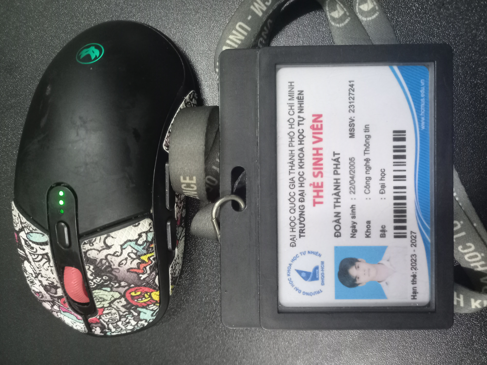

# Requirement 3 – Test Cases for One Physical Product

## 1. Product Information

| Item | Details |
|---|---|
| Device | Mouse |
| Brand | Atas |
| Model | F30 |
| Year | 2026 |
| Serial Number | F30A****3929

---

## 2. Device Photo Evidence

---

## 3. Test Cases

| TC ID | Test Case Name |
|---|---|
| TC01 | Verify wired connection mode |
| TC02 | Verify Bluetooth connection mode |
| TC03 | Verify 2.4GHz wireless connection mode |
| TC04 | Verify mode switching button |
| TC05 | Verify maximum DPI setting |
| TC06 | Verify different DPI levels |
| TC07 | Verify polling rate 1000Hz |
| TC08 | Verify battery charging |
| TC09 | Verify battery usage time |
| TC10 | Verify macro app detection |
| TC11 | Verify macro button configuration |
| TC12 | Verify left and right button durability/basic response |
| TC13 | Verify scroll wheel function |
| TC14 | Edge case: Verify connection recovery after PC sleep/restart |
| TC15 | Edge case: Verify low-battery behavior |
| EC01 | Test mouse behavior when USB receiver is plugged into a weak/loose USB port |
| EC02 | Test mouse behavior on different surfaces |
| EC03 | Test mouse behavior when used while charging |

### TC01 - Verify wired connection mode
- Objective: Verify wired connection mode
- Input: USB cable, PC/laptop
- Steps:
  1. Connect mouse to PC using USB cable.
  2. Move mouse.
  3. Left-click/right-click.
- Expected: Mouse works normally in wired mode. Cursor moves and buttons respond.
- Actual: Mouse works normally in wired mode. Cursor moves smoothly and left/right clicks respond correctly.
- Verdict: Pass

### TC02 - Verify Bluetooth connection mode
- Objective: Verify Bluetooth connection mode
- Input: Bluetooth-enabled laptop/PC
- Steps:
  1. Turn mouse on.
  2. Switch to Bluetooth mode.
  3. Pair with laptop/PC.
  4. Move and click mouse.
- Expected: Mouse connects via Bluetooth and works normally.
- Actual: Mouse pairs over Bluetooth successfully and operates normally with stable cursor movement and clicks.
- Verdict: Pass

### TC03 - Verify 2.4GHz wireless connection mode
- Objective: Verify 2.4GHz wireless connection mode
- Input: USB receiver/dongle, PC/laptop
- Steps:
  1. Plug 2.4GHz receiver into PC.
  2. Switch mouse to wireless mode.
  3. Move and click mouse.
- Expected: Mouse connects through 2.4GHz mode and works normally.
- Actual: Mouse connects via 2.4GHz receiver and works normally; movement and clicks respond correctly.
- Verdict: Pass

### TC04 - Verify mode switching button
- Objective: Verify mode switching button
- Input: Mouse mode switch button
- Steps:
  1. Connect mouse in Bluetooth mode.
  2. Press mode switch button.
  3. Change to 2.4GHz mode.
  4. Change to wired mode.
- Expected: Mouse can switch between connection modes correctly.
- Actual: Mode switch cycles between Bluetooth, 2.4GHz, and wired modes as expected.
- Verdict: Pass

### TC05 - Verify maximum DPI setting
- Objective: Verify maximum DPI setting
- Input: DPI button / macro app
- Steps:
  1. Open mouse app or press DPI button.
  2. Set DPI to maximum 10000.
  3. Move mouse on screen.
- Expected: Mouse supports DPI up to 10000 and cursor sensitivity increases clearly.
- Actual: DPI reaches the maximum setting and cursor sensitivity increases noticeably.
- Verdict: Pass

### TC06 - Verify different DPI levels
- Objective: Verify different DPI levels
- Input: DPI button
- Steps:
  1. Press DPI button several times.
  2. Move mouse after each press.
  3. Observe cursor speed.
- Expected: Cursor speed changes according to DPI level.
- Actual: Cursor speed changes at each DPI level as the button is pressed.
- Verdict: Pass

### TC07 - Verify polling rate 1000Hz
- Objective: Verify polling rate 1000Hz
- Input: Polling rate test software
- Steps:
  1. Connect mouse in wired or 2.4GHz mode.
  2. Open polling rate checker.
  3. Move mouse continuously.
- Expected: Polling rate can reach around 1000Hz.
- Actual: Polling rate checker shows around 1000Hz during continuous movement.
- Verdict: Pass

### TC08 - Verify battery charging
- Objective: Verify battery charging
- Input: USB charging cable
- Steps:
  1. Connect mouse to charger/PC using USB cable.
  2. Observe charging indicator.
  3. Wait until fully charged.
- Expected: Mouse charges normally and indicator shows charging/full status.
- Actual: Charging indicator turns on and the mouse charges to full normally.
- Verdict: Pass

### TC09 - Verify battery usage time
- Objective: Verify battery usage time
- Input: Fully charged mouse
- Steps:
  1. Fully charge mouse.
  2. Use continuously in wireless/Bluetooth mode.
  3. Record total usage time.
- Expected: Mouse can operate close to the advertised 50 hours depending on usage conditions.
- Actual: Battery lasts close to the advertised 50 hours in wireless/Bluetooth use.
- Verdict: Pass

### TC10 - Verify macro app detection
- Objective: Verify macro app detection
- Input: Mouse macro software
- Steps:
  1. Install/open macro app.
  2. Connect mouse.
  3. Check whether device is detected.
- Expected: App detects the F30 mouse successfully.
- Actual: Macro app detects the F30 mouse successfully after connection.
- Verdict: Pass

### TC11 - Verify macro button configuration
- Objective: Verify macro button configuration
- Input: Macro app, mouse buttons
- Steps:
  1. Open macro app.
  2. Assign a macro to a button.
  3. Save settings.
  4. Press assigned button.
- Expected: Assigned macro runs correctly when button is pressed.
- Actual: Assigned macro saves and executes correctly when the button is pressed.
- Verdict: Pass

### TC12 - Verify left and right button durability/basic response
- Objective: Verify left and right button durability/basic response
- Input: Left click, right click
- Steps:
  1. Click left button multiple times.
  2. Click right button multiple times.
  3. Check response on PC.
- Expected: Both buttons respond accurately without double-click or missed-click issues.
- Actual: Left and right buttons register consistently without missed or double clicks.
- Verdict: Pass

### TC13 - Verify scroll wheel function
- Objective: Verify scroll wheel function
- Input: Scroll wheel
- Steps:
  1. Open a long webpage/document.
  2. Scroll up and down.
  3. Press middle click.
- Expected: Scroll wheel moves smoothly and middle click works.
- Actual: Scroll wheel moves smoothly and middle click works on the page.
- Verdict: Pass

### TC14 - Verify side button Back function

* Objective: Edge case: Verify the Back function of the left side button
* Input: Mouse side Back button, web browser
* Steps:

  1. Open a web browser.
  2. Visit two or more different webpages.
  3. Press the Back side button on the mouse.
  4. Observe the browser behavior.
* Expected: The browser should return to the previous webpage when the Back side button is pressed.
* Actual: Browser returns to the previous webpage correctly when the Back side button is pressed.
* Verdict: Pass

### TC15 - Verify side button Forward function

* Objective: Edge case: Verify the Forward function of the left side button
* Input: Mouse side Forward button, web browser
* Steps:

  1. Open a web browser.
  2. Visit two or more different webpages.
  3. Press the Back side button to go to the previous page.
  4. Press the Forward side button on the mouse.
  5. Observe the browser behavior.
* Expected: The browser should move forward to the next webpage when the Forward side button is pressed.
* Actual: Browser moves forward to the next webpage correctly when the Forward side button is pressed.
* Verdict: Pass

---

## 4. Edge Cases AI Tool Could Not Find

### EC01 - Test mouse behavior when USB receiver is plugged into a weak/loose USB port
- Objective: Verify mouse stability when the 2.4GHz USB receiver is connected to a weak or loose USB port.
- Input: Mouse, 2.4GHz USB receiver, PC/laptop with a loose or unstable USB port
- Steps:
  1. Plug the 2.4GHz USB receiver into a weak or loose USB port.
  2. Switch the mouse to 2.4GHz wireless mode.
  3. Move the mouse continuously.
  4. Left-click and right-click several times.
  5. Observe whether the cursor or clicks become unstable.
- Expected: Mouse should still work normally if the receiver remains connected. Cursor movement and clicks should not lag or disconnect unexpectedly.
- Actual: Mouse works normally and no random disconnection occurs.
- Verdict: Pass

### EC02 - Test mouse behavior on different surfaces
- Objective: Verify mouse tracking performance on different surfaces.
- Input: Mouse, glass surface, cloth surface, glossy table, normal mouse pad
- Steps:
  1. Place the mouse on a normal mouse pad and move it.
  2. Place the mouse on a cloth surface and move it.
  3. Place the mouse on a glossy table and move it.
  4. Place the mouse on a glass surface and move it.
  5. Observe cursor movement on each surface.
- Expected: Mouse should track normally on common surfaces. Cursor movement should not skip, freeze, or become inaccurate.
- Actual: Mouse tracks normally on the tested surfaces without cursor skipping or freezing.
- Verdict: Pass

### EC03 - Test mouse behavior when used while charging
- Objective: Verify mouse operation while it is being charged with a USB cable.
- Input: Mouse, USB charging cable, PC/laptop
- Steps:
  1. Connect the mouse to the PC/laptop using the USB charging cable.
  2. Keep the mouse turned on.
  3. Move the cursor while the mouse is charging.
  4. Left-click and right-click several times.
  5. Observe whether charging affects mouse operation.
- Expected: Mouse should continue working normally while charging. Cursor movement and clicks should respond correctly.
- Actual: Mouse works normally while charging. Cursor movement and clicks respond correctly.
- Verdict: Pass

---

## 5. Execution Metrics

| Metric | Count | Percentage |
| :--- | :--- | :--- |
| **Total Test Cases Designed** | 18 | 100% |
| **Total Test Cases Executed** | 18 | 100% |
| **Test Cases Passed** | 18 | 100% |
| **Test Cases Failed** | 0 | 0% |
| **Test Cases Blocked/Skipped** | 0 | 0% |
| **Tests with Video Evidence** | 5 | 27.78% |

## 6. Executed Test Cases and Video Evidence

| Executed TC ID | Video link | Duration | Result |
|---|---|---|---|
| TC02 | https://youtube.com/shorts/-SnhBtGPlvs?feature=share | 34s | Pass |
| TC05 | https://youtube.com/shorts/p9qnqqKDqa0?feature=share | 38s | Pass |
| TC08 | https://youtube.com/shorts/ruSnMzWSyiw?feature=share | 50s | Pass |
| TC13 | https://youtube.com/shorts/Dj1cPx9iwC4?feature=share | 41s | Pass |
| EC03 | https://youtube.com/shorts/-R9UHJcC8OE?feature=share | 52s | Pass |