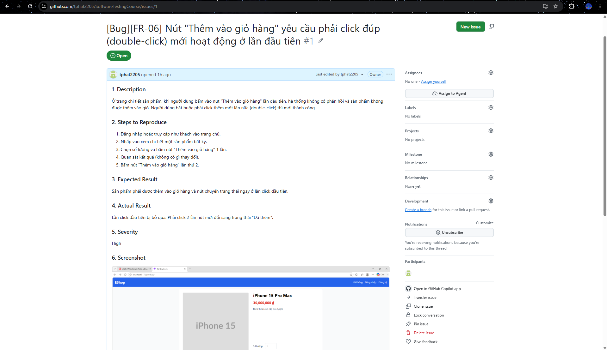
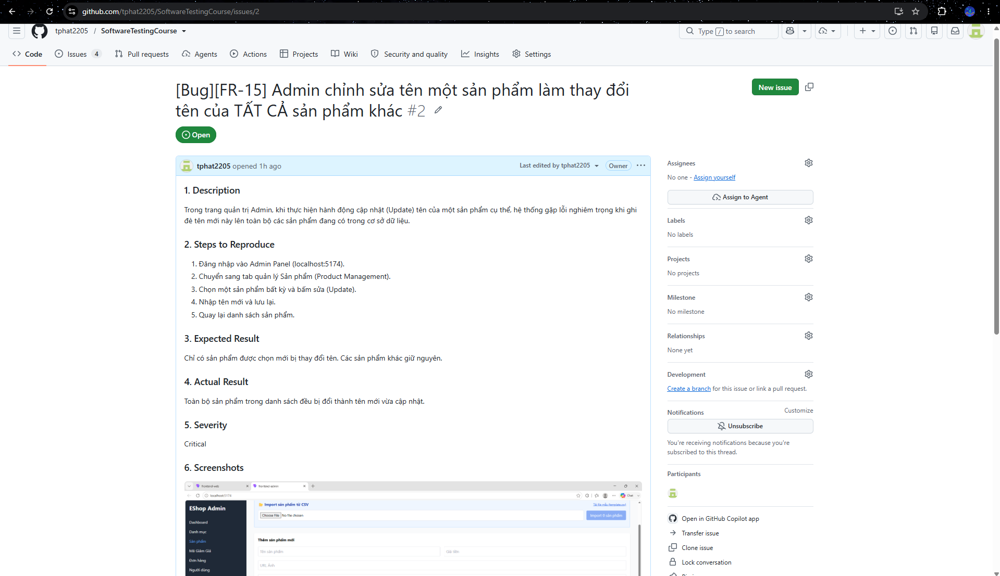
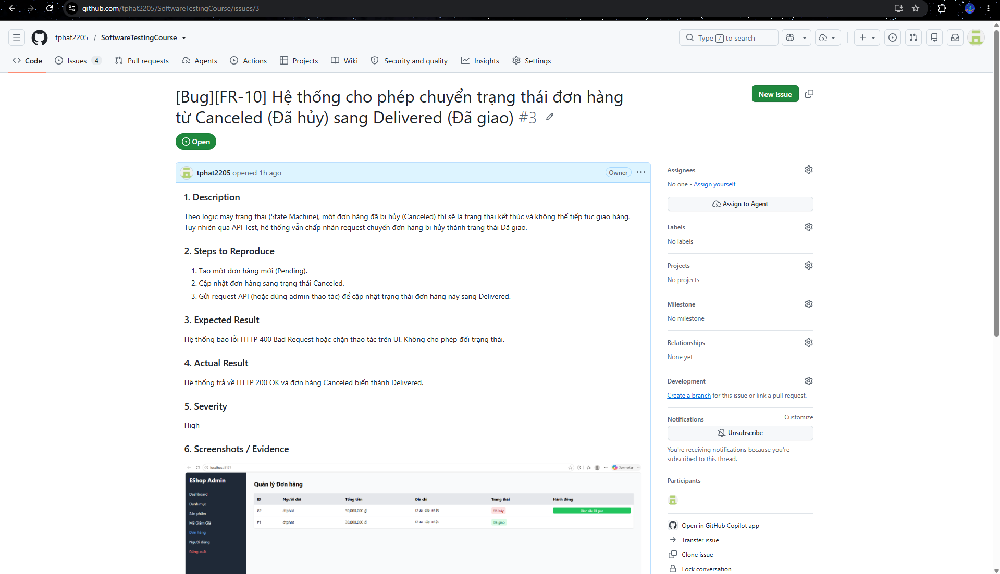
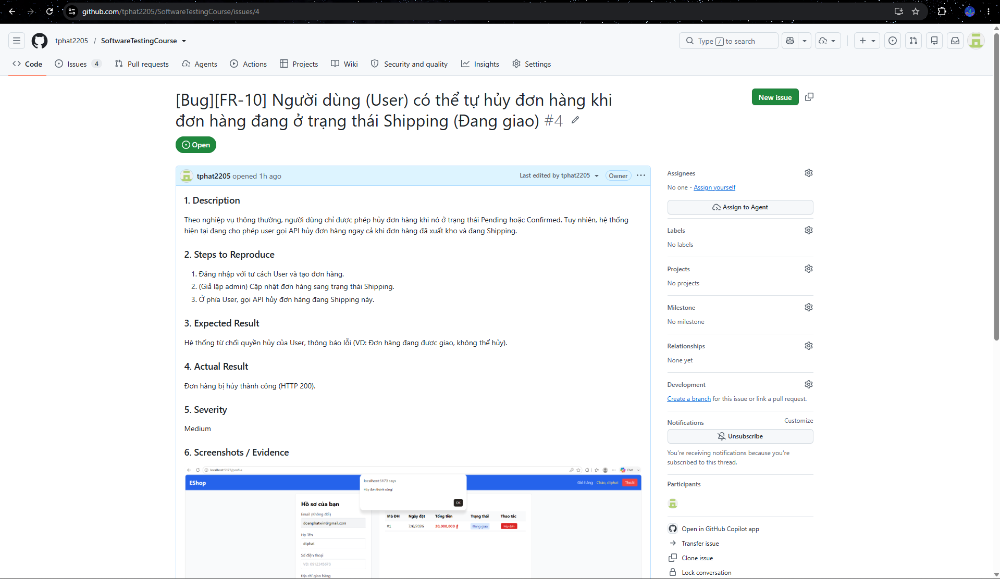

# Bug Report

This document details the bugs found during the automation testing phase across the selected features. All bugs have been logged to the project's GitHub Issues page with attached screenshot evidence.

## Summary

| #   | Bug                                     | Severity | Feature | GitHub Issue                                                |
| --- | --------------------------------------- | -------- | ------- | ----------------------------------------------------------- |
| 1   | Double-click required to add to cart    | High     | FR-06   | https://github.com/tphat2205/SoftwareTestingCourse/issues/1 |
| 2   | Admin update renames ALL products       | Critical | FR-15   | https://github.com/tphat2205/SoftwareTestingCourse/issues/2 |
| 3   | Canceled → Delivered transition allowed | High     | FR-10   | https://github.com/tphat2205/SoftwareTestingCourse/issues/3 |
| 4   | User can cancel shipping orders         | Medium   | FR-10   | https://github.com/tphat2205/SoftwareTestingCourse/issues/4 |

---

## Detailed Bug Reports

### Bug 1: [FR-06] Nút "Thêm vào giỏ hàng" yêu cầu phải click đúp (double-click) mới hoạt động ở lần đầu tiên

**1. Description**
Ở trang chi tiết sản phẩm, khi người dùng bấm vào nút "Thêm vào giỏ hàng" lần đầu tiên, hệ thống không có phản hồi và sản phẩm không được thêm vào giỏ. Người dùng bắt buộc phải click thêm một lần nữa (double-click) thì mới thành công.

**2. Steps to Reproduce**

1. Đăng nhập hoặc truy cập như khách vào trang chủ.
2. Nhấp vào xem chi tiết một sản phẩm bất kỳ.
3. Chọn số lượng và bấm nút "Thêm vào giỏ hàng" 1 lần.
4. Quan sát kết quả (không có gì thay đổi).
5. Bấm nút "Thêm vào giỏ hàng" lần thứ 2.

**3. Expected Result**
Sản phẩm phải được thêm vào giỏ hàng và nút chuyển trạng thái ngay ở lần click đầu tiên.

**4. Actual Result**
Lần click đầu tiên bị bỏ qua. Phải click 2 lần nút mới đổi sang trạng thái "Đã thêm".

**5. Severity:** High

**6. Screenshot**

---

### Bug 2: [FR-15] Admin chỉnh sửa tên một sản phẩm làm thay đổi tên của TẤT CẢ sản phẩm khác

**1. Description**
Trong trang quản trị Admin, khi thực hiện hành động cập nhật (Update) tên của một sản phẩm cụ thể, hệ thống gặp lỗi nghiêm trọng khi ghi đè tên mới này lên toàn bộ các sản phẩm đang có trong cơ sở dữ liệu.

**2. Steps to Reproduce**

1. Đăng nhập vào Admin Panel (localhost:5174).
2. Chuyển sang tab quản lý Sản phẩm (Product Management).
3. Chọn một sản phẩm bất kỳ và bấm sửa (Update).
4. Nhập tên mới và lưu lại.
5. Quay lại danh sách sản phẩm.

**3. Expected Result**
Chỉ có sản phẩm được chọn mới bị thay đổi tên. Các sản phẩm khác giữ nguyên.

**4. Actual Result**
Toàn bộ sản phẩm trong danh sách đều bị đổi thành tên mới vừa cập nhật.

**5. Severity:** Critical

**6. Screenshot**

---

### Bug 3: [FR-10] Hệ thống cho phép chuyển trạng thái đơn hàng từ Canceled (Đã hủy) sang Delivered (Đã giao)

**1. Description**
Theo logic máy trạng thái (State Machine), một đơn hàng đã bị hủy (Canceled) thì sẽ là trạng thái kết thúc và không thể tiếp tục giao hàng. Tuy nhiên qua API Test, hệ thống vẫn chấp nhận request chuyển đơn hàng bị hủy thành trạng thái Đã giao.

**2. Steps to Reproduce**

1. Tạo một đơn hàng mới (Pending).
2. Cập nhật đơn hàng sang trạng thái Canceled.
3. Gửi request API (hoặc dùng admin thao tác) để cập nhật trạng thái đơn hàng này sang Delivered.

**3. Expected Result**
Hệ thống báo lỗi HTTP 400 Bad Request hoặc chặn thao tác trên UI. Không cho phép đổi trạng thái.

**4. Actual Result**
Hệ thống trả về HTTP 200 OK và đơn hàng Canceled biến thành Delivered.

**5. Severity:** High

**6. Screenshot**

---

### Bug 4: [FR-10] Người dùng (User) có thể tự hủy đơn hàng khi đơn hàng đang ở trạng thái Shipping (Đang giao)

**1. Description**
Theo nghiệp vụ thông thường, người dùng chỉ được phép hủy đơn hàng khi nó ở trạng thái Pending hoặc Confirmed. Tuy nhiên, hệ thống hiện tại đang cho phép user gọi API hủy đơn hàng ngay cả khi đơn hàng đã xuất kho và đang Shipping.

**2. Steps to Reproduce**

1. Đăng nhập với tư cách User và tạo đơn hàng.
2. (Giả lập admin) Cập nhật đơn hàng sang trạng thái Shipping.
3. Ở phía User, gọi API hủy đơn hàng đang Shipping này.

**3. Expected Result**
Hệ thống từ chối quyền hủy của User, thông báo lỗi (VD: Đơn hàng đang được giao, không thể hủy).

**4. Actual Result**
Đơn hàng bị hủy thành công (HTTP 200).

**5. Severity:** Medium

**6. Screenshot**

