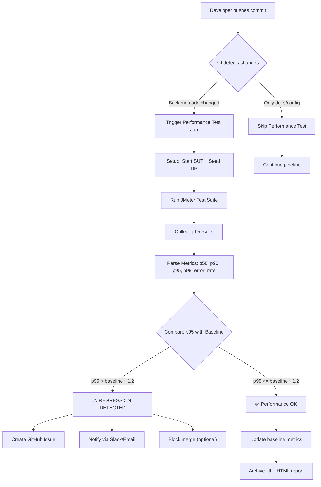

# Continuous Performance Testing Skill

## Mục đích
Hướng dẫn AI thiết kế **mô hình kiểm thử hiệu năng liên tục** (Continuous Performance Testing) tích hợp vào CI/CD pipeline, bao gồm:
1. Flowchart quy trình tự động
2. Cấu hình GitHub Actions chạy JMeter
3. Xác định p95 regression threshold
4. Phân tích trade-offs

## Mô hình tổng quan

```
Developer Push Code → CI Detect Changes → Decide: Run Perf Test?
    ↓ Yes                                    ↓ No
Run JMeter Suite                         Skip (minor change)
    ↓
Collect Metrics (.jtl)
    ↓
Compare p95 with Baseline
    ↓
p95 Regression Detected?
    ↓ Yes                    ↓ No
Flag & Notify Team       ✅ Pass → Update Baseline
```

## Flowchart (Mermaid)

Sử dụng template Mermaid sau cho báo cáo:



## GitHub Actions Template

```yaml
name: Performance Test

on:
  push:
    branches: [main, develop]
    paths:
      - 'backend/**'  # Chỉ chạy khi backend code thay đổi
  pull_request:
    branches: [main]
    paths:
      - 'backend/**'

jobs:
  performance-test:
    runs-on: ubuntu-latest
    timeout-minutes: 30
    
    steps:
      - name: Checkout code
        uses: actions/checkout@v4
      
      - name: Setup Node.js
        uses: actions/setup-node@v4
        with:
          node-version: '18'
      
      - name: Install dependencies & Start SUT
        run: |
          cd backend
          npm install
          node server.js &
          sleep 5  # Wait for server to start
      
      - name: Setup JMeter
        run: |
          wget https://archive.apache.org/dist/jmeter/binaries/apache-jmeter-5.6.3.tgz
          tar -xzf apache-jmeter-5.6.3.tgz
          export PATH=$PATH:$(pwd)/apache-jmeter-5.6.3/bin
      
      - name: Seed Test Data
        run: |
          python scripts/seed_data.py
      
      - name: Run Load Test
        run: |
          jmeter -n -t tests/load_test.jmx \
                 -l results/load_results.jtl \
                 -e -o results/load_html_report
      
      - name: Analyze Results
        run: |
          python scripts/analyze_jtl.py results/load_results.jtl \
                 --baseline baselines/load_baseline.json \
                 --threshold 1.2
      
      - name: Upload Results
        if: always()
        uses: actions/upload-artifact@v4
        with:
          name: performance-results
          path: results/
      
      - name: Check Regression
        run: |
          python scripts/check_regression.py \
                 --results results/load_results.jtl \
                 --baseline baselines/load_baseline.json \
                 --p95-threshold 1.2 \
                 --error-rate-threshold 0.01
```

## Xác định p95 Regression Threshold

### Phương pháp

1. **Baseline Run**: Chạy performance test trên version ổn định → ghi nhận p95
2. **Threshold = Baseline p95 × Factor**:
   - **Factor 1.1 (10%)**: Rất nghiêm ngặt — phù hợp production critical
   - **Factor 1.2 (20%)**: Cân bằng — recommended cho hầu hết dự án
   - **Factor 1.5 (50%)**: Lỏng — phù hợp early development

3. **Dynamic Baseline**: Cập nhật baseline sau mỗi lần test pass
   ```python
   # Sliding window baseline (last 5 successful runs)
   baseline_p95 = mean(last_5_p95_values)
   threshold = baseline_p95 * 1.2
   ```

### Regression Detection Logic

```python
def check_regression(current_p95, baseline_p95, factor=1.2):
    threshold = baseline_p95 * factor
    is_regression = current_p95 > threshold
    
    return {
        "current_p95": current_p95,
        "baseline_p95": baseline_p95,
        "threshold": threshold,
        "is_regression": is_regression,
        "deviation_pct": ((current_p95 - baseline_p95) / baseline_p95) * 100
    }
```

## Trade-offs Analysis

### Template bảng phân tích

| Yếu tố | Ưu điểm | Nhược điểm | Giải pháp giảm thiểu |
|---------|---------|------------|----------------------|
| **Cost (CI minutes)** | Phát hiện regression sớm | Tốn thời gian CI (5-15 min/run) | Chỉ chạy khi backend code thay đổi; dùng `paths` filter |
| **False Alarms** | Bắt được mọi regression | Noise từ CI hardware variance | Dùng threshold 20%; chạy 3 lần lấy median; loại outlier |
| **Coverage** | Test nhiều endpoints = an toàn hơn | Thời gian chạy tỷ lệ thuận với số endpoints | Ưu tiên critical endpoints; parallel jobs |
| **Baseline Drift** | Dynamic baseline bám sát thực tế | Regression tích lũy dần qua nhiều commit | Giữ absolute baseline ban đầu song song |
| **Environment Differences** | CI chạy trên hardware cố định | Khác biệt so với production | Document rõ CI spec; dùng relative metrics (% change) |

### Khi nào KHÔNG nên chạy perf test

- Chỉ thay đổi documentation, README, comments
- Chỉ thay đổi frontend (CSS, HTML) mà không ảnh hưởng API
- Hotfix khẩn cấp cần deploy ngay (có thể chạy post-deploy)

### Khi nào BẮT BUỘC chạy perf test

- Thay đổi database schema hoặc queries
- Thay đổi middleware (authentication, rate limiting)
- Thêm/sửa API endpoint
- Thay đổi dependencies (npm packages)
- Release candidate trước production deploy

## Kết luận

Continuous Performance Testing không chỉ là chạy test tự động — mà là xây dựng **văn hóa theo dõi hiệu năng** trong team. Bằng cách tích hợp vào CI/CD:

1. **Phát hiện sớm** regression trước khi lên production
2. **Giảm chi phí sửa lỗi** (10x-100x rẻ hơn so với fix ở production)
3. **Tạo confidence** khi deploy
4. **Tích lũy baseline data** theo thời gian → hiểu rõ xu hướng hiệu năng

Trade-off chính là **thời gian CI vs. rủi ro bỏ sót regression**. Với threshold 20% và path filter, pipeline thêm ~10 phút nhưng đảm bảo an toàn hiệu năng cho mỗi commit.
