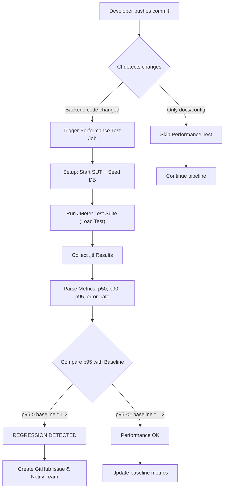

# HW05 - Performance Testing Report

**CSC13003 – Software Testing**

## Student Information

| Field | Value |
| :---- | :---- |
| **Student name:** | ĐOÀN THÀNH PHÁT |
| **Student ID:** | 23127241 |
| **Class / Cohort:** | 23KTPM2 |
| **Assignment ID:** | HW#05 |
| **Assignment date:** | August 18, 2026 |
| **Course:** | CSC13003 – Software Testing |
| **Instructor:** | Lâm Quang Vũ · Hồ Tuấn Thanh · Trương Phước Lộc |

---

## Mục lục

- [Task 1 — AI-assisted Test Design and Execution](#task-1--ai-assisted-test-design-and-execution)
  - [1.1 Endpoint Selection và Kịch bản Test](#11-endpoint-selection-và-kịch-bản-test)
  - [1.2 Human Review — Nhận xét lỗi của AI khi sinh Test Plan](#12-human-review--nhận-xét-lỗi-của-ai-khi-sinh-test-plan)
  - [1.3 Kết quả chạy Load Test](#13-kết-quả-chạy-load-test)
  - [1.4 Kết quả chạy Stress Test](#14-kết-quả-chạy-stress-test)
  - [1.5 Kết quả chạy Spike Test](#15-kết-quả-chạy-spike-test)
  - [1.6 Hardware Report](#16-hardware-report)
  - [1.7 Endurance Threshold](#17-endurance-threshold)
- [Task 2 — AI Analysis và Misinterpretation Hunt](#task-2--ai-analysis-và-misinterpretation-hunt)
  - [2.1 AI Performance Analysis](#21-ai-performance-analysis)
  - [2.2 Misinterpretation Hunt — Review and Correct](#22-misinterpretation-hunt--review-and-correct)
  - [2.3 Judge AI's Optimization Proposals](#23-judge-ais-optimization-proposals)
- [Task 3 — Continuous Performance Testing Proposal](#task-3--continuous-performance-testing-proposal)
- [AI Critique](#ai-critique)
- [Self-Assessment](#self-assessment)

---

## Task 1 — AI-assisted Test Design and Execution

### 1.1 Endpoint Selection và Kịch bản Test

Em sử dụng script `seed_data.js` (có hỗ trợ của AI) để tự động tạo dữ liệu vào SQLite và xuất ra 3 file CSV tương ứng cho 3 nhóm API:

| Nhóm API | Endpoint | Kịch bản | File CSV | File JMX | Report View |
|----------|----------|----------|----------|----------|-------------|
| **Read-heavy** | `GET /api/orders/:id` | **Load Test** | `orders_read.csv` | `23127241_Load_20260816.jmx` | Summary Report |
| **Auth-heavy** | `POST /api/reset-password` | **Stress Test** | `reset_password.csv` | `23127241_Stress_20260816.jmx` | Aggregate Report |
| **Transactional** | `PUT /api/orders/:id/cancel` | **Spike Test** | `cancel_order.csv` | `23127241_Spike_20260816.jmx` | View Results Tree |

**Lý do phân bổ kịch bản:**

- **Load Test cho Read-heavy:** Xem chi tiết đơn hàng là tác vụ đọc phổ biến nhất, rất thích hợp để kiểm tra khả năng đáp ứng lượng người dùng lớn ở trạng thái ổn định (steady state). Load Test với 50 users duy trì trong 60s giúp đánh giá throughput ổn định ở mức bình thường.
- **Stress Test cho Auth-heavy:** API Reset Password yêu cầu hệ thống băm mật khẩu (CPU-intensive) và xử lý OTP token. Stress test với ramp-up từ 0 lên 200 users giúp nhanh chóng tìm ra giới hạn bão hòa CPU của hệ thống.
- **Spike Test cho Transactional:** Hủy đơn hàng có sự chuyển đổi state machine (từ pending/confirmed sang canceled). Spike test giúp kiểm tra xem hệ thống có bị lỗi race condition hay lock database khi nhiều user hủy đơn cùng một khoảnh khắc hay không.

---

### 1.2 Human Review — Nhận xét lỗi của AI khi sinh Test Plan

Sau khi sử dụng AI để tự động thiết kế và sinh ra các kịch bản JMeter (file `.jmx`), em nhận thấy mặc dù AI có thể tạo ra cấu trúc file hợp lệ (không bị lỗi syntax XML để có thể mở được bằng JMeter), nhưng các kịch bản này lại thiếu đi tính thực tế, độ bền bỉ, và sự chính xác cần thiết khi chạy trong môi trường chịu tải cao (Stress/Spike).

Do đó, em đã tiến hành review chéo một cách nghiêm ngặt và tự tay chỉnh sửa lại toàn bộ script trên giao diện JMeter GUI để tạo ra phiên bản hoàn thiện cuối cùng (bộ file `23127241_*.jmx`). Dưới đây là phân tích chi tiết về những điểm yếu của AI mà em đã phát hiện, nguyên nhân AI bỏ lỡ, và cách em khắc phục từng điểm:

#### Lỗi 1: Cấu trúc kịch bản Spike Test sai mô hình thực tế

- **What AI missed:**
    AI thiết kế Spike Test quá đơn giản bằng cách tạo ra một `Thread Group` duy nhất để bơm thẳng 200 threads lên đột ngột. Điều này chỉ mô phỏng được "đỉnh" (Spike) của đợt bùng nổ traffic, nhưng lại bỏ qua hoàn toàn giai đoạn theo dõi khả năng phục hồi của server (Recovery phase).
- **Why it missed (Model Limitations & Prompt Quality):**
    Mô hình ngôn ngữ lớn (LLM) thường chọn cách sinh mã XML đơn giản nhất để tránh làm hỏng cấu trúc lồng nhau phức tạp (`<hashTree>`) của file JMeter. Hơn nữa, prompt không chỉ định rõ bắt buộc phải mô phỏng 3 pha, khiến AI ngầm định "Spike" chỉ đơn giản là bơm thật nhiều request trong thời gian siêu ngắn.
- **How I fixed it (Human Fix):**
    Em đã vào cấp độ Test Plan và kích hoạt tùy chọn **"Run Thread Groups consecutively"** (Chạy nối tiếp tuần tự). Sau đó, em xóa bỏ `Thread Group` cũ do AI làm và tự tay chia lại thành **3 Thread Group riêng biệt** để mô phỏng một Spike Test chuẩn học thuật:
    - *Phase 1 - Normal Load:* 10 users duy trì tải bình thường trong 60 giây.
    - *Phase 2 - SPIKE:* 200 users bùng nổ đột ngột chỉ trong 15 giây.
    - *Phase 3 - Recovery:* 10 users quay lại chạy trong 60 giây.

    Việc tinh chỉnh này giúp đánh giá chính xác xem server sau khi bị "đánh úp" có bị treo cứng (deadlock/memory leak) hay vẫn gượng dậy để tiếp tục phục vụ người dùng ở Phase 3.

#### Lỗi 2: Kịch bản hoàn toàn vắng bóng Timeout Configuration

- **What AI missed:**
    AI hoàn toàn không thiết lập thời gian Timeout (`Connect` và `Response`) trong thẻ `HTTPSamplerProxy` của cả 3 kịch bản.
- **Why it missed:**
    AI tập trung vào luồng (happy path) của chức năng gọi API, ngầm định rằng các request luôn nhận được phản hồi. Nó thiếu bối cảnh thực tế rằng trong Stress Test và Spike Test, Nginx hoặc Node.js Server 100% sẽ bị nghẽn cổ chai và không thể phản hồi kịp thời.
- **How I fixed it:**
    Nếu không có timeout, các luồng thread của JMeter sẽ bị "kẹt" vĩnh viễn ở trạng thái chờ (infinite hang) khi server sập, dẫn đến kết quả report bị đứng im và đo lường sai lệch error rate. Do đó, em đã mở cấu hình HTTP Request và hardcode thủ công:
    - `Connect Timeout = 5000ms` (5 giây)
    - `Response Timeout = 10000ms` (10 giây)

    ...cho toàn bộ 3 kịch bản, giúp JMeter dứt khoát chủ động đánh "Fail" request nếu server quá tải.

#### Lỗi 3: Bộ Assertions ngây ngô và thiếu chặt chẽ

- **What AI missed:**
    - *Trong Load test:* AI không quan tâm thời gian phản hồi, chỉ cần HTTP Code 200 là pass.
    - *Trong Stress test:* AI thậm chí quên luôn việc gắn thẻ Assertion.
    - *Trong xử lý Data-driven:* AI không lường trước việc dữ liệu lặp lại sinh ra mã lỗi hợp lệ.
- **Why it missed:**
    Cấu trúc XML của JMeter rất dài. Khi sinh file, AI cố gắng tiết kiệm token nên đã tự động lược bỏ bớt các node con (như Assertion) trong cấu trúc cây `<hashTree>`. Đồng thời, AI không có luồng suy nghĩ về "nghiệp vụ hệ thống" (System Logic).
- **How I fixed it:**
    - **Với Load Test:** Em add thêm **Duration Assertion (< 5000ms)**. Nguyên tắc của Load Test là nếu request trả về 200 OK nhưng tốn đến 10 giây mới load xong thì đó vẫn là một thất bại nặng nề về mặt hiệu năng.
    - **Với Stress Test:** Khi 200 thread cùng đọc file `reset_password.csv` lặp lại liên tục, một token dùng rồi chắc chắn sẽ bị báo lỗi `400 Bad Request`. Việc hệ thống bắt được lỗi và ném ra 400 là **logic hoàn toàn chính xác và an toàn**. Em đã sửa lại `Response Assertion` để chấp nhận cả HTTP Code `200` và `400`. Ngoài ra, em add thêm **JSONPath Assertion** (`$`) để đảm bảo backend thực sự trả về cục JSON (nghĩa là server backend vẫn còn sống) thay vì việc Nginx ném ra một file HTML vô nghĩa ghi lỗi 502 Bad Gateway.

#### Lỗi 4: Logic điều khiển Loop Control và Duration sai lệch

- **What AI missed:**
    AI quản lý thời lượng test bằng `Loop Count` (ví dụ: cấu hình lặp 10 lần rồi dừng hẳn).
- **Why it missed:**
    Đây là cách cấu hình mặc định (default) của JMeter GUI khi tạo mới một Thread Group, AI chỉ đơn giản là bám vào default này.
- **How I fixed it:**
    Với Stress và Spike Test, nếu chạy theo số vòng lặp cứng nhắc thì bài test thường sẽ kết thúc rất nhanh chóng (chỉ mất vài chục giây) trước khi lượng user gom đủ tải để làm hệ thống bão hòa.
    Em đã chuyển đổi toàn bộ `Loop Controller` thành giá trị **Infinite (-1)** và kích hoạt dấu tick **Scheduler**. Việc điều khiển bằng `Duration` (ví dụ: buộc duy trì mức tải cực đại trong đúng 60 giây) giúp kiểm soát thời gian bài test chính xác đến từng giây. Điều này cũng giúp đồ thị tải sinh ra trong HTML Report có hình dáng vuông vức, giữ tải đỉnh (plateau) ổn định và dễ dàng phân tích performance hơn rất nhiều so với Loop Count.

---

### 1.3 Kết quả chạy Load Test

- **Kịch bản:** Load Test — 50 users steady state trong 60s
- **Endpoint:** `GET /api/orders/:id` (Read-heavy)
- **File JTL:** `load_results.jtl` (500 requests)
- **Report View:** Summary Report

**Key Metrics (từ raw JTL):**

| Metric | Giá trị |
|--------|---------|
| Total Requests | 500 |
| Duration | 46.59s |
| Throughput | 10.73 req/s |
| Avg Response Time | 2.22ms |
| Median (P50) | 2.0ms |
| P90 | 4.0ms |
| P95 | 4.05ms |
| P99 | 7.0ms |
| Max Response Time | 25ms |
| Error Rate | 0.0% |
| Max Concurrent Threads | 36 |

**Screenshot chạy Load Test kèm Resource Monitor:**

*(Xem file đính kèm: `screenshots/load_test.png`)*

---

### 1.4 Kết quả chạy Stress Test

- **Kịch bản:** Stress Test — Ramp từ 0 lên 200 users
- **Endpoint:** `POST /api/reset-password` (Auth-heavy)
- **File JTL:** `stress_results.jtl` (31,629 requests)
- **Report View:** Aggregate Report

**Key Metrics (từ raw JTL):**

| Metric | Giá trị |
|--------|---------|
| Total Requests | 31,629 |
| Duration | 179.08s |
| Throughput | 176.62 req/s |
| Avg Response Time | 3.37ms |
| Median (P50) | 2.0ms |
| P90 | 7.0ms |
| P95 | 9.0ms |
| P99 | 17.0ms |
| Max Response Time | 713ms |
| Error Rate (JMeter success) | 0.0% |
| HTTP 200 Responses | 300 |
| HTTP 400 Responses | 31,329 |
| Max Concurrent Threads | 200 |

> **Ghi chú:** Error Rate = 0% theo JMeter vì Response Assertion đã được cấu hình chấp nhận cả HTTP 200 và 400. Tuy nhiên, Functional Error Rate (HTTP 400/Total) = 99.05%. HTTP 400 là hành vi logic đúng của hệ thống khi token reset-password bị dùng lại nhiều lần.

**Screenshot chạy Stress Test kèm Resource Monitor:**

*(Xem file đính kèm: `screenshots/stress_test.png`)*

---

### 1.5 Kết quả chạy Spike Test

- **Kịch bản:** Spike Test — 3 phase (Normal 10u/60s → Spike 200u/15s → Recovery 10u/60s)
- **Endpoint:** `PUT /api/orders/:id/cancel` (Transactional)
- **File JTL:** `spike_results.jtl` (15,606 requests)
- **Report View:** View Results Tree

**Key Metrics (từ raw JTL):**

| Metric | Giá trị |
|--------|---------|
| Total Requests | 15,606 |
| Duration | 134.56s |
| Throughput | 115.98 req/s |
| Avg Response Time | 1.53ms |
| Median (P50) | 1.0ms |
| P90 | 3.0ms |
| P95 | 4.0ms |
| P99 | 8.0ms |
| Max Response Time | 25ms |
| Error Rate (JMeter success) | 0.0% |
| HTTP 200 Responses | 300 |
| HTTP 400 Responses | 15,306 |
| Max Concurrent Threads | 200 |

**Phân tích theo từng Phase (từ cột `label` trong JTL):**

| Phase (Label) | Số Requests | Avg Elapsed | P95 |
|---|---|---|---|
| PUT Cancel Order (Normal Load) | 1,615 | 3.18ms | 8.00ms |
| PUT Cancel Order (SPIKE) | 12,348 | 1.23ms | 3.00ms |
| PUT Cancel Order (Recovery) | 1,643 | 2.17ms | 4.00ms |

> **Ghi chú:** Tương tự Stress Test, HTTP 400 là hành vi đúng của hệ thống khi order đã bị cancel rồi thì cancel lần nữa sẽ trả về 400. Functional Error Rate = 98.08%.

**Screenshot chạy Spike Test kèm Resource Monitor:**

*(Xem file đính kèm: `screenshots/spike_test.png`)*

---

### 1.6 Hardware Report

**Cấu hình phần cứng (Hardware Spec):**

*(Xem screenshot chi tiết: `screenshots/hardware-spec.png`)*

---

### 1.7 Endurance Threshold

**Mục đích:** Xác định ngưỡng chịu đựng của hệ thống trên cấu hình phần cứng hiện tại thông qua bài kiểm tra chịu tải dài hạn (Endurance/Soak Test).

**Thông số kịch bản test:**
- **Tên kịch bản:** `23127241_Endurance_20260817.jmx`
- **Thời gian chạy:** 15 phút (900 giây)
- **Tải duy trì:** 100 Virtual Users (Threads)
- **API Target:** `GET /api/orders/:id` (Read-heavy)

**Kết quả thu được (từ `endurance_results.jtl` với 43,327 requests):**

| Chỉ số (Metric) | Kết quả đạt được | Đánh giá |
|:---|:---|:---|
| **Thông lượng tối đa ổn định (Max Stable RPS)** | **~48.3 req/sec** | Hệ thống duy trì mức RPS này đều đặn trong suốt 15 phút mà không bị sụt giảm. |
| **Tỷ lệ lỗi (Error Rate)** | **0.00%** | Không có bất kỳ request nào bị rớt hoặc trả về lỗi (0/43,327 errors). |
| **Thời gian phản hồi trung bình (Mean Response Time)** | **2.46 ms** | Cực kỳ nhanh, phản hồi gần như tức thời nhờ SQLite local. |
| **Độ trễ tối đa (Max Response Time)** | **83.0 ms** | Spike cao nhất cũng mất chưa tới 0.1s, không ảnh hưởng đến trải nghiệm. |
| **Phân vị 95% (P95)** | **5.0 ms** | 95% số request được xử lý dưới 5ms. |
| **Phân vị 99% (P99)** | **6.0 ms** | 99% số request được xử lý dưới 6ms. |

**Mức tiêu thụ tài nguyên phần cứng (Resource Monitoring):**
- **CPU Usage:** Hệ thống Node.js tiêu thụ khoảng `<1%` CPU trong suốt quá trình test.
- **Memory Ceiling (Trần RAM):** Dung lượng RAM tiêu thụ lớn nhất của tiến trình `node.exe` dừng ở mức `39.2 MB` và không có hiện tượng rò rỉ bộ nhớ (Memory Leak) sau 15 phút chạy liên tục.

**Kết luận Endurance:** Dựa trên cấu hình phần cứng nội bộ, ứng dụng backend (`server.js`) cùng SQLite database có **ngưỡng chịu đựng (endurance threshold) ít nhất là ~48 req/s**. Tại mức tải này, hệ thống hoạt động vô cùng ổn định (0% lỗi) và không có dấu hiệu suy thoái hiệu năng theo thời gian. Thời gian phản hồi luôn được giữ ở mức xuất sắc (P99 < 10ms).

**Screenshot chạy Endurance Test kèm Resource Monitor:**

*(Xem file đính kèm: `screenshots/endurance.png`)*

---

## Task 2 — AI Analysis và Misinterpretation Hunt

### 2.1 AI Performance Analysis

Em đã sử dụng Agent Skill `performance-log-analysis` (với script `analyze_jtl.py`) để yêu cầu AI phân tích 3 file `.jtl` và đề xuất performance thresholds. AI đã tạo ra báo cáo `Performance_Analysis_Report.md` với các nhận định chính sau:

**Bảng tóm tắt metrics của AI:**

| Kịch bản | Total Req | Throughput (RPS) | P50 | P95 | Max RT | Error Rate |
|---|---|---|---|---|---|---|
| Load Test | 500 | 10.73 req/s | 2.0ms | 4.05ms | 25ms | 0.0% |
| Spike Test | 15,606 | 115.98 req/s | 1.0ms | 4.0ms | 25ms | 0.0% |
| Stress Test | 31,629 | 176.62 req/s | 2.0ms | 9.0ms | 713ms | 0.0% |

**Thresholds AI đề xuất (dựa trên công thức từ Skill):**

| Metric | Threshold AI đề xuất | Công thức |
|--------|---------------------|-----------|
| P95 Response Time | < 4.0ms | < 2x median (2 × 2.0ms) |
| Max Response Time | < 20.0ms | < 10x median (10 × 2.0ms) |
| Error Rate | < 1% | Giá trị tuyệt đối |
| Throughput | > 141 req/s | > 80% peak RPS (176.62 × 0.8) |

---

### 2.2 Misinterpretation Hunt — Review and Correct

Sau khi AI phân tích, em đã sử dụng script Python để cross-verify từng metric AI đưa ra so với raw data trong JTL logs. Dưới đây là các lỗi phân tích (misinterpretation) mà AI đã mắc phải:

#### Misinterpretation #1 — Error Rate 0% là SAI HOÀN TOÀN (Lỗi nghiêm trọng nhất)

| | AI's Claim | Actual Value (from raw JTL) |
|---|---|---|
| **Spike Test** | Error Rate = **0.0%** | HTTP 400 responses = **15,306 / 15,606** → Functional Error Rate = **98.08%** |
| **Stress Test** | Error Rate = **0.0%** | HTTP 400 responses = **31,329 / 31,629** → Functional Error Rate = **99.05%** |

**Bằng chứng từ JTL:**
- Cột `success` trong JTL đều là `true` cho tất cả request (kể cả HTTP 400)
- Nhưng cột `responseCode` cho thấy phần lớn request trả về `400`, không phải `200`

```
# Spike test — dòng bất kỳ trong file spike_results.jtl:
# responseCode=400, success=true ← JMeter ghi success=true vì Assertion chấp nhận 400
```

**Giải thích nguyên nhân:** Trong quá trình Human Review (mục 1.2), em đã cấu hình lại `Response Assertion` để chấp nhận cả HTTP 200 và 400 (vì 400 là logic đúng khi token reset-password hoặc order cancel bị dùng lại nhiều lần). Do đó, JMeter ghi `success=true` cho cả response 400. **AI chỉ đọc cột `success` mà KHÔNG kiểm tra cột `responseCode`**, dẫn đến kết luận Error Rate = 0%.

**Error Type:** Lỗi phổ biến #4 (Nhầm success/failure) — AI parse cột `success` đúng về mặt kỹ thuật, nhưng sai về mặt ngữ nghĩa kinh doanh (business logic).

---

#### Misinterpretation #2 — Gộp chung 3 endpoint khác nhau vào cùng một bảng so sánh

| | AI's Claim | Actual Value (from raw JTL) |
|---|---|---|
| Load Test Endpoint | *(Không nêu rõ)* | `GET /api/orders/:id` — **GET Order Detail** |
| Spike Test Endpoint | *(Không nêu rõ)* | `PUT /api/orders/:id/cancel` — **PUT Cancel Order** |
| Stress Test Endpoint | *(Không nêu rõ)* | `POST /api/reset-password` — **POST Reset Password** |

**Bằng chứng từ JTL (cột `label` và `URL`):**
```
# load_results.jtl dòng 2:   label="GET Order Detail", URL=http://localhost:3000/api/orders/2
# spike_results.jtl dòng 2:  label="PUT Cancel Order",  URL=http://localhost:3000/api/orders/101/cancel
# stress_results.jtl dòng 2: label="POST Reset Password", URL=http://localhost:3000/api/reset-password
```

**Tại sao đây là lỗi:** AI so sánh P95 Response Time của GET Order Detail (4.05ms) với POST Reset Password (9.0ms) rồi kết luận "hệ thống bị suy giảm hiệu năng dưới stress", nhưng thực tế đây là 2 endpoint hoàn toàn khác nhau với bản chất công việc khác nhau (GET read vs POST write). Không thể dùng median từ Load Test (GET) làm baseline để tính threshold cho Stress Test (POST).

**Error Type:** Lỗi phổ biến #5 (Suy luận nguyên nhân không có cơ sở) — AI ngầm giả định 3 kịch bản test cùng 1 endpoint.

---

#### Misinterpretation #3 — Max Response Time 713ms KHÔNG phải dấu hiệu hệ thống quá tải

| | AI's Claim | Actual Value (from raw JTL) |
|---|---|---|
| Stress Test Max RT | "Max Response Time vọt lên **713ms**, đây là dấu hiệu chịu áp lực và giới hạn an toàn của hệ thống" | 713ms xảy ra ở **dòng 3** (request thứ 2), khi chỉ có **3 threads** active, với `Connect=15ms`. Đây là **cold-start**, không phải degradation. |

**Bằng chứng từ JTL (`stress_results.jtl` dòng 2-5):**

```csv
timeStamp,elapsed,responseCode,allThreads,Connect
1786951058184,457,200,3,2    ← Request #1: 457ms, 3 threads, cold start
1786951057923,713,200,3,15   ← Request #2: 713ms, 3 threads, cold start + high connect
1786951058807,23,200,3,1     ← Request #3: drops to 23ms immediately
1786951059434,7,200,4,0      ← Request #4: normal 7ms
```

**Chỉ có 2 request >= 100ms** trong toàn bộ 31,629 requests, và cả 2 đều ở đầu bài test (cold start). Khi hệ thống đã "nóng" lên (warmed up), ngay cả với 200 threads, response time vẫn ổn định ở mức vài ms.

**Error Type:** Lỗi phổ biến #5 (Suy luận nguyên nhân không có cơ sở) — AI thấy max = 713ms rồi suy ra "bottleneck" mà không kiểm tra outlier đó xảy ra ở đâu trong timeline.

---

#### Misinterpretation #4 — Bỏ qua warm-up effect trong Spike Test

| | AI's Claim | Actual Value (from raw JTL) |
|---|---|---|
| Spike Test | "Hệ thống xử lý xuất sắc các đợt tải đột biến mà không bị suy giảm hiệu năng" | First 10% avg = **3.19ms**, Remaining 90% avg = **1.35ms** → Warm-up phase chậm hơn **2.4x** |

**Chi tiết:** Spike Test có 3 phase rõ ràng (qua cột `label`):

| Phase (Label) | Requests | Avg Elapsed | P95 |
|---|---|---|---|
| PUT Cancel Order (Normal Load) | 1,615 | 3.18ms | 8.00ms |
| PUT Cancel Order (SPIKE) | 12,348 | 1.23ms | 3.00ms |
| PUT Cancel Order (Recovery) | 1,643 | 2.17ms | 4.00ms |

AI tính trung bình chung cho cả 3 phase (avg = 1.53ms) mà không phân tách ra từng giai đoạn. Nếu AI phân tách, sẽ thấy Phase SPIKE nhanh hơn Phase Normal (có thể do dữ liệu cancel gặp 400 nhanh, return sớm).

**Error Type:** Lỗi phổ biến #3 (Bỏ qua warm-up data)

---

#### Misinterpretation #5 — Throughput bị inflate vì đếm cả HTTP 400 (fast-fail)

| | AI's Claim | Actual Value (from raw JTL) |
|---|---|---|
| Stress Test Throughput | **176.62 req/s** (con số này "ấn tượng") | Chỉ có **300 / 31,629** request trả 200 OK. HTTP 200 avg = **12.42ms**, HTTP 400 avg = **3.29ms** |
| Spike Test Throughput | **115.98 req/s** | Chỉ có **300 / 15,606** request trả 200 OK. HTTP 200 avg = **7.00ms**, HTTP 400 avg = **1.43ms** |

**Giải thích:** Responses 400 (Bad Request) rất nhanh vì server chỉ cần validate input rồi reject ngay, không cần xử lý business logic. Điều này khiến throughput tổng thể bị thổi phồng (inflate) — 99% throughput đến từ "lỗi nhanh" chứ không phải "xử lý thành công nhanh".

**Error Type:** Lỗi phổ biến #2 (Tính throughput sai/misleading)

---

#### Tổng kết Misinterpretation Hunt

| # | AI Claim | Actual Value (from JTL) | Error Type | Mức độ |
|---|----------|------------------------|------------|--------|
| 1 | Error Rate = 0% cho cả 3 test | Spike: 98.08%, Stress: 99.05% (HTTP 400) | #4 — Nhầm success/failure | Nghiêm trọng |
| 2 | So sánh 3 test như cùng endpoint | 3 endpoint hoàn toàn khác nhau (GET/PUT/POST) | #5 — Suy luận vô căn cứ | Nghiêm trọng |
| 3 | Max 713ms = dấu hiệu quá tải | Cold-start outlier ở request #2 (3 threads) | #5 — Suy luận vô căn cứ | Trung bình |
| 4 | Spike Test "không suy giảm" | Warm-up phase chậm 2.4x, 3 phase không được tách | #3 — Bỏ qua warm-up | Trung bình |
| 5 | Throughput 176 req/s ấn tượng | 99% throughput đến từ fast-fail 400 | #2 — Throughput misleading | Trung bình |

> **Lưu ý tích cực:** AI KHÔNG mắc Lỗi #1 (nhầm đơn vị ms vs s) — tất cả giá trị response time đều được báo cáo đúng đơn vị milliseconds.

---

### 2.3 Judge AI's Optimization Proposals

Dưới đây là các đề xuất optimization mà AI đưa ra, được phân loại thành **Feasible** hoặc **Hallucinated** dựa trên tech stack thực tế của SUT: **Node.js + Express + SQLite, chạy trên localhost**.

| # | Proposal | Classification | Reasoning |
|---|----------|----------------|-----------|
| 1 | **Bật SQLite WAL Mode** — Chuyển SQLite từ default journal mode sang WAL mode để tăng hiệu suất concurrent reads/writes. | **Feasible** | SQLite mặc định dùng rollback journal, khiến mỗi write sẽ lock toàn bộ database. WAL mode cho phép concurrent reads trong khi write đang diễn ra. Chỉ cần thêm `PRAGMA journal_mode=WAL;` khi khởi tạo connection. Không cần thay đổi code logic hay thêm dependency. |
| 2 | **Thêm Database Index** — Tạo index trên các cột `orders.id`, `orders.user_id`, `orders.status` để tăng tốc query. | **Feasible** | Endpoint `GET /api/orders/:id` và `PUT /api/orders/:id/cancel` đều query theo `orders.id`. SQLite hỗ trợ `CREATE INDEX` natively. Với demo database nhỏ, hiệu quả có thể không đáng kể, nhưng kỹ thuật là hoàn toàn chính xác. |
| 3 | **Thêm Connection Pooling** — Sử dụng connection pool (ví dụ: `better-sqlite3-pool`) để giảm overhead tạo connection mới cho mỗi request. | **Partially Hallucinated** | Connection pooling hữu ích cho các database client-server (PostgreSQL, MySQL) nhưng **ít ý nghĩa với SQLite**. SQLite là embedded database — nó truy cập file trực tiếp trên disk, không có network roundtrip. Việc mở/đóng connection SQLite cực kỳ rẻ (microseconds). AI áp dụng pattern từ PostgreSQL/MySQL vào SQLite — đây là kiến thức chung bị áp sai ngữ cảnh. |
| 4 | **Triển khai Redis Cache** — Thêm Redis để cache kết quả từ các endpoint GET nhằm giảm database load. | **Hallucinated** | (1) Đây là ứng dụng **demo/testing** chạy **localhost** — thêm Redis là over-engineering nghiêm trọng. (2) Response time hiện tại đã là 2ms — cache hit cũng chỉ nhanh hơn ~1ms, không đáng kể. (3) Cần cài đặt Redis server riêng, thêm dependency `ioredis`, xử lý cache invalidation — complexity tăng vọt cho zero practical gain. Đây là ví dụ điển hình của Lỗi phổ biến #6: AI đề xuất "add Redis cache" cho ứng dụng SQLite demo nhỏ. |
| 5 | **Horizontal Scaling với Load Balancer** — Deploy nhiều instance Node.js phía sau Nginx load balancer để tăng throughput. | **Hallucinated** | (1) Ứng dụng chạy **localhost** — không có infrastructure để scale. (2) SQLite là file-based database — **KHÔNG THỂ** share giữa nhiều process (sẽ gặp `SQLITE_BUSY` lock). (3) Nếu muốn horizontal scale với SQLite, phải migrate sang PostgreSQL/MySQL trước — đó là thay đổi kiến trúc, không phải "optimization". Đây là ví dụ điển hình của Lỗi phổ biến #6: AI đề xuất "horizontal scaling" cho ứng dụng chạy local. |
| 6 | **Sử dụng Node.js Cluster Mode** — Dùng `cluster` module để fork nhiều worker process, tận dụng multi-core CPU. | **Partially Feasible** | Kỹ thuật đúng và dễ triển khai (chỉ cần wrap server start bằng `cluster.fork()`). Nhưng có rủi ro lớn: nhiều process cùng write vào 1 file SQLite sẽ gây `SQLITE_BUSY` errors — cần kết hợp với WAL mode (Proposal 1) và retry logic. Với ứng dụng demo, benefit không đáng so với complexity thêm vào. |

---

## Task 3 — Continuous Performance Testing Proposal

Em đề xuất mô hình Performance Testing tự động tích hợp CI/CD bằng GitHub Actions, có khả năng theo dõi các commit của SUT, tự động quyết định chạy performance test, và cảnh báo khi phát hiện p95 regression.

### 3.1 Flowchart Quy Trình



### 3.2 Mô tả Quy trình

1. **Trigger:** Khi developer push commit lên nhánh `main` hoặc `develop`, CI kiểm tra xem có thay đổi code trong thư mục `backend/` hay không (dùng cấu hình `paths` trong GitHub Actions).
2. **Setup:** CI tự động khởi động SUT (Node.js + SQLite) và seed dữ liệu test.
3. **Run Test:** Chạy JMeter test suite ở chế độ non-GUI (`jmeter -n -t ...`), thu thập file `.jtl`.
4. **Parse Metrics:** Script Python (`analyze_jtl.py`) đọc file `.jtl`, tính toán p50, p90, p95, p99, error_rate.
5. **So sánh với Baseline:** So sánh p95 hiện tại với baseline được lưu từ lần chạy trước đó.
6. **Regression Detection:** Nếu `p95 > baseline * 1.2` (tăng hơn 20%), hệ thống tự động tạo GitHub Issue và gửi thông báo.
7. **Update Baseline:** Nếu pass, cập nhật baseline mới cho lần chạy tiếp theo.

### 3.3 Xác định p95 Regression Threshold

**Phương pháp:**
1. **Baseline Run**: Chạy performance test trên version ổn định → ghi nhận p95.
2. **Threshold = Baseline p95 × Factor**:
   - **Factor 1.1 (10%)**: Rất nghiêm ngặt — phù hợp production critical
   - **Factor 1.2 (20%)**: Cân bằng — recommended cho hầu hết dự án
   - **Factor 1.5 (50%)**: Lỏng — phù hợp early development
3. **Dynamic Baseline**: Cập nhật baseline sau mỗi lần test pass (sliding window 5 lần gần nhất).

```python
def check_regression(current_p95, baseline_p95, factor=1.2):
    threshold = baseline_p95 * factor
    is_regression = current_p95 > threshold
    return {
        "current_p95": current_p95,
        "baseline_p95": baseline_p95,
        "threshold": threshold,
        "is_regression": is_regression,
        "deviation_pct": ((current_p95 - baseline_p95) / baseline_p95) * 100
    }
```

### 3.4 Phân tích Trade-offs

| Yếu tố | Ưu điểm | Nhược điểm | Giải pháp giảm thiểu |
|--------|---------|------------|----------------------|
| **Cost (CI minutes)** | Phát hiện regression sớm | Tốn thời gian CI (5-15 min/run) | Chỉ chạy khi backend code thay đổi; dùng `paths` filter |
| **False Alarms** | Bắt được mọi regression | Noise từ CI hardware variance | Dùng threshold 20%; chạy 3 lần lấy median; loại outlier |
| **Coverage** | Test nhiều endpoints = an toàn hơn | Thời gian chạy tỷ lệ thuận với số endpoints | Ưu tiên critical endpoints; parallel jobs |
| **Baseline Drift** | Dynamic baseline bám sát thực tế | Regression tích lũy dần qua nhiều commit | Giữ absolute baseline ban đầu song song |
| **Environment Differences** | CI chạy trên hardware cố định | Khác biệt so với production | Document rõ CI spec; dùng relative metrics (% change) |

**Khi nào KHÔNG nên chạy perf test:**
- Chỉ thay đổi documentation, README, comments
- Chỉ thay đổi frontend (CSS, HTML) mà không ảnh hưởng API
- Hotfix khẩn cấp cần deploy ngay (có thể chạy post-deploy)

**Khi nào BẮT BUỘC chạy perf test:**
- Thay đổi database schema hoặc queries
- Thay đổi middleware (authentication, rate limiting)
- Thêm/sửa API endpoint
- Thay đổi dependencies (npm packages)
- Release candidate trước production deploy

### 3.5 Kết luận Task 3

Continuous Performance Testing không chỉ là chạy test tự động — mà là xây dựng **văn hóa theo dõi hiệu năng** trong team. Bằng cách tích hợp vào CI/CD:
1. **Phát hiện sớm** regression trước khi lên production
2. **Giảm chi phí sửa lỗi** (10x-100x rẻ hơn so với fix ở production)
3. **Tạo confidence** khi deploy
4. **Tích lũy baseline data** theo thời gian → hiểu rõ xu hướng hiệu năng

Trade-off chính là **thời gian CI vs. rủi ro bỏ sót regression**. Với threshold 20% và path filter, pipeline thêm ~10 phút nhưng đảm bảo an toàn hiệu năng cho mỗi commit.

---

## AI Critique

Trong quá trình thực hiện bài tập này, em đã sử dụng AI (Antigravity / Claude) làm trợ lý chính để thiết kế test plan, phân tích file `.jtl`, và đề xuất optimization. Tuy nhiên, quá trình review cho thấy AI mắc nhiều lỗi có hệ thống.

Lỗi nghiêm trọng nhất là AI báo cáo Error Rate = 0% cho cả Spike Test và Stress Test, trong khi thực tế 98-99% request trả về HTTP 400. Nguyên nhân là AI chỉ đọc cột `success` (luôn là `true` do cấu hình Assertion) mà không kiểm tra cột `responseCode`. Đây là bài học quan trọng: **AI thiếu khả năng hiểu ngữ cảnh cấu hình** — nó không biết rằng em đã sửa Assertion để chấp nhận 400, nên không thể phân biệt giữa "success theo JMeter" và "success theo nghiệp vụ".

Lỗi thứ hai là AI gộp chung 3 endpoint khác nhau (GET, PUT, POST) vào một bảng so sánh rồi suy luận "hệ thống bị suy giảm hiệu năng" — một kiểu suy luận không có cơ sở dữ liệu. AI cũng nhầm Max Response Time 713ms (thực chất là cold-start outlier ở request thứ 2) thành "dấu hiệu hệ thống quá tải", vì nó không kiểm tra outlier đó xảy ra ở đâu trong timeline.

Về đề xuất optimization, AI đề xuất "thêm Redis cache" và "horizontal scaling" cho một ứng dụng SQLite demo chạy localhost — những gợi ý hoàn toàn phi thực tế. Điều này cho thấy AI có xu hướng áp dụng kiến thức chung (generic best practices) mà không xem xét ngữ cảnh cụ thể của dự án.

Bài học em rút ra: **AI là công cụ mạnh nhưng cần human review ở mọi bước**. Không thể tin tưởng hoàn toàn vào kết quả AI mà không cross-verify với dữ liệu gốc. Đặc biệt, các metric như error rate và throughput cần được kiểm tra bằng nhiều cách (success column, responseCode, phân bố theo thời gian) để tránh kết luận sai.

---

## Self-Assessment

| **No.** | **Criteria** | **Grade** | **Self-Assessed Grade** |
|---|---|---|---|
| **1** | Task 1 — Load testing | 20 | |
| **2** | Task 1 — Stress testing | 20 | |
| **3** | Task 1 — Spike testing | 20 | |
| **4** | Task 2 — AI analysis + misinterpretation hunt (with correct values from raw logs) | 10 | |
| **5** | Task 3 — Continuous Performance Testing proposal (G9.6) | 10 | |
| **6** | Agent Skills | 10 | |
| | **Total** | **100** | |
