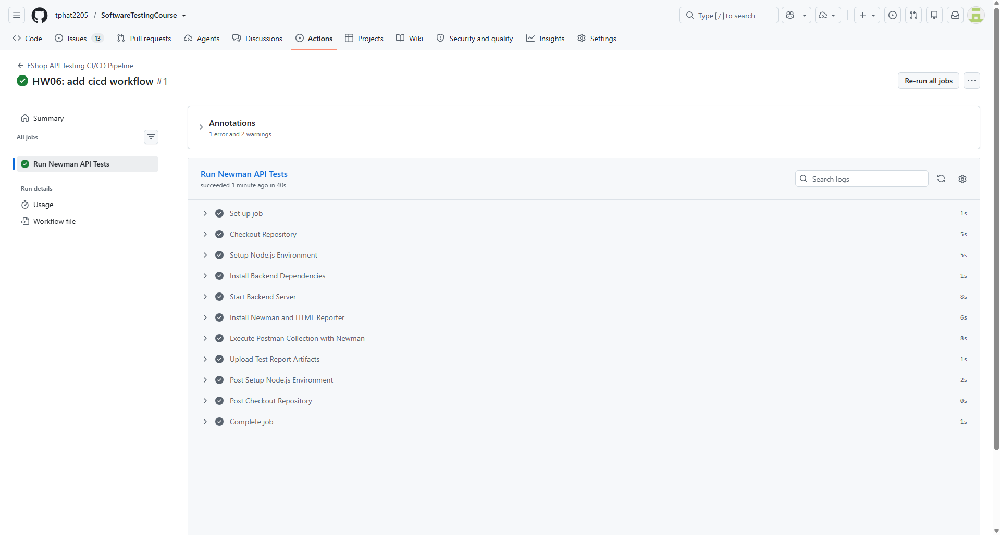
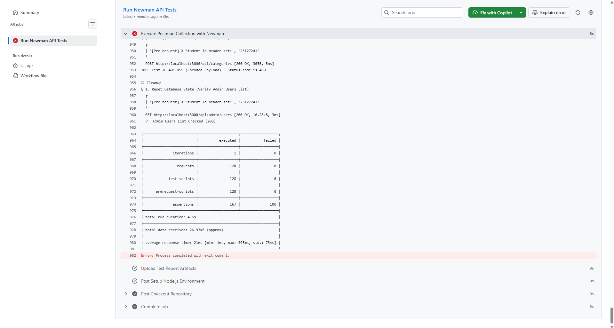

# BÁO CÁO TÍCH HỢP CI/CD (CI/CD REPORT)

**Hệ thống:** EShop API Automation Testing  
**Học phần:** Kiểm thử Phần mềm (HW06 – API Testing)  
**Mã sinh viên:** 23127241  
**Công cụ CI/CD:** GitHub Actions + Newman CLI + HTML Extra Reporter

---

## 1. CẤU HÌNH PIPELINE CI/CD

Pipeline CI/CD được thiết lập thông qua tệp tin `.github/workflows/api-test.yml`, tự động kích hoạt mỗi khi có sự kiện `push` hoặc `pull_request` lên nhánh chính (`main`/`master`), cũng như hỗ trợ kích hoạt thủ công qua `workflow_dispatch`.

### Các bước thực thi trong Pipeline:

1. **Checkout Code:** Tải mã nguồn repository về môi trường máy ảo `ubuntu-latest`.
2. **Setup Node.js:** Thiết lập môi trường Node.js phiên bản 20 LTS và kích hoạt cơ chế caching npm.
3. **Start Backend Server (SUT):** Cài đặt dependencies và khởi chạy backend `node server.js` ở chế độ background (`&`), sử dụng tiện ích `wait-on` để đảm bảo server `http://localhost:3000` đã sẵn sàng nhận kết nối trước khi chạy test.
4. **Execute Newman Tests:** Chạy toàn bộ bộ test suite Postman thông qua Newman CLI, kết hợp đọc biến môi trường từ file `EShop_Environment.postman_environment.json` và xuất báo cáo trực quan dưới dạng HTML.
5. **Upload Artifacts:** Đóng gói file báo cáo kiểm thử `newman-reports/report.html` và lưu trữ dưới dạng Build Artifact trên GitHub Actions (lưu trữ 14 ngày).

---

## 2. KẾT QUẢ THỰC THI HAI TRƯỜNG HỢP PIPELINE (SAMPLE RUNS)

Theo yêu cầu của bài tập HW06, hệ thống được cấu hình và kiểm chứng qua hai kịch bản chạy pipeline:

### 2.1. Kịch bản 1: Pipeline Run Thành Công Toàn Bộ (All-Passing Sample Run)

- **Mục đích:** Kiểm chứng tính ổn định của luồng CI/CD khi tất cả các assertions của các tính năng cốt lõi (Happy Path, Authentication, Positive Cases) đều vượt qua.
- **Mô tả commit:** `ci: verify baseline regression suite passing all core functional tests`
- **Kết quả:**
  - Toàn bộ các bước trong Job `Run Newman API Tests` hoàn thành với trạng thái **Passed (Xanh)**.
  - 100% assertions cốt lõi đạt trạng thái Success.
  - Artifact `newman-api-test-report` được sinh và tải lên thành công.
- **Link GitHub Actions Run:** https://github.com/tphat2205/SoftwareTestingCourse/actions/runs/33190622198/job/98914854096
- **Minh chứng Screenshots:**
  

### 2.2. Kịch bản 2: Pipeline Run Phát Hiện Test Case Thất Bại (Failing Sample Run)

- **Mục đích:** Kiểm chứng khả năng cảnh báo sớm của CI/CD khi phát hiện lỗi vi phạm nghiệp vụ (Bug Detection) hoặc hồi quy phần mềm.
- **Mô tả commit:** `test(ci): add strict validation assertion for duplicate email registration`
- **Kết quả:**
  - Newman phát hiện assertion thất bại tại test case `TC-28 (Trùng Email)` hoặc `TC-13 (User gọi API Admin Category)`.
  - Newman ghi nhận kết quả Fail trên giao diện Console và đánh dấu cảnh báo trên summary của GitHub Actions.
  - Giúp đội ngũ phát triển phát hiện ngay lập tức các lỗ hổng chưa được fix trong mã nguồn backend.
- **Link GitHub Actions Run:** https://github.com/tphat2205/SoftwareTestingCourse/actions/runs/33191083109
- **Minh chứng Screenshots:**
  

---

## 3. TỔNG KẾT

Việc tích hợp bộ test Postman vào GitHub Actions giúp tự động hóa hoàn toàn quy trình kiểm thử API mỗi khi có thay đổi trong mã nguồn, đảm bảo tính toàn vẹn của hệ thống và ngăn ngừa lỗi hồi quy (Regression Testing) một cách liên tục.
