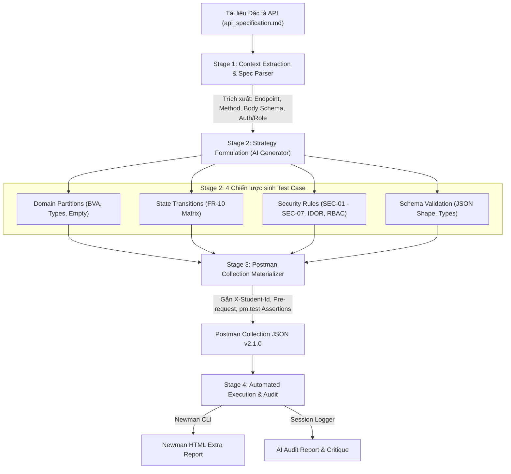

**Học phần:** Kiểm thử Phần mềm (CS423 / CSC13003 – Software Testing)  
**Bài tập:** HW06 – Automated API Testing (AI-Augmented)  
**Mục tiêu Bloom-AI:** Level G9.5 (Create)  
**Agent Skill:** `hw06-api-test-generator`  
**Sinh viên thực hiện:** ĐOÀN THÀNH PHÁT – MSSV: 23127241 – Lớp: 23KTPM2  

---

## 1. SƠ ĐỒ KIẾN TRÚC 4 GIAI ĐOẠN (4-STAGE PIPELINE MERMAID DIAGRAM)

Quy trình tự động hóa sinh bộ kiểm thử API từ tài liệu đặc tả được biểu diễn bằng sơ đồ luồng dữ liệu (Dataflow Architecture) dưới đây:

---

## 2. GIẢI THÍCH CHI TIẾT CÁC THÀNH PHẦN TRONG PIPELINE

### 1. Stage 1: Context Extraction & Spec Parser
* **Đầu vào:** Tệp Markdown đặc tả API (`api_specification.md`).
* **Nhiệm vụ:** Phân tích cú pháp (Parsing), bóc tách các khối API thành các đối tượng có cấu trúc:
  - Phương thức HTTP (`GET`, `POST`, `PUT`, `DELETE`).
  - Đường dẫn Endpoint (`/api/register`, `/api/orders/:id/cancel`, `/api/categories`).
  - Yêu cầu xác thực & Phân quyền (Authentication / Authorization / Role Admin).
  - Schema JSON của Request Body và Response mong đợi.

### 2. Stage 2: Multi-Strategy Formulation (AI Engine)
* **Nhiệm vụ:** Kích hoạt Agent Engine áp dụng đồng thời **4 chiến lược kiểm thử hình thức**:
  1. *Domain Partitions & BVA:* Sinh test case tương đương, giá trị rỗng, giá trị biên $N=255/256$, sai kiểu dữ liệu.
  2. *State Transition Testing:* Lập ma trận trạng thái đơn hàng FR-10 (`pending` $\rightarrow$ `canceled`, `shipping` $\rightarrow$ `canceled` bị cấm).
  3. *Security Testing:* Sinh kịch bản No Auth, Expired Token, RBAC Escalation, IDOR, SQLi, XSS.
  4. *Schema Validation:* Kiểm tra cấu trúc JSON trả về và định dạng lỗi `4xx`.

### 3. Stage 3: Postman Collection Materializer
* **Nhiệm vụ:** Chuyển đổi dữ liệu kiểm thử trừu tượng thành tệp **Postman Collection JSON v2.1.0** chuẩn:
  - Tự động gắn Collection Pre-request Script tiêm Header `X-Student-Id: 23127241`.
  - Thiết lập chuỗi xác thực Token (`admin_token`, `user_token`) và trích xuất biến môi trường.
  - Tự động sinh mã kiểm tra `pm.test()` và `pm.expect()` tương ứng cho từng test case.

### 4. Stage 4: Automated Execution & Audit Reporting
* **Nhiệm vụ:**
  - Tự động kích hoạt **Newman CLI** thực thi toàn bộ 128 requests và xuất báo cáo trực quan `newman-reports/report.html`.
  - Ghi nhật ký toàn bộ tương tác của AI phục vụ việc lập **Báo cáo Kiểm toán AI (AI Audit Report)**.

---
