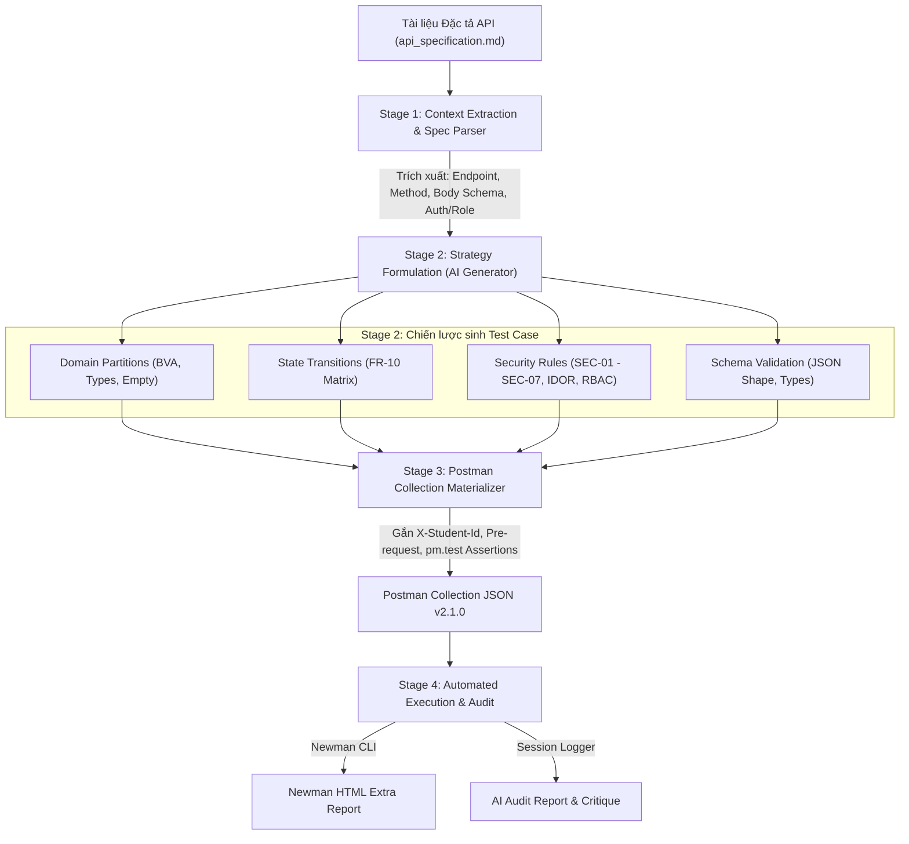

# THIẾT KẾ AI-DRIVEN API TEST GENERATOR
**Học phần:** Kiểm thử Phần mềm (HW06 – API Testing)  
**Mục tiêu Bloom-AI:** Level G9.5 (Create)  
**Agent Skill:** `hw06-api-test-generator`  

---

## 1. SƠ ĐỒ KIẾN TRÚC HỆ THỐNG (PIPELINE ARCHITECTURE)

Hệ thống được thiết kế theo quy trình Pipeline 4 giai đoạn tự động (4-Stage Pipeline), tiếp nhận tài liệu đặc tả API và sản sinh ra bộ kiểm thử Postman có khả năng thực thi:



---

## 2. THUẬT TOÁN VÀ MÃ GIẢ (PSEUDOCODE)

### Stage 1: Context Extraction & Spec Parser
Mục tiêu: Đọc file Markdown đặc tả API và trích xuất ngữ cảnh kỹ thuật thành cấu trúc dữ liệu chuẩn.

```python
function parse_api_spec(markdown_content):
    endpoints = []
    api_blocks = split_by_markdown_headers(markdown_content)
    
    for block in api_blocks:
        endpoint_info = {
            "method": extract_http_method(block),
            "url": extract_url(block),
            "description": extract_text_description(block),
            "auth_required": check_if_token_required(block),
            "role_required": check_if_admin_required(block),
            "body_schema": extract_json_body_schema(block),
            "response_schema": extract_expected_response(block)
        }
        endpoints.append(endpoint_info)
        
    return endpoints
```

### Stage 2: Strategy Formulation (Multi-Strategy AI Generation)
Mục tiêu: Áp dụng 4 kỹ thuật kiểm thử hình thức để sinh tối thiểu 35 test cases cho mỗi API.

```python
function generate_test_strategies(endpoint, llm_engine):
    test_cases = []
    
    # 1. Chiến lược Domain Partitions & Boundary Value Analysis
    domain_cases = llm_engine.prompt_domain_bva(
        schema=endpoint.body_schema,
        rules=["valid", "empty", "missing_field", "length_boundary_255", "wrong_type"]
    )
    test_cases.extend(domain_cases)
    
    # 2. Chiến lược State Transition (Áp dụng cho Order state machine FR-10)
    if endpoint.involves_state_change:
        state_cases = llm_engine.prompt_state_matrix(
            current_states=["pending", "confirmed", "shipping", "delivered", "canceled"],
            target_action=endpoint.action
        )
        test_cases.extend(state_cases)
        
    # 3. Chiến lược Bảo mật (Security Rules SEC-01 to SEC-07)
    sec_cases = llm_engine.prompt_security(
        endpoint=endpoint,
        threats=["No_Auth", "Invalid_Token", "Expired_Token", "RBAC_User_To_Admin", "IDOR", "SQLi", "XSS"]
    )
    test_cases.extend(sec_cases)
    
    # 4. Chiến lược Schema Validation
    schema_cases = llm_engine.prompt_schema_validation(
        expected_shape=endpoint.response_schema
    )
    test_cases.extend(schema_cases)
    
    return test_cases
```

### Stage 3: Postman Collection Materializer
Mục tiêu: Chuyển đổi danh sách test cases trừu tượng thành đối tượng JSON Postman Collection v2.1.0 hoàn chỉnh kèm Pre-request scripts và Assertions.

```python
function materialize_postman_collection(test_cases, student_id, base_url):
    collection = new PostmanCollection(name="HW06 - EShop API Testing")
    
    # Thiết lập Collection-level Pre-request script (Anti-AI-Cheat)
    collection.set_prerequest_script(f"""
        const studentId = pm.environment.get('student_id') || '{student_id}';
        pm.request.headers.upsert({{ key: 'X-Student-Id', value: studentId }});
        console.log('[Pre-request] X-Student-Id header set:', studentId);
    """)
    
    for tc in test_cases:
        req = new PostmanRequest()
        req.name = f"[{tc.category}] {tc.id} - {tc.name}"
        req.method = tc.method
        req.url = f"{base_url}/{tc.path}"
        req.headers.add("Content-Type", "application/json")
        
        # Gán Auth Header theo Role
        if tc.requires_auth:
            req.headers.add("Authorization", f"Bearer {tc.token_variable}")
            
        req.body = tc.payload_json
        
        # Gán Test Script Assertions
        req.test_script = f"""
            pm.test("Status code is {tc.expected_status}", function() {{
                pm.response.to.have.status({tc.expected_status});
            }});
        """
        collection.add_request(folder=tc.api_group, request=req)
        
    return collection.to_json()
```

### Stage 4: Execution & Audit Logging
Mục tiêu: Kích hoạt Newman CLI để thực thi và ghi lại toàn bộ log phiên làm việc.

```python
function execute_and_audit(collection_file, env_file):
    # 1. Chạy Newman và xuất báo cáo HTML
    newman_cmd = f"newman run {collection_file} -e {env_file} -r cli,htmlextra --reporter-htmlextra-export newman-reports/report.html"
    exec_status = run_shell(newman_cmd)
    
    # 2. Sinh AI Audit Report
    generate_audit_markdown(log_history=get_agent_session_logs())
    
    return exec_status
```
