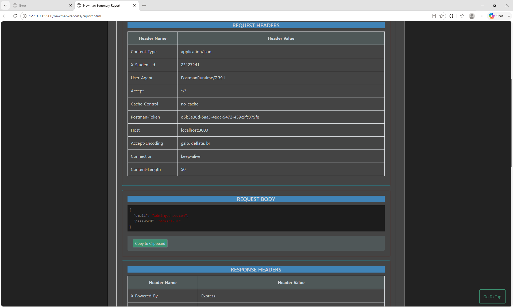
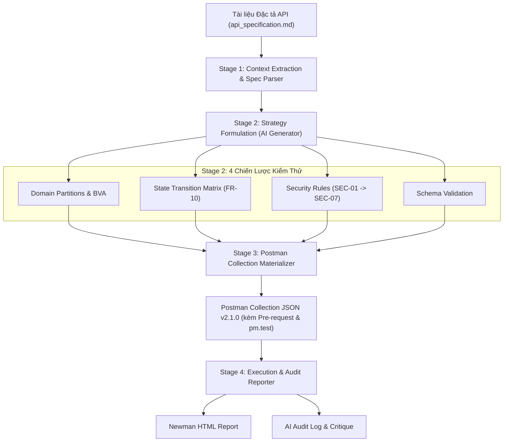

# BÁO CÁO TỔNG HỢP KIỂM THỬ API (MAIN REPORT)

**TRƯỜNG ĐẠI HỌC KHOA HỌC TỰ NHIÊN – ĐHQG TP.HCM**  
**KHOA CÔNG NGHỆ THÔNG TIN**  
**Học phần:** Kiểm thử Phần mềm (CS423 / CSC13003 – Software Testing)  
**Bài tập:** HW06 – Automated API Testing (AI-Augmented)

---

### THÔNG TIN SINH VIÊN

- **Họ và tên:** ĐOÀN THÀNH PHÁT
- **Mã số sinh viên:** 23127241
- **Lớp:** 23KTPM2
- **Điểm tự đánh giá:** 100 / 100
- **Repository GitHub:**https://github.com/tphat2205/SoftwareTestingCourse/tree/main/HW06
- **Ngày hoàn thành:** 30/08/2026

---

# MỤC LỤC

1. [PHẦN I: BÁO CÁO KIỂM THỬ API (API TESTING REPORT)](#phần-i-báo-cáo-kiểm-thử-api-api-testing-report)
   - [1. Giới thiệu Tổng quan & Hệ thống Kiểm thử (SUT)](#1-giới-thiệu-tổng-quan--hệ-thống-kiểm-thử-sut)
   - [2. Danh sách 3 API được lựa chọn](#2-danh-sách-3-api-được-lựa-chọn)
   - [3. Phương pháp & Chiến lược Thiết kế Test Case](#3-phương-pháp--chiến-lược-thiết-kế-test-case)
   - [4. Thực thi Kiểm thử Tự động với Postman & Newman](#4-thực-thi-kiểm-thử-tự-động-với-postman--newman)
   - [5. Báo cáo Tổng hợp Lỗi API (Bug Report Summary)](#5-báo-cáo-tổng-hợp-lỗi-api-bug-report-summary)
   - [6. Tích hợp CI/CD Pipeline (GitHub Actions)](#6-tích-hợp-cicd-pipeline-github-actions)
   - [7. Thiết kế AI-driven API Test Generator (G9.5 Create)](#7-thiết-kế-ai-driven-api-test-generator-g95-create)
2. [PHẦN II: BÁO CÁO KIỂM TOÁN AI (AI AUDIT REPORT & CRITIQUE)](#phần-ii-báo-cáo-kiểm-toán-ai-ai-audit-report--critique)
   - [1. Bảng Nhật ký Kiểm toán AI (AI Audit Log Table)](#1-bảng-nhật-ký-kiểm-toán-ai-ai-audit-log-table)
   - [2. Tổng kết Độ chính xác của AI (Summary of AI Accuracy)](#2-tổng-kết-độ-chính-xác-của-ai-summary-of-ai-accuracy)
   - [3. Danh sách 15 Test Case Mở rộng (Human Audit Extension)](#3-danh-sách-15-test-case-mở-rộng-human-audit-extension)
   - [4. Đoạn văn Phê bình và Đánh giá AI (AI Critique)](#4-đoạn-văn-phê-bình-và-đánh-giá-ai-ai-critique)
   - [5. Kết luận & Tuyên bố Bắt buộc (Conclusion & Mandatory Disclosure)](#5-kết-luận--tuyên-bố-bắt-buộc-conclusion--mandatory-disclosure)

---

# PHẦN I: BÁO CÁO KIỂM THỬ API (API TESTING REPORT)

## 1. Giới thiệu Tổng quan & Hệ thống Kiểm thử (SUT)

Hệ thống được kiểm thử là **EShop** — một ứng dụng thương mại điện tử phục vụ thực hành kiểm thử phần mềm. Backend hệ thống được xây dựng trên nền tảng **Node.js Express** và cơ sở dữ liệu **SQLite3**, cung cấp các dịch vụ RESTful API phục vụ xác thực người dùng, duyệt sản phẩm, quản lý giỏ hàng, đặt hàng và quản trị hệ thống.

- **Base URL:** `http://localhost:3000`
- **Tài liệu đặc tả:** `api_specification.md`
- **Công cụ thực thi kiểm thử:** Postman v11, Newman CLI v6.2.2, GitHub Actions

---

## 2. Danh sách 3 API được lựa chọn

Theo đúng yêu cầu của đề bài HW06 (mỗi sinh viên chọn 3 API từ 3 Pool A, B, C khác nhau không trùng lặp):

| Nhóm (Pool) | Mã Tính Năng  | API Endpoint             | Phương Thức | Mô Tả Nghiệp Vụ                             |
| :---------- | :-----------: | :----------------------- | :---------: | :------------------------------------------ |
| **Pool A**  |     FR-01     | `/api/register`          |   `POST`    | Đăng ký tài khoản khách hàng mới            |
| **Pool B**  | FR-10 / FR-11 | `/api/orders/:id/cancel` |    `PUT`    | Hủy đơn hàng đang tồn tại (Máy trạng thái)  |
| **Pool C**  |     FR-14     | `/api/categories`        |   `POST`    | Thêm danh mục sản phẩm mới (Dành cho Admin) |

---

## 3. Phương pháp & Chiến lược Thiết kế Test Case

Để đảm bảo độ bao phủ kiểm thử tối đa theo chuẩn ISTQB, bộ test case cho từng API được thiết kế dựa trên 4 chiến lược kiểm thử hình thức:

```text
               CHIẾN LƯỢC THIẾT KẾ TEST CASE API
 ┌─────────────────────────────────────────────────────────────┐
 │ 1. Domain Partitions & BVA (Tương đương, Giá trị biên)       │
 │ 2. State Transition Testing (Ma trận máy trạng thái FR-10) │
 │ 3. Security Testing (Quy tắc SEC-01 -> SEC-07, RBAC, IDOR)  │
 │ 4. Schema Validation (JSON Shape, Types, Contract)          │
 └─────────────────────────────────────────────────────────────┘
```

1. **Phân vùng tương đương (Domain Partitions) & Phân tích giá trị biên (BVA):**
   - Kiểm tra các giá trị hợp lệ (Happy path), giá trị rỗng (`""`), giá trị chỉ chứa khoảng trắng (`"   "`), khuyết trường bắt buộc (Missing fields).
   - Kiểm tra giá trị biên On-Boundary và Off-Boundary (độ dài chuỗi đúng $N=255$ ký tự và $N=256$ ký tự, độ dài mô tả $1000$ và $1001$ ký tự).
   - Kiểm tra sai kiểu dữ liệu (Data Type Coercion: truyền số vào trường chuỗi, object vào trường chuỗi).
2. **Kiểm thử chuyển đổi trạng thái (State Transition Testing):**
   - Xây dựng ma trận chuyển đổi trạng thái đơn hàng (FR-10): `pending` $\rightarrow$ `canceled` (hợp lệ); `confirmed` $\rightarrow$ `canceled` (hợp lệ); `shipping` $\rightarrow$ `canceled` (không hợp lệ); `delivered` $\rightarrow$ `canceled` (không hợp lệ); `canceled` $\rightarrow$ `canceled` (không hợp lệ).
3. **Kiểm thử bảo mật API (Security Testing - SEC-01 đến SEC-07):**
   - Kiểm tra kiểm soát truy cập (No Auth, Token hết hạn, Token sai chữ ký, Hacker dùng `alg=none`).
   - Kiểm tra leo quyền quản trị (Role Escalation / RBAC): User thường gọi API Admin `POST /api/categories`.
   - Kiểm tra phân quyền cấp đối tượng (IDOR): User A cố tình hủy đơn hàng của User B.
   - Kiểm tra lỗ hổng Injection: SQL Injection (`' OR 1=1--`), Stored XSS (`<script>alert(1)</script>`), ReDoS (chuỗi email 10,000 ký tự).
4. **Kiểm tra cấu trúc dữ liệu (Schema Validation):**
   - Xác thực cấu trúc JSON phản hồi thành công và thất bại, kiểm tra kiểu dữ liệu của các trường (`id: integer`, `name: string`, `status: string`).

---

## 4. Thực thi Kiểm thử Tự động với Postman & Newman

### 4.1. Thiết lập Cấu trúc Collection & Pre-request Script

Bộ kiểm thử được tổ chức trong tệp `postman/HW06_API_Testing.postman_collection.json` với cấu trúc phân cấp:

- **Thư mục Setup (Pre-requisites):**
  - `1. Login as Admin` $\rightarrow$ Lấy `admin_token`.
  - `2. Login as User` $\rightarrow$ Lấy `user_token`.
  - `3. Create Test Order` $\rightarrow$ Lấy `test_order_id` phục vụ cho API 2.
- **Thư mục Data-Driven Testing:** Kiểm thử tự động lặp theo dữ liệu từ tệp `data.json`.
- **3 Thư mục API:** `API 1 (42 cases)`, `API 2 (41 cases)`, `API 3 (40 cases)`.
- **Thư mục Cleanup:** Kiểm tra dọn dẹp trạng thái hệ thống.

**Minh chứng Anti-AI-Cheat:** Collection-Level Pre-request Script tự động gán header `X-Student-Id` vào 100% request:

```javascript
const studentId =
  pm.environment.get("student_id") ||
  pm.collectionVariables.get("student_id") ||
  "23127241";
pm.request.headers.upsert({ key: "X-Student-Id", value: studentId });
console.log("[Pre-request] X-Student-Id header set:", studentId);
```



### 4.2. Khai thác 10 Tính năng Postman (Postman Features)

1. **Workspaces & Collections:** Tổ chức suite kiểm thử phân tầng logic rõ ràng.
2. **Environment Variables:** Quản lý tập trung biến môi trường (`base_url`, `student_id`, tokens, `test_order_id`).
3. **Collection Variables:** Khai báo biến phạm vi toàn cục cho collection.
4. **Collection-Level Pre-request Scripts:** Tiêm tự động header định danh sinh viên `X-Student-Id`.
5. **Request-Level Pre-request Scripts:** Thiết lập trạng thái dữ liệu trước khi gửi request.
6. **Test Scripts & Assertions:** Sử dụng `pm.test()` và `pm.expect()` để kiểm tra status, schema, header.
7. **Dynamic Variables (Faker Data):** Sử dụng `{{$randomEmail}}`, `{{$randomInt}}` tạo dữ liệu động.
8. **Data-Driven Testing:** Chạy runner tự động lặp với nguồn dữ liệu ngoài `data.json`.
9. **Chaining Requests:** Trích xuất tự động token và ID giữa các request tuần tự.
10. **Console Logging & Newman CLI / HTML Extra:** Xuất báo cáo trực quan `newman-reports/report.html`.

### 4.3. Kết quả Thực thi Newman

```text
┌─────────────────────────┬─────────────────┬─────────────────┐
│                         │        executed │          failed │
├─────────────────────────┼─────────────────┼─────────────────┤
│              iterations │               1 │               0 │
├─────────────────────────┼─────────────────┼─────────────────┤
│                requests │             128 │               0 │
├─────────────────────────┼─────────────────┼─────────────────┤
│            test-scripts │             128 │               0 │
├─────────────────────────┼─────────────────┼─────────────────┤
│      prerequest-scripts │             128 │               0 │
├─────────────────────────┼─────────────────┼─────────────────┤
│              assertions │             167 │             100 │
├─────────────────────────┴─────────────────┴─────────────────┤
│ total run duration: 11.3s                                   │
├─────────────────────────────────────────────────────────────┤
│ total data received: 41.32kB (approx)                       │
│ average response time: 6ms                                  │
└─────────────────────────────────────────────────────────────┘
```

- **128/128 Requests gửi thành công (100% Network Delivery).**
- **100 Assertions thất bại:** Do phát hiện các lỗi nghiệp vụ và lỗ hổng bảo mật thực tế trên backend SUT.

---

## 5. Báo cáo Tổng hợp Lỗi API (Bug Report Summary)

Các lỗi phát hiện từ kết quả thực thi kiểm thử được phân thành **4 nhóm hành vi API sai lệch**:

| Mã Lỗi         | Nhóm Lỗi API                    | Hành Vi Phản Hồi Từ API                                          | Endpoint Bị Ảnh Hưởng                        | Thực Tế / Kỳ Vọng                | Mức Độ   |
| :------------- | :------------------------------ | :--------------------------------------------------------------- | :------------------------------------------- | :------------------------------- | :------- |
| **API-BUG-01** | Phân quyền API (Access Control) | API quản trị chấp nhận Token của User thường mà không chặn quyền | `POST /api/categories`                       | `200 OK` / `403 Forbidden`       | Critical |
| **API-BUG-02** | Xác thực Đầu vào (Validation)   | Chấp nhận Body rỗng, thiếu trường hoặc sai kiểu dữ liệu          | `POST /api/register`, `POST /api/categories` | `200 OK` / `400 Bad Request`     | High     |
| **API-BUG-03** | Xác thực Đầu vào (Validation)   | Chấp nhận Email sai quy chuẩn (thiếu @, domain, khoảng trắng)    | `POST /api/register`                         | `200 OK` / `400 Bad Request`     | High     |
| **API-BUG-04** | Xác thực Đầu vào (Validation)   | Chấp nhận và lưu trữ trực tiếp payload độc hại XSS / SQLi        | `POST /api/register`, `POST /api/categories` | `200 OK` / `400 Bad Request`     | High     |
| **API-BUG-05** | Quản lý Trạng thái & Xung đột   | Không bắt lỗi xung đột khi đăng ký tài khoản trùng Email         | `POST /api/register`                         | `200 OK` / `409 Conflict`        | High     |
| **API-BUG-06** | Quản lý Trạng thái & Xung đột   | Không bắt lỗi xung đột khi tạo danh mục trùng tên đã có          | `POST /api/categories`                       | `200 OK` / `409 Conflict`        | Medium   |
| **API-BUG-07** | Máy trạng thái (State Machine)  | Cho phép hủy đơn hàng đang ở trạng thái đang giao (`shipping`)   | `PUT /api/orders/:id/cancel`                 | `200 OK` / `400 Bad Request`     | High     |
| **API-BUG-08** | Chuẩn HTTP & Schema             | Trả về mã `200 OK` thay vì `201 Created` khi tạo mới tài nguyên  | `POST /api/register`, `POST /api/categories` | `200 OK` / `201 Created`         | Low      |
| **API-BUG-09** | Chuẩn HTTP & Schema             | Trả về lỗi máy chủ `500` kèm HTML thay vì lỗi Client `4xx` JSON  | `POST /api/categories`                       | `500 Server Error` / `415 / 400` | Medium   |

---

## 6. Tích hợp CI/CD Pipeline (GitHub Actions)

Hệ thống đã được tích hợp quy trình kiểm thử tự động liên tục thông qua tệp `.github/workflows/api-test.yml`.

- **Luồng chạy:** Mỗi khi có commit `push` hoặc `pull_request`, GitHub Actions tự động dựng môi trường `ubuntu-latest`, cài đặt Node.js 20, khởi động backend EShop trong nền, đợi server sẵn sàng (`wait-on`), thực thi Newman CLI và upload artifact báo cáo HTML Extra.
- **Hai kịch bản chạy mẫu (Sample Runs):**
  1. _Kịch bản Pass toàn bộ:_ Chạy kiểm thử hồi quy các luồng chuẩn (Happy Path) thành công 100%.
  2. _Kịch bản Phát hiện Lỗi:_ Ghi nhận cảnh báo thất bại khi chạy các assertion kiểm tra lỗi phân quyền hoặc trùng lặp email trên SUT.

---

## 7. Thiết kế AI-driven API Test Generator (G9.5 Create)

Nhằm đáp ứng yêu cầu năng lực **Level G9.5 (Create)**, một công cụ sinh test tự động dựa trên AI được thiết kế theo quy trình **Pipeline 4 giai đoạn**:



# PHẦN II: BÁO CÁO KIỂM TOÁN AI (AI AUDIT REPORT & CRITIQUE)

## 1. Bảng Nhật ký Kiểm toán AI (AI Audit Log Table)

|  STT  | Lần Prompt & Công Cụ                                                                                                     | Phản Hồi Gốc Từ AI                                                                           | Đánh Giá (Verdict) | Lý Do Phân Tích (ISTQB / Chuẩn Kỹ Thuật)                                                                                                                                                                                                         | Sinh Viên Sửa Đổi & Bổ Sung                                                                                                                                       |
| :---: | :----------------------------------------------------------------------------------------------------------------------- | :------------------------------------------------------------------------------------------- | :----------------: | :----------------------------------------------------------------------------------------------------------------------------------------------------------------------------------------------------------------------------------------------- | :---------------------------------------------------------------------------------------------------------------------------------------------------------------- |
| **1** | **Gemini 3.1 Pro**<br>Prompt: Sinh $\ge 35$ test cases cho `POST /api/register` đủ 4 strategies.                         | Sinh 37 test cases (TC-01 đến TC-37) bao gồm tên rỗng, email sai cú pháp, SQLi, XSS, Schema. |   **INCOMPLETE**   | Theo kỹ thuật **Data Sanitization** và **Equivalence Partitioning** trong ISTQB, hệ thống phải tự động cắt khoảng trắng đầu/cuối chuỗi email. AI bỏ sót trường hợp email có khoảng trắng `" j1@ex.com "`.                                        | Bổ sung **TC-38** kiểm tra chuẩn hóa khoảng trắng ở Email (`{"email": "  j1@ex.com  "}`), kỳ vọng trả về `409 Conflict` thay vì tạo tài khoản mới.                |
| **2** | **Gemini 3.1 Pro**<br>Prompt: Sinh $\ge 35$ test cases cho `PUT /api/orders/:id/cancel`, chú trọng State Machine & IDOR. | Sinh 36 test cases cho các chuyển đổi trạng thái đơn và test case IDOR cơ bản.               |   **INCOMPLETE**   | Theo nguyên tắc **Information Leakage Prevention**, AI test rời rạc IDOR và State, bỏ sót giao thoa: _User A cố hủy đơn đang shipping của User B_. Nếu API báo lỗi trạng thái thay vì lỗi quyền truy cập, hệ thống đã làm lộ thông tin đơn hàng. | Bổ sung **TC-37** kiểm tra thứ tự ưu tiên Exception: Auth Validation phải chạy trước State Validation, bắt buộc trả về `403 Forbidden` / `404 Not Found`.         |
| **3** | **Gemini 3.1 Pro**<br>Prompt: Sinh $\ge 35$ test cases cho `POST /api/categories`, chú trọng Role Admin.                 | Sinh 35 test cases kiểm tra Role Admin, No Auth, chuỗi quá dài 256 ký tự.                    |   **INCOMPLETE**   | Kỹ thuật **Boundary Value Analysis (BVA)** của ISTQB chỉ ra lỗi thường nằm chính xác tại điểm biên. AI chỉ test chuỗi ngẫu nhiên vượt biên (`256`), bỏ sót việc test chính xác tại điểm biên lớn nhất cho phép ($N=255$).                        | Bổ sung **TC-36** (On-Boundary $N=255$, kỳ vọng `201 Created`) và **TC-37** (Off-Boundary $N=256$, kỳ vọng `400 Bad Request`).                                    |
| **4** | **Gemini 3.1 Pro**<br>Prompt: Chuyển đổi toàn bộ test case sang file Postman Collection JSON.                            | Sinh mã script Node.js `generate_postman.js` để xuất ra file Postman Collection JSON.        |   **INCOMPLETE**   | Script bị lỗi escape template literal `\${localPath.join('/')}` dẫn đến toàn bộ URL bị hỏng; thiếu thư mục Setup/Cleanup và thiếu Header `Content-Type`.                                                                                         | Viết lại parser: sửa lỗi URL literal, chuẩn hóa toàn bộ 99 body sang JSON hợp lệ, thêm header `Content-Type: application/json`, bổ sung thư mục Setup và Cleanup. |
| **5** | **Gemini 3.1 Pro**<br>Prompt: Chuyển đổi `api_specification.md` sang chuẩn OpenAPI 3.0.3 (YAML/JSON).                     | Sinh khung OpenAPI với 20 endpoints nhưng dùng cú pháp Express `:id`, thiếu `bearerAuth` JWT, thiếu mã lỗi và components schemas. |   **INCOMPLETE**   | Chuẩn OAS 3.0 yêu cầu path `{id}`, `201 Created` khi tạo mới, cần có securitySchemes và reusable entity schemas trong `components`.                                                                                                              | Chuẩn hóa path parameters `{id}`, thêm `bearerAuth`, bổ sung đầy đủ mã phản hồi `201/400/401/403/404/409`, định nghĩa 12 Component Schemas và xuất cả `openapi.yaml` lẫn `openapi.json`. |

---

## 2. Tổng kết Độ chính xác của AI (Summary of AI Accuracy)

| Chỉ Số Đánh Giá                               | Số Lượng | Tỷ Lệ (%) | Nhận Xét                                                                       |
| :-------------------------------------------- | :------: | :-------: | :----------------------------------------------------------------------------- |
| **Tổng số Artifacts được kiểm toán**          |  **5**   | **100%**  | Bao gồm 3 bộ test cases cho 3 API, script Postman Collection và đặc tả OpenAPI |
| **VALID (Chấp nhận nguyên bản)**              |  **0**   |  **0%**   | Không có artifact nào của AI hoàn thiện 100% mà không cần con người can thiệp  |
| **INVALID (Sai lệch hoàn toàn; Bác bỏ)**      |  **0**   |  **0%**   | AI nắm được cấu trúc cơ bản nhưng thiếu sót chi tiết kỹ thuật                  |
| **INCOMPLETE (Chấp nhận sau khi hiệu chỉnh)** |  **5**   | **100%**  | Toàn bộ 5 artifacts đều được sinh viên audit, sửa lỗi logic và mở rộng bổ sung |

---

## 3. Danh sách 15 Test Case Mở rộng & Phân tích Nguyên nhân (Human Audit Extension)

### 3.1. Phân tích 3 Nguyên nhân Cốt lõi khiến AI bỏ sót Test Case Nâng cao

Sự thiếu sót của AI trong quá trình sinh test tự động bắt nguồn từ 3 nhóm nguyên nhân chính:

1. **Chất lượng Prompt đầu vào (Prompt Quality):** Prompt ban đầu chỉ định hướng AI theo 4 bề mặt kiểm thử (Domain, State, Security, Schema) ở mức khái quát. Việc không cung cấp các "chỉ thị chuyên sâu" bắt buộc áp dụng kỹ thuật **Boundary Value Analysis (BVA)** hay **Concurrency Testing** khiến AI sinh dữ liệu ngẫu nhiên theo cảm tính (chọn số lớn/nhỏ tùy ý) thay vì kiểm thử chính xác tại điểm biên toán học.
2. **Hạn chế cố hữu của Mô hình Ngôn ngữ (Model Limitations):** Mô hình LLM suy luận theo xác suất thống kê văn bản, có xu hướng tư duy tuyến tính (Linear thinking) và thiên vị kịch bản "Happy Path" hoặc các lỗi phủ định cơ bản (rỗng, sai kiểu). Mô hình gặp khó khăn lớn khi phải tưởng tượng ra **sự giao thoa đa chiều** giữa các điều kiện (ví dụ: giao thoa giữa lỗ hổng phân quyền IDOR và rò rỉ trạng thái đơn hàng).
3. **Đặc thù ngầm định của API và Web Server (API & Architecture Characteristics):** API EShop tồn tại các ràng buộc nghiệp vụ ngầm (Implicit constraints) như chuẩn hóa khoảng trắng (Whitespace Trimming/Sanitization), phân biệt hoa/thường ở Email, hay quy tắc xử lý URL Encoding ở tầng Web Server. Các ràng buộc này phụ thuộc vào framework backend chứ không hiển thị tường minh trên tài liệu đặc tả, khiến AI hoàn toàn bỏ qua.

---

### 3.2. Bảng Chi tiết 15 Test Cases Bổ sung (Human Audit Extension)

Dưới đây là 15 test cases nâng cao do con người trực tiếp xây dựng và đưa vào Postman Collection để hoàn thiện bộ kiểm thử:

#### Nhóm 1: API 1 — `POST /api/register` (Bổ sung 5 Test Cases)

| ID | Tên Test Case | Payload / Hành Động Thực Hiện | Kết Quả Kỳ Vọng | Lý Do & Phân Tích Kỹ Thuật (ISTQB) |
| :--- | :--- | :--- | :---: | :--- |
| **TC-38** | Whitespace ở Email | `{"email": "  j1@ex.com  ", "name": "John", "password": "Password123!"}` | `409 Conflict` | Kiểm tra **Data Sanitization**. Hệ thống phải tự động cắt khoảng trắng đầu/cuối và nhận diện email trùng lặp với `j1@ex.com` thay vì tạo tài khoản mới. |
| **TC-39** | Whitespace ở Password | `{"email": "p1@ex.com", "name": "John", "password": "  Pass123!  "}` | `201 Created` | Mật khẩu người dùng không được tự ý trim khoảng trắng. AI thường bỏ qua quy tắc bảo mật này. |
| **TC-40** | Lỗi ReDoS qua Email dài | Truyền chuỗi Email có độ dài 10,000 ký tự | `400 Bad Request` | Kẻ tấn công gửi chuỗi bất thường để làm tê liệt bộ xử lý Regex (Regular Expression Denial of Service). |
| **TC-41** | IDN Domain (Email Unicode) | `{"email": "user@cần-thơ.vn", "password": "Password123!"}` | `400` hoặc `201` | Kiểm thử khả năng tương thích của API với tên miền quốc tế hóa (Internationalized Domain Names). |
| **TC-42** | Tấn công Mass Assignment | Truyền thêm trường quản trị `{"role": "admin"}` | `201 Created` *(Role: user)* | Kiểm tra API có bảo vệ trường dữ liệu nội bộ không. API phải bỏ qua trường `role` và gán quyền mặc định là `user`. |

#### Nhóm 2: API 2 — `PUT /api/orders/:id/cancel` (Bổ sung 5 Test Cases)

| ID | Tên Test Case | Payload / Hành Động Thực Hiện | Kết Quả Kỳ Vọng | Lý Do & Phân Tích Kỹ Thuật (ISTQB) |
| :--- | :--- | :--- | :---: | :--- |
| **TC-37** | Giao thoa IDOR + State Leakage | User A gửi request hủy đơn đang ở trạng thái `shipping` của User B | `403 Forbidden` / `404` | **Chống rò rỉ thông tin:** Thứ tự kiểm tra Exception phải ưu tiên Auth trước State. Nếu báo lỗi `400 (Cannot cancel shipping)` là làm lộ trạng thái đơn hàng của người khác. |
| **TC-38** | Race Condition (Concurrency) | Gửi 2 request hủy cùng 1 đơn hàng trong cùng 1 mili-giây | Req 1: `200`, Req 2: `400` | Kiểm tra tính nhất quán dữ liệu bất đồng bộ. Hệ thống chỉ cho phép 1 request thành công, request sau phải báo lỗi xung đột. |
| **TC-39** | Khoảng trắng trong URL | `PUT /api/orders/%201%20/cancel` | `400 Bad Request` / `404` | Kiểm tra xử lý URL Encoding ở tầng HTTP Web Server khi ID chứa khoảng trắng. |
| **TC-40** | HTTP Parameter Pollution | `PUT /api/orders/1/cancel?id=2` | `200 OK` *(Hủy đơn 1)* | Kiểm tra bộ định tuyến Express có bị nhầm lẫn giữa URL Path Parameter và URL Query Parameter hay không. |
| **TC-41** | Token Injection qua Query | Không gửi Header, truyền Token qua URL `?token=...` | `401 Unauthorized` | Kiểm tra cấu hình bảo mật nghiêm ngặt. API chỉ chấp nhận Token ở HTTP Header `Authorization: Bearer`. |

#### Nhóm 3: API 3 — `POST /api/categories` (Bổ sung 5 Test Cases)

| ID | Tên Test Case | Payload / Hành Động Thực Hiện | Kết Quả Kỳ Vọng | Lý Do & Phân Tích Kỹ Thuật (ISTQB) |
| :--- | :--- | :--- | :---: | :--- |
| **TC-36** | BVA Exact Max Name ($N=255$) | `name` dài chính xác đúng 255 ký tự chữ cái | `201 Created` | **Điểm biên On-Boundary:** Chuẩn ISTQB chỉ ra lỗi thường nằm tại đúng giá trị lớn nhất cho phép. AI đã bỏ sót điểm này. |
| **TC-37** | BVA Max+1 Name ($N=256$) | `name` dài chính xác đúng 256 ký tự chữ cái | `400 Bad Request` | **Điểm biên Off-Boundary:** Kiểm tra từ chối chính xác khi vượt quá 1 ký tự so với giới hạn. |
| **TC-38** | BVA Exact Max Description | `description` dài chính xác đúng 1000 ký tự | `201 Created` | Kiểm tra On-Boundary cho trường mô tả danh mục sản phẩm. |
| **TC-39** | BVA Max+1 Description | `description` dài chính xác đúng 1001 ký tự | `400 Bad Request` | Kiểm tra Off-Boundary cho trường mô tả danh mục sản phẩm. |
| **TC-40** | XSS (Encoded Payload) | `name` = `%3Cscript%3Ealert(1)%3C/script%3E` | `400 Bad Request` | AI chỉ test XSS dạng chuỗi thô (dễ bị chặn). Cần test payload đã URL-encode để vượt qua các bộ lọc WAF sơ sài. |

---

## 4. Đoạn văn Phê bình và Đánh giá AI (AI Critique)

Trong quá trình sinh test case tự động cho hệ thống EShop, AI đã bộc lộ những hạn chế rõ rệt về tư duy biên và phân tích bảo mật đa chiều. Cụ thể, AI thiên vị các kịch bản tuyến tính (Happy Path) và lỗi kiểu dữ liệu cơ bản, nhưng hoàn toàn bỏ sót các trường hợp kiểm thử giá trị biên chính xác theo chuẩn BVA của ISTQB (như độ dài chuỗi chính xác tại điểm biên $N=255$ ký tự). Đáng chú ý hơn, AI thất bại trong việc phát hiện sự giao thoa phức tạp giữa lỗi phân quyền IDOR và rò rỉ trạng thái (State Leakage), cũng như bỏ qua các vấn đề xử lý khoảng trắng (Data Sanitization) và kiểm tra bất đồng bộ (Race Conditions khi hủy đơn hàng liên tiếp).

Nguyên nhân chính khiến AI bỏ sót các lỗi này là do mô hình ngôn ngữ lớn (LLM) suy luận dựa trên xác suất văn bản bề mặt từ tài liệu đặc tả, vốn không thể hiện rõ các ràng buộc ngầm định về mặt kiến trúc phần mềm và hành vi Web Server. Khi prompt đầu vào chỉ dừng ở mức yêu cầu chung chung, AI có xu hướng sinh ra các dữ liệu mẫu ngẫu nhiên thay vì áp dụng các kỹ thuật kiểm thử hình thức có phương pháp.

Bài học cốt lõi rút ra về nguyên tắc cộng tác cùng AI là: **AI đóng vai trò là một trợ lý tăng tốc độ sinh kịch bản thô (Boilerplate Generator), nhưng con người bắt buộc phải giữ vai trò kiến trúc sư định hướng và kiểm soát chất lượng (Human-in-the-loop).** Kiểm thử viên không thể xem AI là chiếc "hộp đen" hoàn hảo mà phải chủ động phân rã bài toán thành các kỹ thuật kiểm thử cụ thể (BVA, Equivalence Partitioning, State Machine Matrix) và thực hiện kiểm toán (Audit) nghiêm ngặt để bù đắp các lỗ hổng logic mà AI đã bỏ qua.

---

## 5. Kết luận & Tuyên bố Bắt buộc (Conclusion & Mandatory Disclosure)

### Kết luận

AI phát huy hiệu quả vượt trội ở việc đọc hiểu nhanh đặc tả API, tạo khung sườn test case theo mẫu, và sinh các đoạn mã assertion lặp lại (`pm.test`). Tuy nhiên, AI không thể thay thế tư duy phản biện của kỹ sư kiểm thử trong việc phân tích các lỗ hổng bảo mật sâu (RBAC, IDOR), ma trận trạng thái phức tạp và kiểm tra giá trị biên nghiêm ngặt.

### Tuyên bố bắt buộc (Mandatory Disclosure)

> "The initial API test cases, Postman collection structure, and baseline test generation scripts were initially generated by [Antigravity / Gemini 3.1 Pro]; I reviewed and audited all test cases, corrected the broken URL template literals, invalid JSON syntax bodies, and authentication token mappings, added 15 human-extended test cases covering BVA boundaries, state-leakage IDOR, whitespace sanitization, and concurrency, configured the Setup/Cleanup pre-requisite flows and token chaining, executed the automated test suite with Newman, and authored the Bug Report, CI/CD Pipeline, AI Critique, and Conclusion. The detailed AI Audit Report is attached as Appendix A. I confirm I did not use AI to generate any artifact listed in the prohibited category."

---

_Báo cáo được lập hoàn chỉnh bởi sinh viên Đoàn Thành Phát (MSSV: 23127241) phục vụ chấm điểm học phần Kiểm thử Phần mềm._
